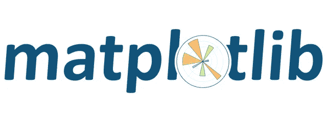
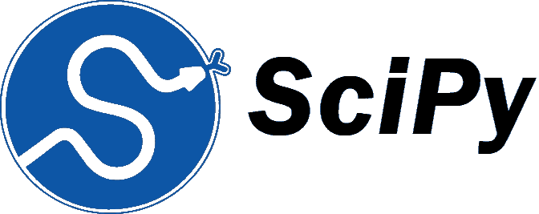
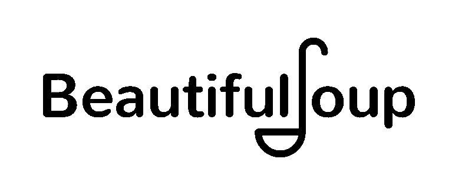

# 数据科学工具包—指南

> 原文：<https://medium.com/codex/the-data-science-toolkit-a-guide-c218ef8513ac?source=collection_archive---------7----------------------->

照片由[法比奥](https://unsplash.com/@fabioha?utm_source=medium&utm_medium=referral)在 [Unsplash](https://unsplash.com?utm_source=medium&utm_medium=referral) 上拍摄

> “世界是一个大数据问题”
> 
> 安德鲁·麦卡菲

21 世纪最大的繁荣之一，如果不是最大的繁荣，是人类对数据的依赖，以满足他们的日常需求。

无论是健身追踪器、在线流媒体数据还是体育运动，数据无处不在。

因此，将数据科学视为世界各地许多人的首选工作并不奇怪。根据[消息来源](https://www.analyticsinsight.net/countries-which-hold-the-greatest-opportunities-for-data-scientists/)、**美国、欧洲、英国、中国和印度**为数据科学家提供了最大的机会。

想了解更多关于数据科学以及数据科学世界中使用的基本工具和软件的信息吗？嗯，你来对地方了。那么，让我们开始吧！

## 什么是数据科学？

意思来自于这个词本身——数据+科学。也就是说，数据的科学就是我们所说的数据科学。

你可能想知道——这到底是什么科学？

这里的科学意味着开发分析、清理、存储和记录数据的方法，以便有效地从中收集信息。

数据科学的主要目标是深入了解给定数据并从中收集知识，无论数据是结构化的还是非结构化的。

这就引出了另一个问题——数据到底是怎么处理的？

请继续阅读！答案在下一节！

## 编程语言和包

奥斯卡·伊尔迪兹在 [Unsplash](https://unsplash.com?utm_source=medium&utm_medium=referral) 上拍摄的照片

在我们谈论包之前，我们必须知道哪些编程语言可以用来编写我们的代码。老实说，所有的基本编程语言都可以使用。我重复一遍！

对一些人来说，这可能会让人感到惊讶，但这是事实。

然而，这里有一个小问题。

虽然所有的编程语言都可以使用，但一种编程语言的效率与另一种不同。

我在这里提到的编程语言的类型是——低级和高级编程语言。

简而言之，定义这两种语言——低级语言是非人类可读的，并且是神秘的，而高级语言易于阅读，不神秘，并且具有相对简单的语法。

数据科学家通常更喜欢高级编程语言，而不是低级编程语言。这是因为高级编程语言非常注重细节，并且能够创建独立于计算机类型的代码，而低级编程语言则不是这种情况。

数据科学中最常用的一些编程语言有——**Python、JavaScript、Scala、R、SQL 和 Julia**——这些语言无疑都是高级编程语言。

如果你想知道作为一名有抱负的数据科学家应该使用哪种编程语言，我建议你使用 Python。这样做的主要原因是编程语言的简单性，我觉得这是其他语言所没有的。

这只是我的看法。你可以选择哪个最适合你！

看来编程语言的障碍已经被清除了。

接下来是包裹。

就像我们需要一支钢笔或铅笔在纸上写字一样，我们需要基本的数据科学包来首次进入数据科学的世界。

一些基本的数据科学包包括:

1. **NumPy**

来源: [**维基百科**](https://en.wikipedia.org/wiki/NumPy)

这是我第一次探索数据科学时遇到的第一个包，我不得不说它至今仍是我最喜欢的包。

NumPy 基本上像一个科学计算器一样工作，你可能遇到过。它执行 Python 中的基本计算操作。它也被认为是使用 Python 进行科学计算所需的最基本的包。

2. **Matplotlib**

来源: [**Steemit**](https://steemit.com/utopian-io/@scipio/learn-python-series-10-matplotlib-part-1)

这是基本的 Python 2D 绘图库。它主要用于制作条形图，直方图和其他类似的 2D 图。数据科学领域需要大量的绘图和绘制图形；因此，当你编码时，你会经常碰到这个包。

3.熊猫

来源: [**维基百科**](https://en.wikipedia.org/wiki/Pandas_(software))

虽然不是严格意义上的机器学习包，但它非常适合数据分析和操作，尤其是在有大型数据集要处理的时候，非常有用。它与 NumPy 形成了致命的组合，你必须看到他们两个一起行动——这是一个值得一看的景象！

4.Seaborn

来源: [**GitHub**](https://github.com/mwaskom/seaborn/issues/2243)

我们看到了 Matplotlib，它可以用于 2D 可视化。但是，Matplotlib 的问题是可视化可能不像人们想象的那样有吸引力。这就是 Seaborn 的用武之地。Seaborn 基于 Matplotlib，并提供了一个高级接口，用于绘制有吸引力和信息丰富的统计图形。每当需要更详细的统计推断时，这个包比 Matplotlib 更受欢迎。

5. **SciPy**

来源: [**全栈 Python**](https://www.fullstackpython.com/scipy-numpy.html)

虽然 NumPy 可以帮助执行基本的数学和科学运算，但有时也需要复杂的运算。这里用的是 SciPy。诸如信号处理、优化算法、傅立叶分析等操作。是使用 SciPy 执行的。

6. **Scikit-Learn**

来源: [**维基百科**](https://en.wikipedia.org/wiki/Scikit-learn)

这个初学者友好的包是建立在 SciPy 和 NumPy 之上的。它包含了很多用于分类、回归、聚类和降维的工具。它主要用于预测数据分析。

7. **PyTorch**

来源: [**维基共享资源**](https://commons.wikimedia.org/wiki/File:Pytorch_logo.png)

一个面向性能的包，它主要用于代替 NumPy。这个包有更好的性能，更重要的是，非常快速和高效。PyTorch 提供了两个主要功能-通过图形处理单元(GPU)实现强大加速的张量计算和基于类型的自动微分系统构建的深度神经网络。

8.**张量流**

来源: [**维基百科**](https://en.wikipedia.org/wiki/TensorFlow)

一个流行的软件包，它专门使用数据流图进行数值计算。我认为 TensorFlow 从其他包中脱颖而出的一个特性是，它可以训练和运行深度神经网络，用于模拟手写数字分类、图像识别、单词嵌入等。

9. **Keras**

来源: [**keras.io**](https://keras.io/)

这个包通常构建在 TensorFlow 之上。它主要用于简单快速的原型制作。它还可以在 CPU 和 GPU 上运行，这使它成为另一个独特的包。

10.**美丽组图**

来源:[**WordPress**](https://funthon.wordpress.com/2017/05/21/beautiful-soup-4/\)

这个包装与我们目前看到的完全不同。虽然上面讨论的包侧重于如何操作和处理数据，但 BeautifulSoup 是不同的。这是一个数据挖掘包，我们可以从中提取数据来执行各种任务。虽然数据可能不是标准的 csv 格式，BeautifulSoup 可以帮助您以所需的格式排列所需的数据。

这些是在数据科学领域使用的最流行的包。然而，当您迈出进入数据科学世界的第一步时，您肯定会明白，它不是一个池塘，而是一个海洋，有各种各样的软件包在发挥作用。

> 尽管我还不是一名数据科学家，但请相信我——如果你是一名有抱负的数据科学家，一场令人惊叹的旅程正等待着你——有大量的数据和数据集可供使用！