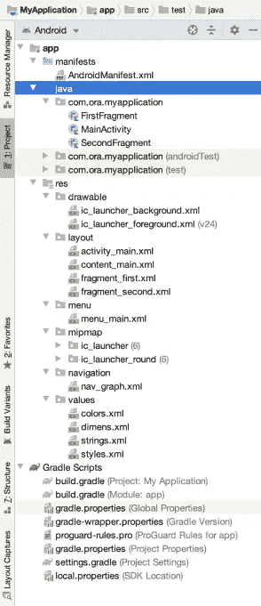
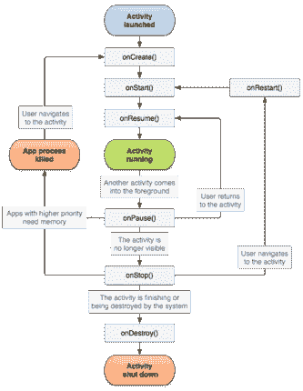
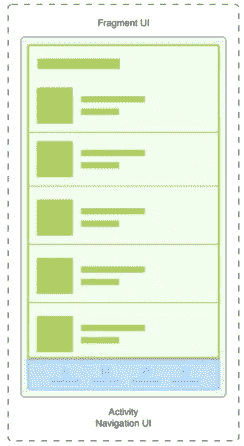
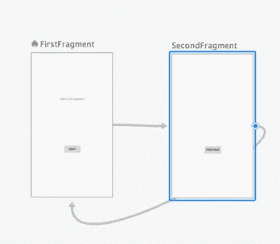

# 你好世界的第二天

> 原文：<https://medium.com/codex/the-day-after-hello-world-3c51f03dcf6f?source=collection_archive---------1----------------------->

## [法典](https://medium.com/codex)

## 所以它开始了…

# 嗨！

如果你看了[这个](https://brunaesteves.medium.com/android-programming-tips-the-beginning-for-everyone-8fe88343efc1)，有很大概率你现在就是我们中的一员！还有…对不起，但是我必须警告你…你可能也会面对所有的开发人员的刻板印象！欢迎光临！别担心，我们都在一起。


照片由[丹尼·米勒](https://unsplash.com/@redaquamedia?utm_source=medium&utm_medium=referral)在 [Unsplash](https://unsplash.com?utm_source=medium&utm_medium=referral) 拍摄

下一部分是完全必要的，我将告诉你为什么。

作为一名开发人员，我面临着许多问题，因为我首先做了大的步骤，我知道这听起来有点荒谬，但当我说大时，一个例子是我开始从事一个项目，我甚至不知道它是如何构造的，或者基本步骤，如配置文件的目的以及当构建成功时一切如何连接。考虑到这一点，我认为我们应该分析一下目前的情况，因为你肯定不想重蹈我的覆辙。

# 项目结构

如果您选择了 **Kotlin** 并且默认选择了从一个基本活动开始，那么现在您就有了一个自己的项目。
所以，应该是这样的:



具有基本活动的第一个应用程序

但是布鲁纳，看看这张照片！！那太多了！是的，我知道，但是让我们慢慢来…我们将一个一个地理解每个文件…或者死也不尝试。💀

# 清单文件

第一个话题是 **AndroidManifest.xml** 。
该文件包含您的应用程序的许多基本配置。

你需要记住的是，当你要声明权限的级别(例如位置)，你的应用的所有 Android 组件(我们马上会谈到)，你的应用需要什么硬件特性(例如摄像头)，包名等。，您必须更改此安装文件。

PS。:**包名**在这里是一个重要的变量。它用于在构建时查找代码实体，但在打包时会被在 **build.gradle** 文件中声明的 **application** 变量替换。重要的是要记住，它们两者是相关的，它们将决定你的应用程序在 Play Store 中的唯一 ID。

# java 包下的文件

OMG！布鲁纳，你告诉我会是科特林！是的，可以更改这个源目录名，但现在还没有必要。

这里我们必须从**的安卓组件**说起。我们的项目在 java 文件夹下有一个 MainActivity、FirstFragment 和 SecondFragment，这就是为什么我们必须讨论活动和片段。

# **活动**

这个组件是 Android 开发的主要关键之一。

它提供了一个单一窗口和用户界面，您可以根据您的屏幕用途进行交互。换句话说，您可以在这个类中配置每个屏幕的行为。在您的项目中，可以在 MainActivity.kt 中进行。

这项活动可以对许多事情负责。设置屏幕布局和声明 UI 组件动作就是一些例子。
您的项目中有一个 Activity，因此您可以在那里找到它的屏幕布局组件配置的链接。

而且我要告诉你…活动是个大姑娘…而且她有自己的生命周期。

这意味着，如果你想根据你的应用程序旅程执行或 Android 系统事件开发一个自定义操作，你可以按照**活动生命周期**访问和使用这些信息。

当你发现自己处于应用暂停时(例如，当你接到电话时)或任何其他情况下应该采取行动的情况下，你会更好地理解这一点，但现在，你可以看看这个:



活动也是应用程序启动时调用的组件，这就是为什么在您的 **AndroidManifest.xml** 文件中您可以看到:

```
<**activity
    android:name=".MainActivity"
    android:label="@string/app_name"
    android:theme="@style/AppTheme.NoActionBar"**>
    <**intent-filter**>
        <**action android:name="android.intent.action.MAIN"** />

        <**category android:name="android.intent.category.LAUNCHER"** />
    </**intent-filter**>
</**activity**>
```

这个基本概念必须是可靠的，因为它会在你开发的每个应用程序中重复出现。这对你来说也很重要，以一种正确完成工作的方式来组织你的屏幕，而不是重复动作。

# **片段**

好吧！我们有主窗口，我们的主活动……但是我怎样才能让它分离呢？是的，有碎片。

这个组件帮助我们组织代码，并把事情放在正确的位置。想象一下，一个应用有五种不同的屏幕 UI 状态，一个屏幕上有不同的内容，等等……没错，在碎片出现之前并不是一个很好的代码(和性能)。

片段是可重用的，这是它的主要(也是更好的)特性。
片段类是作为代码(和 UI)的**部分开发的，可以在应用程序的不同地方多次使用，其逻辑与其他类完全解耦(如活动)。**

它带来了模块化的概念，通过活动，它们允许你将全局元素，比如导航，分离到你在应用程序的不同地方需要的屏幕和代码部分。

哇！多么美妙的时刻！为什么？因为这是我需要开发的内容/我可以如何开发它的开始。此时，你可以开始像下图一样思考。



而你每启动一个不同的需求，就会自动想象和描绘你的 UI 架构。

# **Res**

这是您的资源的位置。
它们可以是可绘制的，布局，菜单配置文件，导航配置文件，甚至是值文件。

# **可拉伸**

Drawable 是可以绘制的图形。我知道这看起来很肤浅，但这是因为在这把伞下有一些不同的主题。

例如，如果您需要图像，您可以将它们配置为不同的格式。Android Studio 有一个叫做 **Asset Studio** 的工具，如果你想把一个. svg 文件转换成一个. xml 文件，它会帮你。这第二种格式将被解释为可提取资源。

您也可以根据不同的可用类型创建自己的资源 drawable。当你没有设计师创造的资产时，或者当它只是一个带圆角的彩色背景时，它非常方便，因为你知道…在这种情况下，你应该为自己做。

在这个文件夹中，你可以根据屏幕大小、密度和其他属性放置不同类型的可绘制文件。这个主题很重要，因为我们有一个自动工具，可以根据设备属性提供所有资源，您需要做的只是提供分类资产。
定制你的应用程序给不同的屏幕带来更好的体验是非常可能的。

# **布局**

这个文件夹是配置用户界面架构的地方。你会发现。xml 文件可以构建为 Android UI 组件。也就是说，当你需要设置一个新的界面组件，一个自定义视图，或者任何与你的布局和屏幕相关的东西时，你可以在这些布局文件中找到它的设计位置。

现在……打开文件 **activity_main.xml** ,在那里可以看到主屏幕的 UI 组件。您可以通过查看布局编辑器查看器来查看您的屏幕。

Android Studio 自动创建的一个基本活动可能会有一个工具栏(顶栏)，并包含一个片段标签(屏幕的一部分，记得吗？)，还有一个 FAB(浮动动作按钮)。所有这些组件都可以被分别调用其布局的类访问。

# **菜单**

如果您的应用程序需要工具栏中的更多选项或更强大的解决方案，您可能需要配置菜单文件。

# **Mipmap**

mipmap 文件夹是您的应用程序启动器图标的位置，该图标出现在您设备的主屏幕和菜单上。他们有一个配置，让你的图标在不同的密度下看起来更好。

# **导航**

这是您将能够配置应用程序导航流程的文件。创建项目时，会自动包含导航组件依赖项。

它将使你的应用程序目的地(用户可以导航到的应用程序中的任何地方)更容易被描述，并且它将全部在一个地方。

将会有一个导航图帮助你清楚地看到它。
例如:



在此图中，您可以看到应用程序的两个片段之间的连接。他们两人都宣布了给对方打电话的行动。

# **数值**

你的资源的价值可以放在那里。如果你需要一个文本、不同的大小值、参数用于你的应用程序的不同部分，你需要在这个文件夹下的 XML 文件中声明它们的值。
如果您打开 **strings.xml** ，您将看到您的应用程序的名称以及在您的项目的布局和类中使用的其他值。

样式也存储在那里，因此如果您想要配置将用于自定义您的应用程序的参数，您可以将它们放在那里，它将根据您的配置解释给所有应用程序组件。

我认为理解这一部分的最好方法是简单地看一下这些文件，看看一个值在其他地方是如何使用的。

PS。:当我打开一个项目时，这是我试图了解项目组织程度的第一部分。如果它没有足够的参数，应用程序可能有许多固定值，这不是一个好的做法。

# 格拉德勒

这是最后一个话题。我很自豪。你已经走了这么远。好吧，我们开始吧。

Gradle 是一个自动化和管理构建过程的工具包。简单吧？
还要健壮。所以…布鲁纳，我需要为我的构建配置一个设置，比如我的项目的依赖项。我能把它放在哪里？很高兴你问了这个问题

您的项目中有不同的**等级**文件，您将能够设置诸如库、构建设置(例如，当您想要基于不同属性的不同构建的应用程序时，如免费或高级、QA 或生产、白色标签等……)、将 apk 所需的签名配置添加到 Play Store 等等。

每个文件的主要职责是:

**gradle . properties**—gradle 机制的设置(例如内存使用)以及 Java 进程将用于执行构建的属性。您可以看到这个文件的两个层次，全局层次(指定为全局属性)，它位于您的 gradle path (~/)中。gradle/gradle.properties)和项目属性之一。通过 Android Studio 配置的任何设置都将覆盖其他设置。但是你现在不需要做任何改变。

**settings.gradle** —用于定义所有包含的子模块，并声明模块树的根。

**gradle-wrapper . properties**—存储您的 grad le 分发设置，如您正在使用的版本和源代码。测试和您的构建的特定版本在该文件中进行配置。

**Proguard-rules . pro**—**Proguard**是一个工具，它有助于使应用程序尽可能小，混淆(它隐藏了重要信息)以更加安全，并优化应用程序。可以应用于这些类的规则存储在这个文件中。程序对逆向工程过程的难度很重要。

**build . gradle**——(一个关系的开始)
你从这个文件的两个层次开始(至少):一个放在 app 层和项目根层下。
主要区别是:
**app 级** —该文件仅用于声明你的模块 app 的设置

**顶层** —它定义了项目的所有模块可以访问的配置。您的项目只有一个模块，因此应用程序所需的所有配置都可供它使用。

那都是乡亲们！我知道很多！但是，请，要全面…我需要你了解 Android 组件，界面，可绘制性，价值，梯度，生命周期，导航，以及我们刚才谈到的其他东西。你准备好弄脏你的手了！！！

在下一篇文章中，我们将创建我们的第一个屏幕。

这将是一个列表，使用图像，文本，按钮和其他用户界面组件的自定义布局。这正是 Android 开发者做了一千次的屏幕类型。有了它，我们将能够使用 RecyclerView、Adapter(并讨论一些设计模式)、ViewHolder、创建一个定制视图、执行操作等等…

我知道你可能不明白我上面说的任何事情…但是牵着我的手，让我们一起做吧！

**再见！**