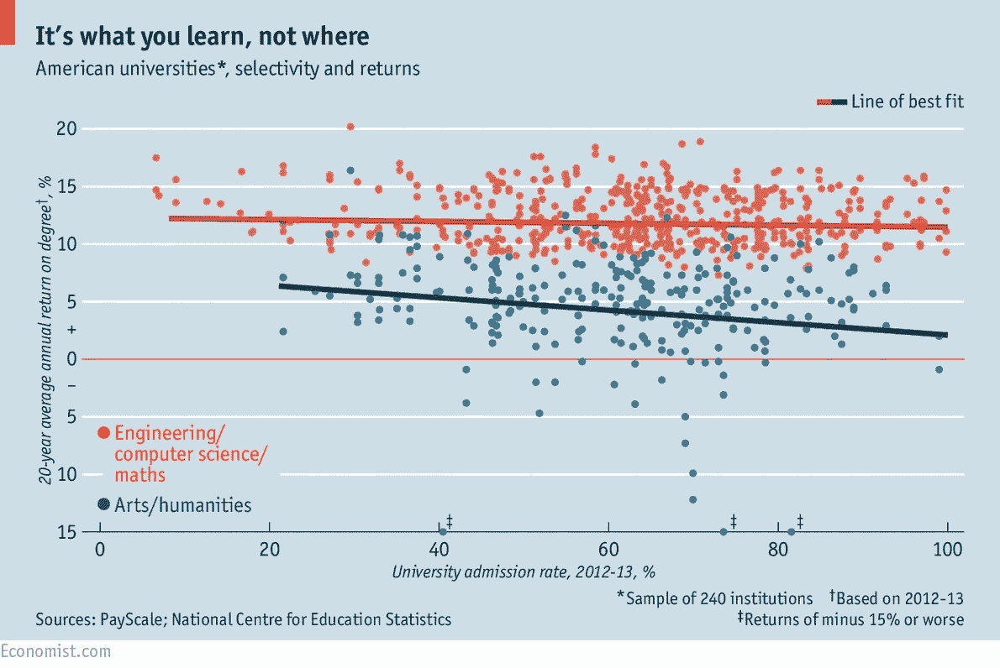
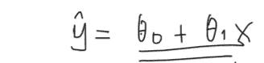
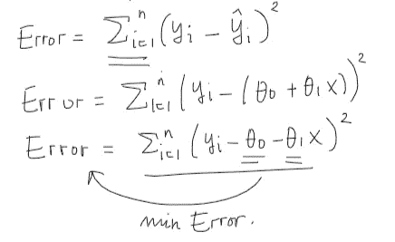
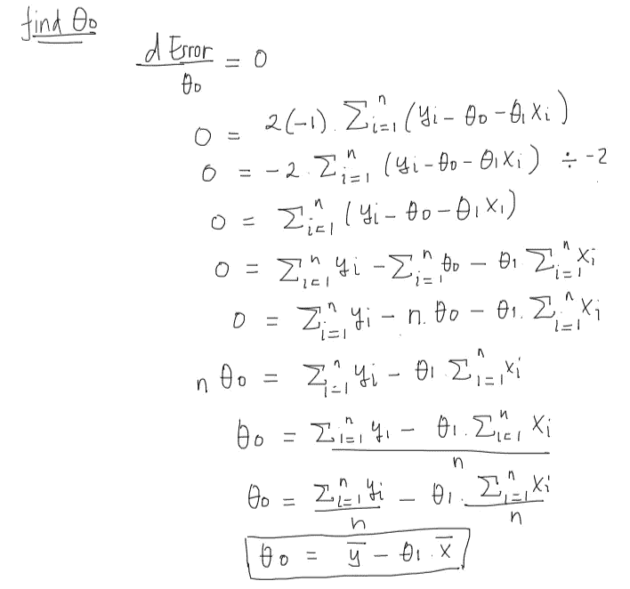
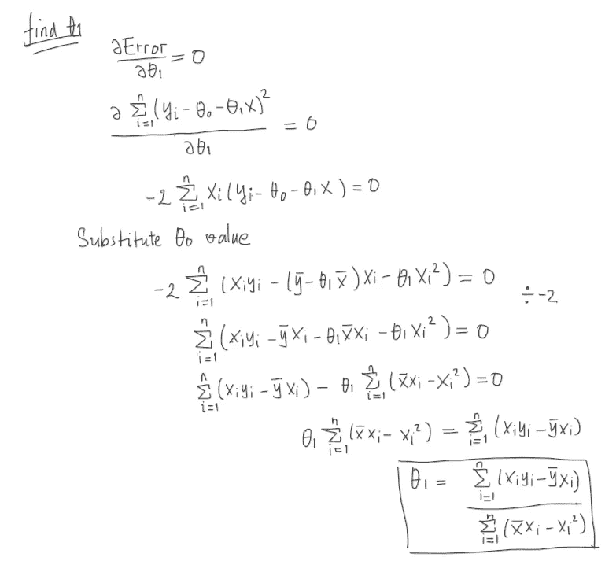
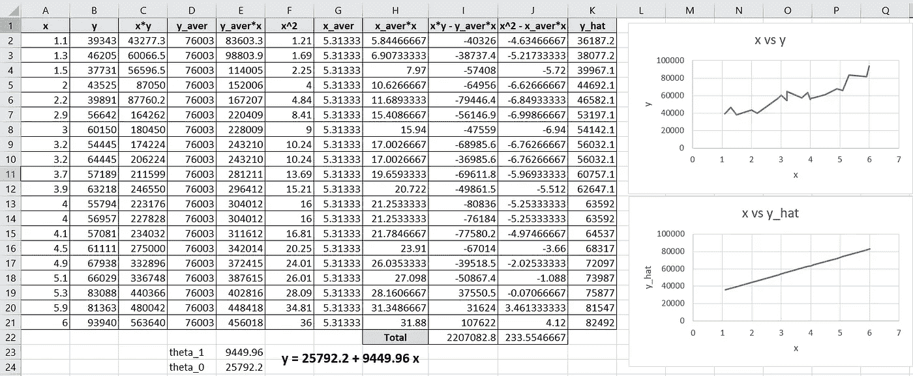

# 线性回归系数的推导

> 原文：<https://medium.com/codex/the-derivation-of-the-linear-regression-coefficient-c801771a9322?source=collection_archive---------3----------------------->

## [法典](http://medium.com/codex)

## 这篇文章的灵感来自我 8 年前做的物理实验室

我记忆最深的一门需要回归的大学科目是物理实验室。我记得我被要求进行数据采集，然后绘制散点图，其中 x 轴是我更改的输入变量，y 轴是输出变量。之后，实验室助理让我把数据收集的结果输入一个不知从何而来的公式，求线性方程 y = theta_0*x + theta_x 的 b 和 m 系数。

# **线性回归示例**

为了便于掌握回归概念，我将根据大学的录取率与学位的 20 年平均年回报率，举一个我在谷歌上找到的例子(我相信它来自《经济学人》)。

下图显示了红线和蓝线之间的差异，其中红线与蓝线相比非常平坦，随着大学录取率的增加，蓝线呈下降趋势。这些线代表回归过程的结果，这有助于我们理解在美国的好大学或坏大学学习几乎没有区别(通过比较大学录取率和获得学位所需的时间)

此外，我们可以看到，线条遵循橙色和蓝色点的扩散趋势。所以我们的目标是学习如何建立这些线。

美国大学录取率与学位 20 年平均年回报率的对比

# **线性回归推导**

理解了线性回归的概念将有助于我们推导出这个方程。它总是从线性回归是一个优化过程开始。在进行优化之前，我们首先需要有线性方程，其中 y_hat 通知我们这是线性回归过程的输出。

线性方程

在我们得到线性方程之后，我们需要确定我们需要通过改变θ_ 0 和θ_ 1 的参数值来最小化观察值与线性回归过程的输出之间的误差的目标函数:

误差方程是需要最小化的目标函数。

记住，当我们用θ_ 0 推导误差方程并将其结果设为零时，它将给出使误差最小/最大的θ_ 0 的最佳值。

因为我们得到了θ_ 0 值，我们将代入它以找到最佳的θ_ 1:

有了 theta_0 和 theta_1 方程，我们会用 Excel 找出那些值，从而给出更直观的解释:

Excel 上的线性回归计算

# 结论

如果你已经读到这部分的文章，恭喜你。如果你按照我的指导一步一步来，你会建立自己的线性回归模型。不得不承认，在 scikit-learn 库用 Python 进行的机器学习中，我们可以轻松做到这一点。尽管如此，我相信理解我们使用的库的基础数学也是很重要的。希望这篇文章能对你有所裨益。