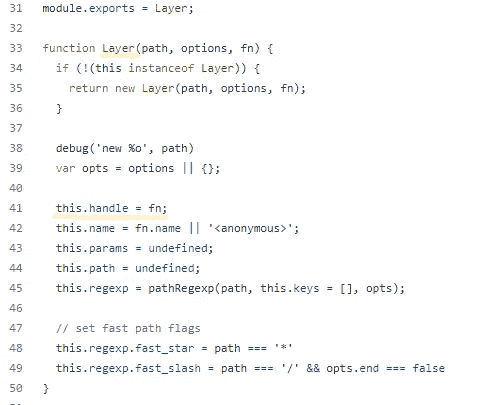

# Express 背后的设计

> 原文：<https://medium.com/codex/the-design-behind-express-b1da569c7e43?source=collection_archive---------8----------------------->

## 从设计角度看快速路由和中间件如何工作

每一个代码库，为了得到广泛的使用，都必须易于使用，并且在保持其健壮性和高度特性的同时，还可以扩展。

在本文中，我们将考察一个著名的库，以及他们如何通过开发设计好的代码来实现那些需求。我将带您了解流行的 NodeJS web 服务器、中间件和路由机制的设计和工作原理。


快速缩略图

首先，
如果您不熟悉 express，这是一个最小且灵活的 NodeJS web 应用程序框架，它为 web 和移动应用程序提供了一组健壮的特性。

如果您没有使用 express 的经验，并且想尝试一下，您可以从 express 项目生成器命令开始:

```
npx express-generator
```

该命令将生成一个 express web 应用程序的示例，如您在 *index.js* 页面上看到的那样，该示例包含一些路由和中间件。


3 快速样本索引. js

每个路由和中间件使用 *app.use* 命令注册，可以接收路径和处理函数。handle 函数有三个参数，请求、响应和下一个函数，我们可以看到，它们用于将请求转发到另一个路由或中间件来处理它。

快速路由机制基于四人组 23 设计模式之一。

如果你不熟悉设计模式，特别是四人组的设计模式，我将很快解释这一点。设计模式是软件设计中反复出现的问题的可重用解决方案。它不是一段完整的代码，而是一个帮助解决特定问题或一系列问题的模板。

四人组的作者 Erich Gamma、Richard Helm、Ralph Johnson 和 John Vlissides 在软件开发中提出了设计模式的概念。在他们的书中，他们提出了 23 种设计模式，其中一种是责任链，这种设计模式使快递路由以它的方式工作。

# 责任链


链式缩略图

责任链是四人帮书中的行为模式之一。

这种模式并不经常使用设计模式，但它在著名的 web 服务器库 Express 中占有很大的比重。

## **那么，这个模式的目标是什么:**

这种模式的主要目标是避免将请求的发送者耦合到接收者，同时给多个对象一个处理请求的机会。

这意味着该模式让您**沿着处理程序链传递请求。**当接收到一个请求时，每个处理程序决定要么处理该请求，要么将其传递给链中的下一个处理程序。

## 它看起来会像这样:


责任链 UML

## 工作原理:

现在让我们来看看这个模式的不同部分。

**Handler** :处理请求的接口。
**ConcreteHandler** :处理程序的实现，要么将请求转发给下一个处理程序，要么作为继任者并结束处理请求。
**客户端**:客户端是向处理程序发起请求的一方。


请求链场景

现在我们已经理解了责任链模式的目标和用途，让我们看看 express 是如何在其路由架构中实现它的。

Express library 是开源代码，这就是我们如何从它的代码中学习并了解它是如何工作的。

也可以看看 [express 源代码。](https://github.com/expressjs/express)



快速层

所以，具体的路由和中间件都是“层”。

正如我们所见，每一层都有路径、选项和功能。
同样，我们可以看到 handle 函数接收三个参数(请求、响应和下一个函数)。


快速层句柄

很容易看出，我们之前在创建层时应用的函数就是现在在 *handle_request* 中运行的函数。

但是我们如何准确地创建处理程序，
我们熟悉命令 *app .使用*来注册中间件或路由。

当返回源代码时，我们将看到这个 use 函数的实现，在这个函数的末尾，我们可以看到 Layer 对象的创建，以及将该对象插入到包含所有层的堆栈数组中。


快速使用功能

*我们将看到每个注册路由或中间件的函数都是一样的，比如路由函数。*

## 在浏览了路线注册代码流后，我们了解到:

我们的处理程序是层对象。
我们看到了 ConcreteHandler 对象的创建。
并将所有的 ConcreteHandler 对象存储在 stack 属性数组中。

创建处理程序是不够的，要看到链模式，我们需要查看我们设计中的“客户端”和链中的请求流。


快速处理功能

在 handle 函数中，我们可以看到所有参数的准备，甚至 CORS 飞行前流程的特殊处理选项请求，但我们关心的是最后对下一个函数的调用。


快速下一个功能

在下一个函数中，我们检查先前初始化的局部索引变量 *idx* index 是否不大于堆栈的长度，该索引是堆栈数组中当前层的索引。


快速下一个功能

在这里，我们看到了前面的*层. handle_request* 及其所有参数，这些参数激活了我们的路由代码。

所以现在你在问这个链是如何继续的， *handle_request* 获得了下一个函数参数，这个参数是之前的同一个下一个函数，带有当前路由的 *idx* 索引，现在如果 *handle_request* 层是一个后继层-ConcreteHandler，将不会使用这个下一个函数，因为这个路由是链的结束处理程序，但是如果这个路由调用了下一个函数， 我们将再次进入下一个函数， *idx* 索引将递增，并且 *handle_request* 将调用链中的下一个路由。

当然，这不是 express 中的所有代码，还有更多，比如在处理之前检查路由路径是否匹配。
如果我们深入观察，我们会发现层对象设计也是一种模板方法设计模式，在同一结构中注册和调用不同的功能。

# 我们总结一下:

快速路由使用责任链模式来实现中间件链处理功能。
通过这种实现方式，他们用这样一个简单的 API 实现了路由器的主要功能。

## 如果我们看看 express 中的模式部分:

**处理程序**是层对象

**具体处理程序**是我们的中间件和路由

****客户端**是启动处理程序链的调用执行流的处理函数**

****处理程序通过使用“next()”**函数调用下一个 ConcreteHandler 函数，继续处理链中的处理程序**

**希望这篇文章对你有所帮助，并且希望下次你使用一些库的时候，它能帮助你理解为什么工程师会这样设计代码。**

**感谢您的阅读。**