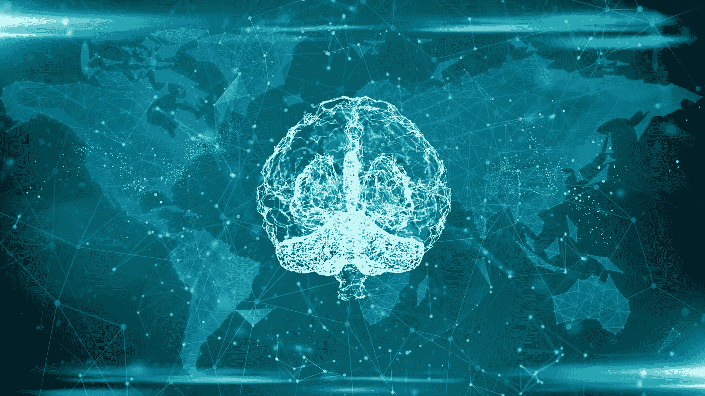

# 强人工智能和弱人工智能的区别

> 原文：<https://medium.com/codex/the-difference-between-a-strong-and-weak-artificial-intelligence-ai-d53bef333a83?source=collection_archive---------17----------------------->

## 你所熟悉的(AI)是“弱的”，但是许多人害怕的(AI)是“强的”。

图片:[https://wallpaper cave . com/super-artificial-intelligence-wallpapers # Google _ vignette](https://wallpapercave.com/super-artificial-intelligence-wallpapers#google_vignette)

抛出“人工智能”这样的术语很容易，但这并不一定意味着我们在谈论同样的事情。术语“**”涵盖了计算机科学的广泛领域。的…**