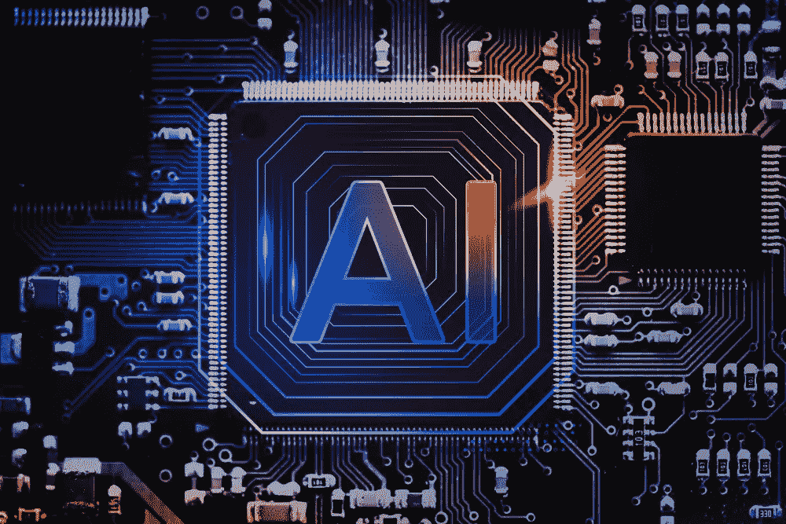

# 符号人工智能和连接人工智能的区别

> 原文：<https://medium.com/codex/the-difference-between-symbolic-ai-and-connectionist-ai-c6a2556f9847?source=collection_archive---------5----------------------->

人工智能发展

每当一件事物有两种分类时，人们不会等着选择哪一方，然后对两者进行比较。符号人工智能和连接人工智能等人工智能技术的情况也是如此。后者取得了成功并引起了媒体的关注，然而，理解符号人工智能和联结主义人工智能的意义是我们的责任。

实话说，这两套技术有自己的位置作为基座。没有哪种人工智能可以在任何地方使用。有各种各样的 [AI 开发](https://www.daffodilsw.com/ai-application-development-solutions)服务可用于各种用途和多种受众。每种人工智能技术都有自己的优点和缺点，然而，选择正确的东西是一项任务。

**什么是象征性人工智能？**

符号人工智能通常被称为基于规则的人工智能、老式人工智能(GOFA)和经典人工智能。早期的人工智能开发研究基于符号人工智能，它依赖于以计算机代码的形式插入人类行为和知识。

我们人类使用符号来驱动我们周围环境中的事物和事件的意义。例如，想象你告诉你的朋友给你买一瓶可乐。你的朋友首先会在脑海中想象一瓶可乐。这正是符号化人工智能发展背后的理念，即这些符号成为认知的基石。

任何用符号化人工智能制作的应用程序都有一个字符组合，通过一系列符号来表示现实世界的概念或实体。这些符号可以很容易地通过网络和列表进行排列或分层排列。这种排列告诉人工智能算法每个符号在整体上是如何相互关联的。

符号人工智能中的信息是通过一种叫做专家系统的东西来处理的。这是 if/then 配对将算法引导到它可以运行的参数的地方。这些专家系统是人造的知识库。推理机是一个术语，指的是引用知识库并选择应用于给定符号的规则的组件。

**符号 AI 的利弊**

符号人工智能非常适合基于清晰规则和目标的应用程序。如果你想让这个人工智能在象棋比赛中击败人类，那么我们需要教会算法象棋的细节。这个框架就像一个帮助它正常运行的边界。

当需要遇到变化时，象征性的人工智能是不够的。以机器视觉为例，机器视觉可以从所有可能的角度观察产品。为所有可能的组合创建规则将是乏味且耗时的。现实世界包含大量的数据和无数的变化。在给定的环境中，很难预料到所有可能的变化。

**什么是连接主义 AI？**

几十年来，早期的专家一直关注符号型人工智能，然而，现在连接主义人工智能更受欢迎。这种人工智能是基于人类大脑的功能及其神经互联。这种人工智能软件开发技术有时也被称为感知器，以表示单个神经元。

随着我们不断输入数据，学习与环境和自身相关的模式和关系，用连接主义人工智能构建的应用程序往往会变得更加智能。另一方面，象征性的人工智能被手工编码。为了理解连接主义人工智能，让我们以人工神经网络为例。每一个都是由数百个单一的单元处理元件和人工神经元组成的。它们是一种分层格式，权重形成与该结构的连接，其中权重是可调整的参数。

在连接主义人工智能中，所有的处理单元都有加权单元、输出和传递函数。但是，请记住，传递函数会评估多个输入，然后将它们组合成一个输出值。算法中的每个权重有效地评估方向性和重要性，最终加权和是激活神经元的分量。当所有工作完成后，激活的信号通过传递函数并产生一个输出。

**联结主义者艾的利弊**

当你有高质量的训练数据时，Connectionist AI 是一个很好的选择。即使这个人工智能模型随着数据的输入变得更加智能，它仍然需要准确信息的支持来启动整个学习过程。连接主义者 AI 在医疗保健行业相当有名。当有大量医学图像需要人工验证其正确性并为上下文分配注释时，这种方法最常用。

尽管有这么多优点，这个人工智能经常无法解释它是如何得出一个解决方案的。因此，建议不要选择该人工智能作为主要或唯一的选择，因为其得出的结论无法解释，并且需要第三方的帮助。比如用连接主义的 AI 来决定一个人是不是杀人犯。人们必然会认为依赖人工智能是不公正和残忍的，这并不能解释它是如何得出这样的结论的。

**结论**

随着人工智能软件开发被广泛使用和接受，它现在变得比以前更加主流。然而，这篇文章展示了为什么理解这些人工智能如何操作并为它们选择正确的人工智能是重要的。