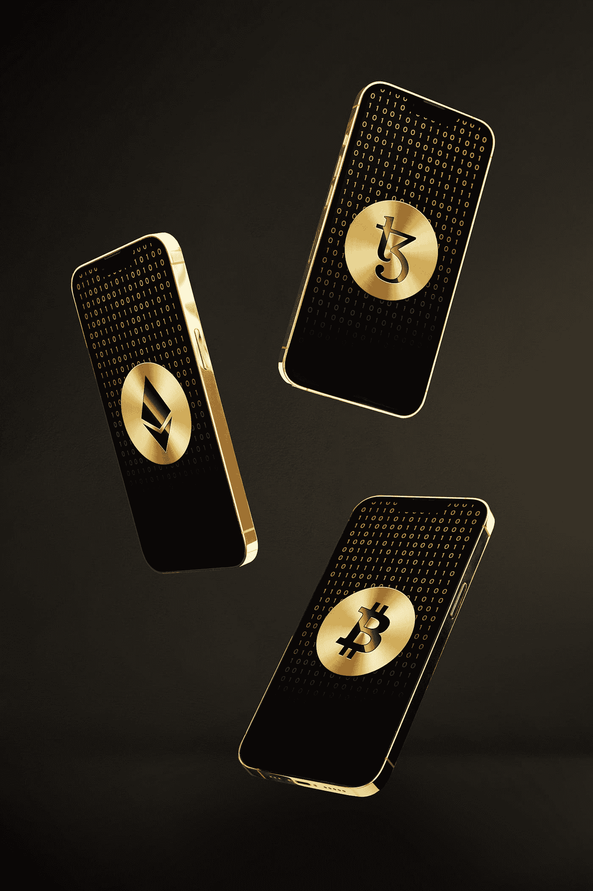

# 加密货币的硬件钱包和软件钱包的区别。

> 原文：<https://medium.com/codex/the-differences-between-a-hardware-wallet-and-a-software-wallet-for-cryptocurrencies-be9ea26fa36f?source=collection_archive---------14----------------------->

## **软件与硬件钱包**

由[伊森·鲁贡](https://unsplash.com/@ethanethan?utm_source=medium&utm_medium=referral)在 [Unsplash](https://unsplash.com?utm_source=medium&utm_medium=referral) 上拍摄的照片

人们可能偶尔会想，他们应该得到什么样的加密货币钱包。说到加密货币钱包，这是一个值得讨论的话题。考虑账户安全、交易速度和钱包提供商的信誉是至关重要的。

考虑你正在进入区块链和加密货币生态系统。简要解释什么是加密货币和加密钱包将是有益的。

照片由[贝南·诺鲁齐](https://unsplash.com/@behy_studio?utm_source=medium&utm_medium=referral)在 [Unsplash](https://unsplash.com?utm_source=medium&utm_medium=referral) 上拍摄

加密货币是一种数字货币或支付债务、交换产品和服务等的手段。，它使用分布式分类帐和安全加密；一个区块链网络。

加密货币钱包是一种用于接受、发送、存储和保护硬币的软件或硬件。具有快速交易时间的安全加密货币钱包是理想的。你可以收到钱，发送钱，用钱购买产品和服务，或者把钱存入加密货币钱包。与你的银行账户相比，加密钱包在很大程度上是分散的，或者至少提供分散的服务，允许你充当你的银行。

您可以将所有资金存放在加密货币钱包中，进行交易，收款，汇款，或将一种加密货币兑换为另一种加密货币，而无需第三方的参与或中央机构的批准。

选择加密钱包时，安全是最重要的。然而，在选择加密钱包时，还有其他一些事情需要考虑。我建议每个人都知道创建加密货币钱包的正确程序。如何正确创建加密钱包？

由 [Max Saeling](https://unsplash.com/@maxsaeling?utm_source=medium&utm_medium=referral) 在 [Unsplash](https://unsplash.com?utm_source=medium&utm_medium=referral) 上拍照

**什么是硬件钱包，硬件钱包是如何工作的？**

硬件钱包是为接收和存储数字货币、资产和密钥而创建的物理项目/设备。

它们能让你在口袋里或脖子上携带大量现金。想象一下，在你的口袋或衣柜里有一个保险箱或银行。硬件加密货币钱包有各种各样的制造商。

硬件钱包离线保存私钥，只有在小设备的小屏幕上设置时才显示密码短语。这为金钱提供了额外的保障。可以指定硬件只接受未签名的事务并返回签名的事务。

因为私钥从不离开钱包，因此不会被泄露。实体钱包需要私钥产生的数字签名来完成交易。与计算机和移动设备中的软件钱包不同，硬件钱包不会受到攻击或利用，因为它被设置为接受特定数据而不连接到互联网。

布莱恩·特罗姆普在 [Unsplash](https://unsplash.com?utm_source=medium&utm_medium=referral) 上拍摄的照片

**什么是软件钱包，软件钱包是如何工作的？**

软件钱包是设计用于接收、保存和转移加密货币资产的软件。它还使私钥能够在交易完成后对交易进行签名。

通过桌面或移动应用软件钱包转移加密货币简单快捷。

当你登录一个软件钱包时，系统会提示你创建一个 pin 码来使用该程序或应用程序——无论是桌面还是移动软件钱包，都提供了访问每个加密货币钱包的短语。恢复短语或密钥可能被视为存储在加密钱包中的所有私钥的主密钥。

硬件加密钱包还是软件加密钱包？

我们已经回顾了加密货币和加密钱包的定义。你应该得到什么和为什么得到它将取决于硬件钱包和软件加密钱包之间的异同。

一个比较将帮助你理解两个钱包如何更好地运作，一个对比将向你展示不同之处。

**软件钱包和硬件钱包之间的典型是什么？**

1)它们都包括公钥和私钥。

2)当两个钱包都启动或初始设置时，他们会提供一个种子短语(助记短语)。助记短语可以是十二(12)、十八(18)或二十四(24)个单词的恢复短语。

3)它们为钱包的资产提供了良好的保护。

4)如果您还在某处记下了恢复短语，您可以从钱包中恢复您的加密货币。

杰里米·贝赞格在 [Unsplash](https://unsplash.com?utm_source=medium&utm_medium=referral) 上的照片

**软件钱包和硬件钱包的区别**

**软件钱包**

它是一个被设计来执行其功能的软件。

您的数据(包括私钥和投资组合)存储在您的计算机上。

您可以轻松访问软件钱包，并使用该软件执行任何交易。

虽然软件钱包可能是安全的，但由于它仍然与互联网有一定的连接，因此钱包存在潜在的风险，因为它可能会受到攻击。

由于经常对软件或应用程序进行升级和修补，因此有可能缺乏稳定性。

它们可能被用来存储大量的加密货币。

大多数软件钱包都是免费的；有些提供高级版本，根据您存储的加密货币数量享受更多优惠。这种高级版本的付款通常是在订阅中。

**硬件钱包**

它是一种用于存储加密货币的物理设备。

您的私钥和加密货币是离线存储的(远离互联网)。

与软件钱包不同，可访问性的模式是刚性的。它主要用于需要长期存储加密货币的情况。

由于硬件钱包的极简设计和对硬件钱包的受控或无在线访问，它为存储在钱包中的加密货币提供了下一级安全性。

硬件为加密资产和访问模式提供了极好的稳定性。

硬件钱包或冷钱包可以容纳更多的加密货币。

大多数硬件钱包的价格都在 100 美元及以上。

在使用区块链和加密货币时，加密钱包对生态系统至关重要。它们支持货币的运输、储存和转移。由于访问资金和资产非常简单，大多数经常交易和使用加密资产的人都使用软件钱包。

硬件钱包也适合这个生态系统。此外，由于它能够在一个安全的地点持有更多重要资产，因此需求很大。此外，有一个很好的理由购买一个。在管理大量资产时，安全性是首要任务，而硬件钱包可以满足您的需求，这也解释了为什么对钱包有如此多的需求。

然而，大多数软件钱包提供商也保证足够的安全性和控制。开始使用加密货币和 NFT 的一个好方法是同时拥有软件和硬件钱包。

请跟随我的媒体频道，并通过媒体订阅我的电子邮件列表，以保持对我未来所有文章的关注。

更多来自我；

 [## 为什么区块链技术对您和您的企业很重要(如果您有)。

### 区块链技术对个人和企业是否至关重要？

medium.com](/codex/why-blockchain-technology-is-important-for-you-and-your-business-if-you-have-one-770ea1b4643f)  [## 什么是区块链技术？

### 区块链科技:区块链技术 101 你需要知道的一切

medium.com](/@princesamuelaadeyemo/what-is-blockchain-technology-560db5c3d8cf) 

你可以看看我的网页来了解更多；请不要忘记关注我的媒体渠道，订阅我的电子邮件列表。谢谢你。