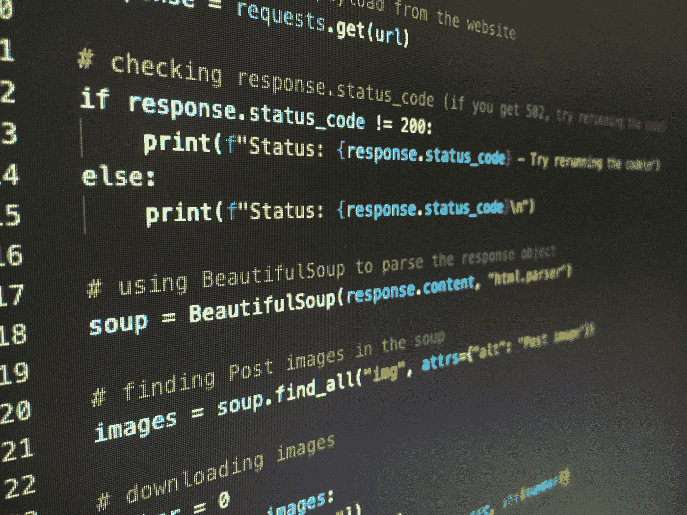

# Python 2 和 Python 3 的区别

> 原文：<https://medium.com/codex/the-differences-between-python-2-and-python-3-af674cdab09f?source=collection_archive---------14----------------------->

如果你还在犹豫是学习 Python 3 还是坚持使用 Python 2，这里有一个关于两者区别的快速指南。在本文中，我们将研究字符编码、库和语法。然后，我们将触及字符编码和 Python 2 的未来。一些公司仍然在使用 Python 2，如果您正在迁移到该语言的最新版本，它仍然是一个不错的选择。

Artturi Jalli 在 [Unsplash](https://unsplash.com?utm_source=medium&utm_medium=referral) 上拍摄的照片