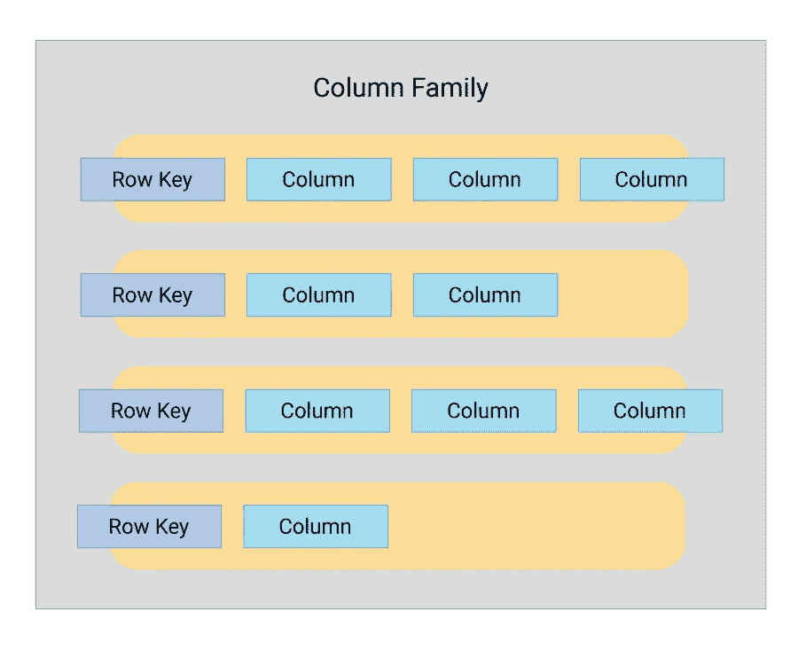

# 不同类型的 NoSQL 数据库

> 原文：<https://medium.com/codex/the-different-types-of-nosql-databases-82a0c254b974?source=collection_archive---------9----------------------->

## 不同的数据库适合不同的项目。明智地选择。


照片由[法比奥](https://unsplash.com/@fabioha?utm_source=unsplash&utm_medium=referral&utm_content=creditCopyText)在 [Unsplash](https://unsplash.com/s/photos/data?utm_source=unsplash&utm_medium=referral&utm_content=creditCopyText) 上拍摄

传统的关系数据库已经存在很长时间了。最初，它是由 [Edgar Codd](https://en.wikipedia.org/wiki/Edgar_F._Codd) 在 1970 年开发的，并获得了广泛的应用。如今，RDBMS 是我们数据库日常生活中至关重要的一部分。

互联网和分布式计算的爆炸性发展使 RDBMS 面临挑战，因为它不再适用。这些新系统要求数据存储速度快，能够存储大量数据，水平扩展，并使模式更改更快、更容易。因此，一个新的数据库家族诞生了，叫做 NoSQL 数据库。NoSQL 数据库的主要好处是它们可以处理非结构化数据，如文件、电子邮件、社交网络等

由于上述优势，谷歌、亚马逊、易贝等公司将大部分工作负载迁移到了 NoSQL 数据库。

NoSQL 服务器可以存储和检索不同格式的数据。有不同的方法对 NoSQL 数据库进行分类。最常用的分类是由 Ben Scofield 在 2010 年 Codemash 会议上介绍的。他提出了如下类别:

# 键值存储

数据存储为成对的键和值。这种数据结构也称为“哈希表”。在键-值数据库中，每个数据都是根据它的键来检索的，并且每个键在数据集中只能出现一次，因此键是数据的唯一标识。


键值存储中的存储示例。来源:[维基百科](https://en.wikipedia.org/wiki/Key%E2%80%93value_database#/media/File:KeyValue.PNG)

由于实施简单，这些系统通常是最快的，并且可以轻松扩展。
此类数据库的示例:Memcached、Redis、Amazon DynamoDB、RocksDB、Berkeley DB、Oracle NoSQL 数据库

# 专栏-家庭商店

列族存储与键值存储非常相似。在列族存储中，数据以一种方式组织，即行有一个唯一的标识符(键)，属于一行的有一个或多个列。列族存储可以支持由数千列组成的非常宽的行。这些行被组合成一个列族，类似于一个表。



卡珊德拉的数据模型。来源: [ScyllaDB 文档](https://www.scylladb.com/glossary/cassandra-column-family/)

由于它们与键值存储相似，所以它们具有高度的可伸缩性，并且根据实现的不同，可以支持非常宽的行。此类数据库的例子:Google Bigtable、Amazon Redshift、Apache HBase、Hypertable、Cassandra、ScyllaDB、Clickhouse 等

# 图形数据库

当数据可以表示为具有互连元素的图形时，可以使用图形数据库。图形数据库将数据存储在图形结构中，由节点、属性和图形边表示。
在图形数据库中，**节点**代表实体，**属性**代表实体的信息，**边**描述实体之间的关系。图形数据库是社交网络图、道路网络表示和路线规划的良好匹配。


来源:[维基百科](https://en.wikipedia.org/wiki/Graph_database)

由于复杂性，图数据库的可伸缩性在不同的实现之间有所不同。
这种数据库的示例列表有:Neo4j、Amazon Neptune

# 面向文档的数据库

文档存储在所谓的文档中表示数据。文档是一种半结构化数据。文档是自描述的，所以在大多数情况下，数据库不使用预设的模式，每个文档都包含文档中单独的键/值对。文档的实现因技术而异，例如:JSON、XML、YAML。文档数据库通常提供额外的功能，例如存储列表、指针和嵌套文档。文档由唯一的键引用，该键通常是字符串、URI 或路径。


面向文档的存储结构

这种数据库的例子有 MongoDB、Amazon DocumentDB、CouchDB、ElasticSearch

正如我们所看到的，根据我们计划存储的数据，有许多不同的 NoSQL 数据库可用。即使在这些类别中，各个数据库也提供不同的功能、不同的优势和局限性。此外，每个类别中还存在许多其他数据库，它们在该类别中的不同领域都有专长，因此为项目选择数据库是一项复杂的任务，需要时间和精力。

# 资源

*   键值数据库:[https://en.wikipedia.org/wiki/Key%E2%80%93value_database](https://en.wikipedia.org/wiki/Key%E2%80%93value_database)
*   列族数据库:[https://en.wikipedia.org/wiki/Column-oriented_DBMS](https://en.wikipedia.org/wiki/Column-oriented_DBMS)
*   图形数据库:[https://en.wikipedia.org/wiki/Graph_database](https://en.wikipedia.org/wiki/Graph_database)
*   面向文档的数据库:[https://en.wikipedia.org/wiki/Document-oriented_database](https://en.wikipedia.org/wiki/Document-oriented_database)
*   Ben Scofield 的介绍:[https://www . slide share . net/bsco field/no SQL-death-to-relational-databases](https://www.slideshare.net/bscofield/nosql-death-to-relational-databases)

```
If you would like to see more content around databases and different database technologies, don’t forget to [subscribe](/@jantoku) to my publications!
```