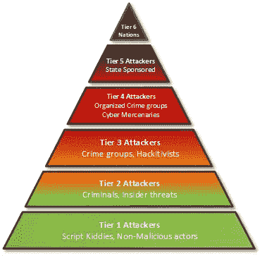

# 不同类型的威胁行为者及其动机

> 原文：<https://medium.com/codex/the-different-types-of-threat-actors-ce04852599e2?source=collection_archive---------13----------------------->

在网络安全领域，众所周知，威胁行为者通常是那些试图破坏系统以获取金钱、政治或个人利益的人。

然而，这些个人或实体可以有不同的形状和大小。从利用先进方法入侵国家系统的最老练、资金充足的对手，到使用众所周知的技术来利用易受攻击的个人的新手，在谁试图危害系统以及这样做的目的方面可能有很大的差异。

让我们使用威胁参与者类别的金字塔模型，深入探讨这些不同类型的威胁参与者。注意，这种表示是一般化的。这条规则会有例外。来自第六层的一些威胁角色可能使用第二层战术等等，但是特征描述应该大致准确。

威胁因素分类的金字塔模型，来源:[https://www . telenor . com/security-architecture-design-phase-the-concept-of-a-Threat-intelligence-driven-defendable-architecture/](https://www.telenor.com/security-architecture-design-phase-the-concept-of-a-threat-intelligence-driven-defendable-architecture/)

**威胁行动者的类别**

**第六级**

**APTs** (高级持续性威胁)就属于这一类。资金充足的民族国家威胁行为者寻求泄露国家安全级别的信息并获得经济优势。这一层中的威胁参与者由于拥有大量资源和专业技术知识，会主动**制造**漏洞。这些对手通常使用鱼叉捕鱼，因为他们拥有资金来坚持特定的目标，并试图提取尽可能多的有价值的信息。这些威胁行为者采用的**TTP**(战术、技术和程序)可能因文化、经济和地理等不同因素而异。例如，俄罗斯可以被视为第六级威胁行为者，可能会选择秘密攻击，这使得很难追踪到他们的行动。另一方面，另一个国家可能使用更具侵略性和暴露的方法来提取有价值的信息并获得经济优势。

**第五层**

在第五层，与第六层相比，在经济资源和规模上有明显的差异。因此，攻击可能不那么复杂，意识形态动机也是可能的。例如，由于一部涉及朝鲜领导人金正恩的电影上映，可能来自朝鲜的黑客泄露了索尼影业员工的机密数据。目标通常包括研究和技术。他们也可能针对持不同政见者(反对官方政策的人)。这方面的一个例子是伊朗利用网络攻击来阻止可能试图在政治上破坏政府的个人的行动。

**第四级**

在第四级，威胁行为者变得越来越多。因此，正确确定特定攻击的原因变得更加困难。这一层中的一些对手可能与 apt 有联系。例如，FancyBear 是一个俄罗斯网络间谍组织，其目标不一定是金钱。相反，他们在寻找国家安全信息，CrowdStrike 以中等信心确定该组织与 GRU(俄罗斯军事情报局)有关。这些团体往往在法律和政治上与同他们有联系的实体保持一定距离，以掩盖攻击的主要来源。

黑客团队和有组织犯罪也属于这一类。他们可以被视为网络雇佣军，只要他们能够逃脱不被起诉，他们就会使用非法手段追求金钱收益。

在这一级别，威胁参与者主动**发现**漏洞(零天)。他们资源相当丰富。大多数攻击都是通过互联网进行的，其中一些方法包括使用后门、加密破解和高级恶意软件。

**三级**

犯罪集团与有组织犯罪相似，追求金钱利益。巴西的犯罪集团就是一个例子。虽然从技术角度来看执行可能会很草率，但社交媒体/社交工程的应用经常会导致信用卡被盗和公司的金钱损失。

黑客行动主义者也属于这一类。与犯罪集团相比，他们不一定有等级结构。匿名就是一个例子。黑客行动主义者对金钱利益不感兴趣。目的是玷污一个政治人物或一个组织的声誉。由于他们的分散组织，他们可能更难跟踪。黑客行动主义者对对他们来说重要的事情直言不讳。在部署这些攻击时，他们可以使用原始工具和已知的漏洞。

**第二层**

在第二层，攻击变得不那么激烈。每个目标的货币收益也较少。然而，威胁行为者的数量也在增加。罪犯属于这一类别，心怀不满的员工也属于这一类别，他们可能已经拥有敏感信息或特权，可能会造成重大损失，因此被视为**内部威胁**。这些攻击的目标通常是小型企业或个人。流行的攻击方法可能包括 **DDOS** (分布式拒绝服务)和僵尸程序。

**一级**

脚本小子就属于这一类。他们会寻找任何可以进入的地方(公司、大学系统等)。通常，他们不具备攻击更复杂目标的工具或专业水平。常用的方法可能包括网络钓鱼、病毒和 DNS 攻击。

非恶意行为者通常对他们能做什么感兴趣，并可能试图渗透到系统中以测试他们的渗透测试技能。如果他们进入，他们甚至可能会透露有关事件的信息，以帮助另一方修复漏洞。

如前所述，这一层的技术能力和持久性会降低。然而，威胁行为者的数量大幅增加。危害尝试通常包括已知的利用和常见的漏洞。

**总结**

威胁者有各种形状和大小。毕竟，他们是拥有不同动机、背景和技能的人。因此，当各种威胁出现时，我们应该随时做好准备。等级系统可以是导航不同类型对手的有用工具。然而，它应该更多地用作指导工具，而不是精确确定的东西。在针对这些威胁制定策略时，考虑什么是最危险的威胁和最有可能的威胁也是至关重要的。虽然最有可能的威胁更便宜且更容易防御，而最危险的威胁更昂贵且不太可能发生，但在做出这些决定时，应始终考虑到**风险**可能引发的损害程度。

*“知己知彼，百战不殆。”——****《孙子兵法》***