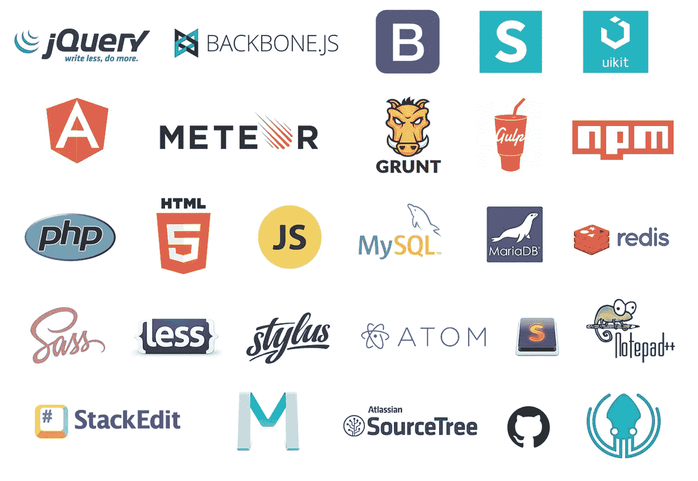
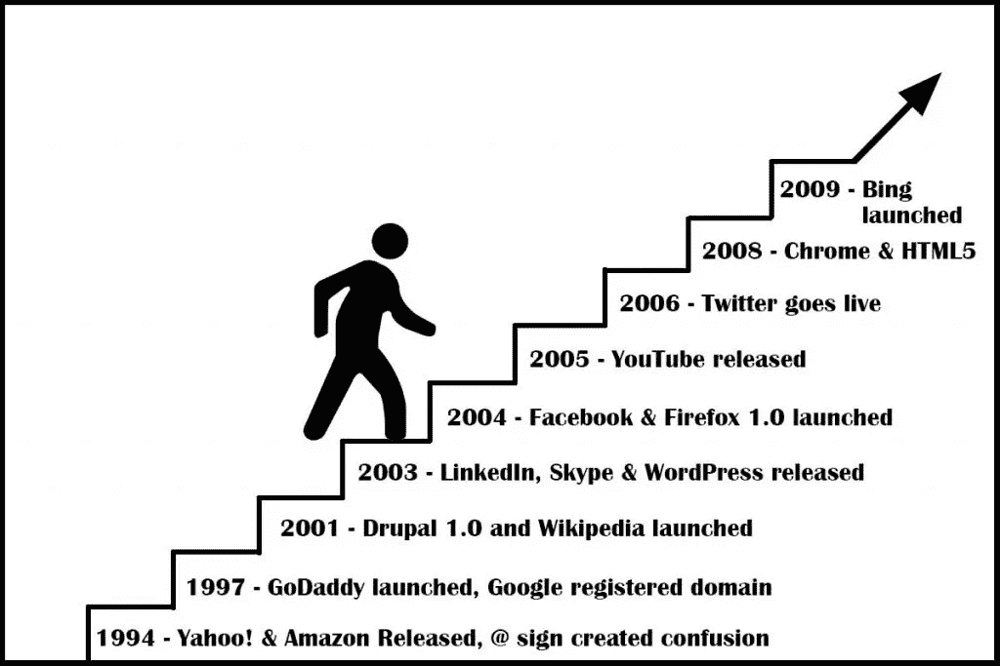
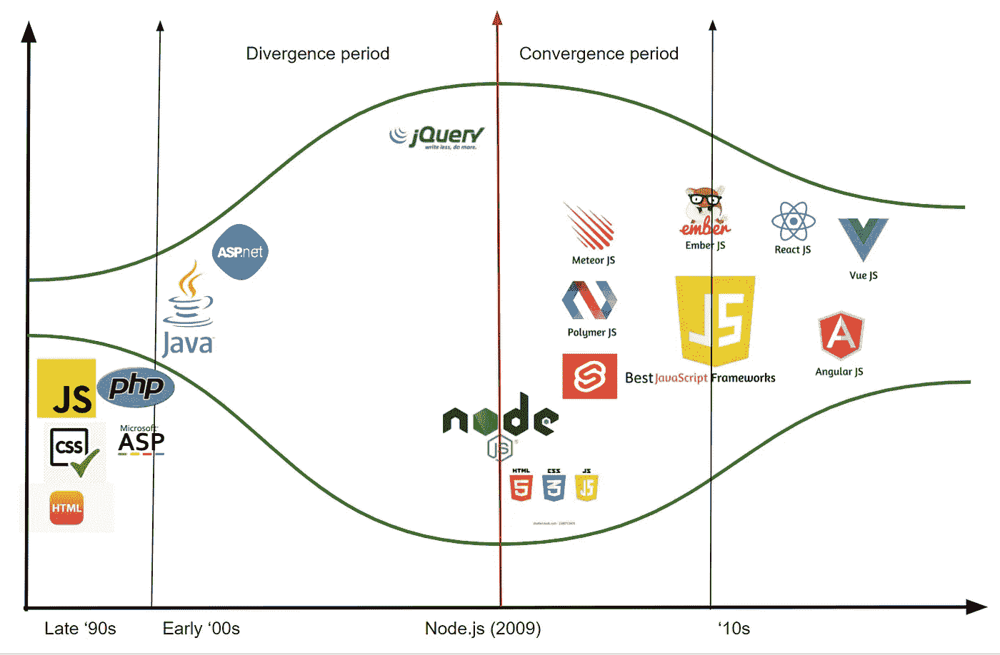

# 数字勘探

> 原文：<https://medium.com/codex/the-digital-prospecting-2f7bfb98dcac?source=collection_archive---------12----------------------->

## 框架战争

## …或者为什么我的框架比你的框架好！

[https://extrafabulouscomics.com/](https://extrafabulouscomics.com/)

这些天来(或者在过去的 5-6 年里)，我们见证了过多的新库/框架，尤其是在前端(JavaScript)领域。作为一个从 90 年代中期就参与 web 开发的人，我可以直接告诉你，这太多了。可怜的 FE 开发人员看不到众所周知的“树中之林”(框架、库等)。

## (数字)勘探

根据[维基百科](https://en.wikipedia.org/wiki/Prospecting)的定义，“探矿是对一个地区进行地质分析的第一阶段。它是寻找矿物、化石、贵金属或矿物标本。它也被称为 fossicking。传统的勘探依赖于对岩石露头或沉积物中矿化的直接观察

所以[“淘金热期间，卖掉铲子”](https://news.ycombinator.com/item?id=19018438#:~:text=So%20the%20saying%20%22during%20a,because%20you%20will%20probably%20fail.)这句谚语是一个比喻，暗示当你意识到淘金热正在发生时，不要试图成为第 100 万个淘金者，因为你很可能会失败。取而代之的是出售数百万采金者都需要的东西，比如铲子，然后通过卖给勘探者而致富。

> 数字潜在客户只是最新的“淘金热”，而“挖土机”是围绕它涌现的各种“行业”——承诺过多和交付不足的框架、拥有各种技术堆栈的课程、面试准备工具包等。一句话——在这个领域，开发者变成了消费者。

来源:[https://hacker noon . com/67-useful-tools-libraries-and-resources-for-saving-your-time-as-a-web-developer-7d3fb 8667030](https://hackernoon.com/67-useful-tools-libraries-and-resources-for-saving-your-time-as-a-web-developer-7d3fb8667030)

人们不禁会注意到，这里的真正目的不是创建一些帮助开发人员的东西——尽管其中一些非常有用，而是制造宣传，并激励群体(开发人员)采用最新/最棒/最新的框架/库。一旦炒作/时尚过去——这是不可避免的——使用这样的工具开发的项目将不可避免地陷入开发它们的版本中:或者，如果一个人愿意投入同样多的时间/精力来跟上，那么最终他们可以昂首阔步地前进。

如果就其本身而言，这些工具中的每一个本质上都不是坏的——相反，每一个都服务于一个特定的目的，或多或少都取得了成功。这里的问题是他们的数量。如果一个人不密切关注，他们可以卡住，很快，很容易。

## 如何不被烧伤

*   无论你能做什么，都要使用现成的核心语言特性。那里有大量的资源(对于 JS 开发者来说— [MDN](https://developer.mozilla.org/en-US/) 、 [Javascript.info](https://javascript.info/) 、[核心语言概念](http://dmitrysoshnikov.com/ecmascript/javascript-the-core-2nd-edition/)等等)。).如果没有任何框架/库，你会惊讶地发现可以完成多少工作。此外，核心语言倾向于以较慢的速度开发，并且对向后兼容性更加小心。
*   认识到你试图解决的问题。不是每个问题都需要锤子(即成熟的库/框架)
*   请特别关注其中一些社区。如果这个社区是活跃的，并且他们描述的东西还没有成型，你可能最终会信任他们。这并不意味着他们不能突然来一个意想不到的 180 度大转弯，这会让你的项目陷入困境。
*   有一个应急计划:做好升级可能出错的准备，你要么等待修复，要么自己修复。

## 网络发展简史

作为一个几乎从一开始就参与 web 开发的人，我目睹了它的所有发展阶段:

*   整体阶段(Monolithic phase)——90 年代中后期:一个开发人员可以简单且几乎毫不费力地构建一个完整的网站，从 db 表格到 css 样式，以及介于两者之间的所有内容。Dev 那时最好的朋友是 ftp 客户端(FileZilla，有人吗？).
*   **编译代码**—90 年代末-00 年代初:有 Java 和 advents。Net 中，代码编译成为时尚。一切都必须被预编译，被部署。
*   **库**—00 年代中期:(jQuery，Firebug，httpRequest 等。).就在那个时候，web 开发进入了它的**分化**阶段。
*   **框架/库/微服务**——' 10s:html 5、CSS3、响应式网页设计、Backbone.js、AngularJS、ReactJS、Vue.js 等。

随着 Node.js (2009)的引入，web 开发空间再次开始**趋同**。Node.js 承诺 js 可以在服务器和客户端上运行，从而消除了对服务器端语言的需求。

这里有一段简短的网络发展历史，按时间顺序排列。在很大程度上，它读起来就像墓地里的墓碑:

 [## 网络的时间线

### 杨致远和大卫费罗创建他们的在线目录，杰里和大卫的万维网指南，在短短几…

thehistoryoftheweb.com](https://thehistoryoftheweb.com/timeline/?date_from=all) 

这里不是结论，而是一个通过使用核心编程语言特性(这里是 JS)可以完成什么的例子:

 [## lucia-gm/note-app

### 一个使用普通 JavaScript 的最小笔记应用程序。

github.com](https://github.com/lucia-gm/note-app) 

**资源**:

*   https://thehistoryoftheweb.com/timeline/?date_from=all
*   【https://www.intlum.com/blog/web-development-history/ 
*   https://dev Dojo . com/tnylea/a-brief-history-of-web-development

照片由[沙哈达特·拉赫曼](https://unsplash.com/@hishahadat?utm_source=medium&utm_medium=referral)在 [Unsplash](https://unsplash.com?utm_source=medium&utm_medium=referral) 上拍摄