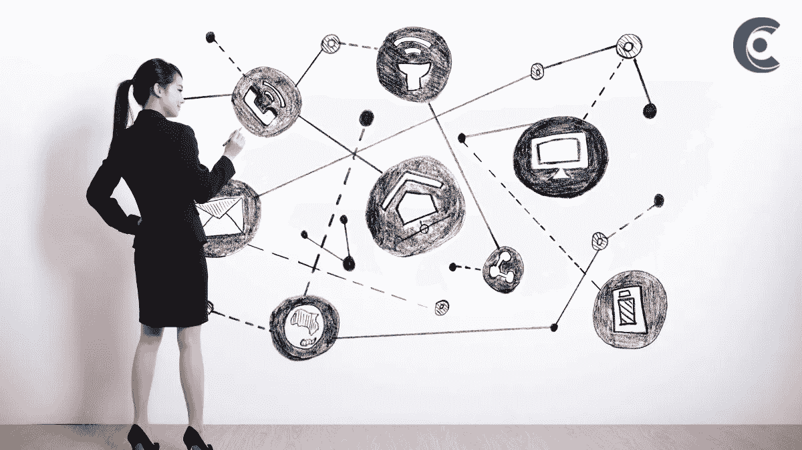

# 困境:云计算还是边缘计算？

> 原文：<https://medium.com/codex/the-dilemma-cloud-computing-or-edge-computing-7cedd48e1ccc?source=collection_archive---------37----------------------->

传感器、控制器、网关、MQTT、AMQP……所有这些时髦词汇都欢迎你来到物联网的“互联”世界及其不可分割的伙伴，[云计算](https://coreviewsystems.com/a-definitive-guide-to-scalability-and-elasticity-in-cloud-computing/)！作为系统核心的传感器性能不佳，它们不知道围绕着它们努力进行的测量而构建的错综复杂的蛛网，这是生物心跳的同义词！

传感器发出测量值，附近的“智能”设备捕捉这些测量值，并将其重新发送到云中更大的系统。云收集数据，各种服务将数据转化为有意义的信息。这种典型的物联网工作流有其自身的副作用——数据爆炸和计算密集型应用！

然而，物联网正在演变成更成熟的设计模式……“边缘计算”就是这样一种模式，它试图在设备上或设备附近执行一些计算。优点呢？带宽、存储空间和计算能力都保存在云中。它本质上是将一些“处理智能”转移到设备上。

嗯，到目前为止一切顺利！边缘计算正在消除云计算的作用吗？不会吧！有些情况下，边缘计算是有益的，有些情况下，云计算是可行的…

通常，设备会发送类似的测量值，其中偶尔会出现尖峰或异常。99%的时间处理类似的消息是浪费资源。在边缘计算中，当消息在正常范围内时，会在设备本身或附近的控制器上汇总/聚合消息。汇总数据以较低的频率发送到云，但是如果数据显示有异常，就会立即发送到云。如果数据是二进制形式(音频、视频或图像)，这尤其有助于节省资源。

实时的现场操作或通知是边缘计算完美解决的另一个问题。假设您有一个监控摄像头的系统，如果有任何入侵，它会发出警报。这最好在内部控制器上处理，而不是将图像传输到云，然后由云发出通知。

数据隐私问题也在边缘计算中找到了解决方案。担心患者数据隐私的医院可以从基于边缘计算的设计中受益。

另一方面，当数据处理需要大量“弹性”即自动扩展计算能力时，云计算占据上风，也可以作为数据的永久家园。对于冷路径数据分析来说，没有什么可以替代云计算—分析去年的趋势、容量规划和增长预测。

总而言之，云计算是一把大伞，为物联网世界中的智能和机械设备提供庇护……你同意我的观点吗？

要阅读更多文章，请访问我们的网站:[www.coreviewsystems.com](http://www.coreviewsystems.com)