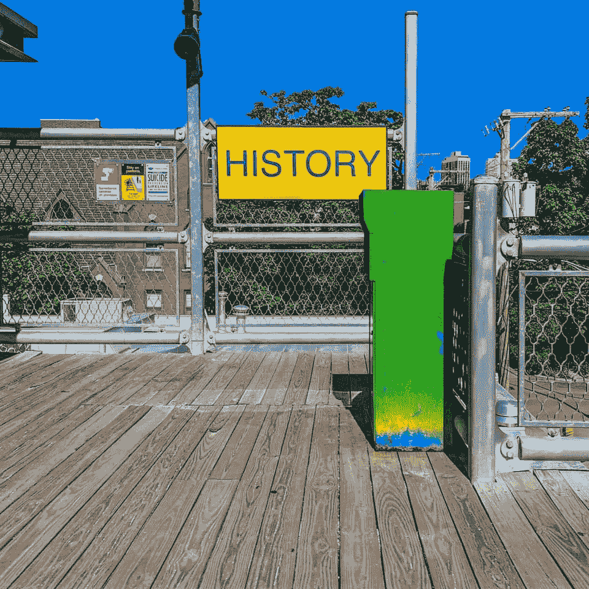

# 消失的黄页

> 原文：<https://medium.com/codex/the-disappearing-yellow-pages-c360eba0ee0e?source=collection_archive---------29----------------------->

芝加哥的一个 CTA(地铁)站。(作者照片，2021)。

多年来，我班上第一次接触*数据结构*的学生不得不观看一个可怕的仪式:在*二分搜索法树的祭坛上牺牲一本黄页书。*该仪式展示了二分搜索法树的功效，并解释了它们的作用机制。

我把黄页书递给一个学生，上面有一个任务清单:

O *用笔随意翻动书页；问我要搜索的条目是在书的左边还是右边；把书一分为二，保留包含条目的部分；重复一遍。*

为了确保完整性，我写下目标条目，并将信息放在一张折叠的纸上交给另一名学生。在我们收敛到目标页面之前，需要大约十次重复。芝加哥庞大的电话簿非常有助于展示二分搜索法树的效率。当电话簿被隆重地扔进教室的回收箱时，学生们已经对左右搜索模式有了概念。

我的邻居知道这种伎俩，每次一本黄页书放在他们家门口，他们都会把它带给我。我的车库的结构完整性的三分之一来自黄页书的堆叠，等待照亮下一代的数据结构学生。

年轻学生对印刷目录和字典越来越不熟悉。他们搜索条目的体验完全是电子化的:输入一些东西，按下回车键，得到答案。或者问 Siri/Alexa/Cortana。我迟早会走进一个满是学生的教室，他们对印刷电话簿一无所知。那些支撑着我车库的书可能永远也不会在去蓝色大垃圾箱的路上完成它们的使命。