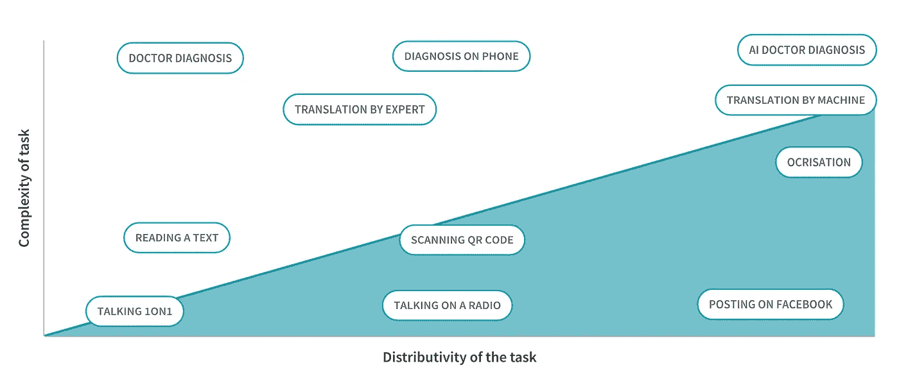

# 人工智能的颠覆性潜力

> 原文：<https://medium.com/codex/the-disruptive-potential-of-ai-9ff271044969?source=collection_archive---------5----------------------->

## [法典](http://medium.com/codex)

W30 个线性步长和 30 个指数步长的区别是什么？在第一个例子中，你可能会猜测你大概走了 30 米。

照片由[贾德·利姆卡科](https://unsplash.com/@jadlimcaco?utm_source=unsplash&utm_medium=referral&utm_content=creditCopyText)在 [Unsplash](https://unsplash.com/s/photos/walking?utm_source=unsplash&utm_medium=referral&utm_content=creditCopyText) 拍摄

在后一种情况下，你会每一步前进 1 米，然后 2 米，4 米，8 米等等。如果你指数级地完成了这 30 个步骤，你最终会达到一个可观的数字。事实上，你已经走过了超过 10 亿米。从另一个角度来看——你可以绕着地球走 26 圈，但仍然走不完所有的路。

这些指数增长的概念可以用来描述人工智能(AI)预计会在多大程度上扰乱(并且正在扰乱)几乎每个行业。这种颠覆性潜力的一个主要原因是它能够克服与可伸缩性相关的问题。有两种可伸缩性:垂直可伸缩性和水平可伸缩性。我们将首先从软件的角度考虑这两个维度，然后扩展到它们在服务行业中的潜在应用。

# 可扩展性(软件)

**可扩展性**是用来描述系统应对增加的负载的能力的术语。然而，可伸缩性不是一维的；相反，有两种方法可以扩大规模——垂直和水平。

**水平可伸缩性**或向外扩展可以定义为在多台机器上分配负载。在这种情况下，每个节点只包含部分数据，它们一起工作以产生更大的输出。

另一方面，**纵向可伸缩性**，或者向上扩展，可以描述为升级到更强大的机器。在这种情况下，所有数据都存储在一个更强大的节点上。

虽然在单台机器上运行的系统通常更简单，但高端机器可能会变得非常昂贵。因此，水平可伸缩性是不可避免的。实际上，最佳实践通常是一种实用的混合，因为几台相当强大的机器仍然比大量小型机器更简单、更便宜。

# 可扩展性(服务)

**水平可伸缩性**可以被视为任务在时空水平上的分布性——在更高的地理和时间平面上访问服务的能力。例如，面对面交谈被视为低水平可扩展性，因为你只能接触到你前面的一个人。

举例来说，下一步是在无线电上交谈。通过无线电波发送您的声音，有可能覆盖更广泛的受众，但这些受众需要同时连接才能收听。这意味着可伸缩性的概念可以应用于地理层面，但不能应用于时间层面。

为了处理时间层，我们可以记录一条消息，比如在脸书上发布一些东西。您可以接触到更广泛的受众，因为有权访问您的订阅源的每个人都可以随时访问您的消息。

**垂直可伸缩性**可以被视为任务的复杂性——解决复杂问题的能力。例如，如果你受伤了或生病了，你可以试着等它过去，让你的身体来处理恢复。

如果我们增加了疾病或伤害的严重性，您可以服用一些药物来减轻疼痛或增加康复的机会。

最后，如果时间和自我药物治疗不足以处理严重的疾病或问题，强烈建议去看医生，接受专业诊断。

# 可扩展性矩阵

正如我们之前所讨论的，我们可以将可伸缩性分为两个方面:

*   **垂直可扩展性，**与任务的复杂程度挂钩
*   **横向可伸缩性**，与任务的分布性相联系

在下图中，您可以看到可扩展性矩阵的可视化。

根据上面的定义，数字技术，主要是互联网，可以被视为*水平*可扩展性的推动者。例如，由于流媒体服务，现在可以在世界任何地方收听录制的现场音乐会。

相反，人工智能、*“执行通常需要人类智能的任务的系统”、*是*垂直*可扩展性的使能因素。例如，正确地翻译语言需要专家，他们除了懂语言之外，还要理解原文试图表达的信息，从而正确地转录它。由于人工智能的进步，即自然语言处理(NLP)，人工智能代理执行正确的翻译已经成为可能。

# 结论

我希望你喜欢这本书，简而言之，这些概念相对简单。可扩展性有两个维度，水平的和垂直的，关于分布性和复杂性，最后，它们的推动者是数字技术和人工智能。

数字技术和人工智能的合作允许这种水平和垂直可扩展性的结合。因此，通过训练正确的模型，人工智能可以用正确的数据扰乱任何行业和商业功能。现在的问题是，你更愿意相信人工智能还是人类来执行你的命令？