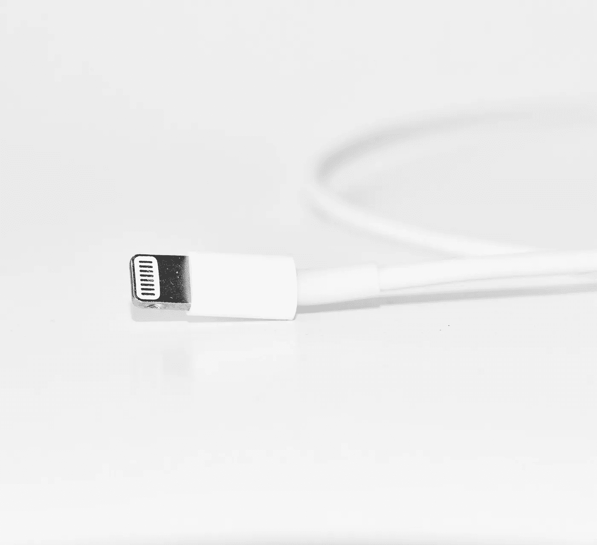

# 欧盟通用充电器端口立法的失败

> 原文：<https://medium.com/codex/the-downfall-of-eu-legislation-on-universal-charger-port-8b17da5902aa?source=collection_archive---------12----------------------->

照片由[马蒂亚斯·佐梅尔](https://www.pexels.com/@matthiaszomer/)在[像素](https://www.pexels.com/photo/close-up-photography-of-white-iphone-charger-914912/)上拍摄

经过长时间的辩论，欧盟计划在电子产品上强制推行通用充电器，包括智能手机、平板电脑、相机和其他设备。具体来说，它适用于任何可通过有线电缆充电、功率高达 100 瓦的技术设备。现在，上述每个设备都需要一个 USB-C 充电端口。法律是专门关于 USB-C 的…