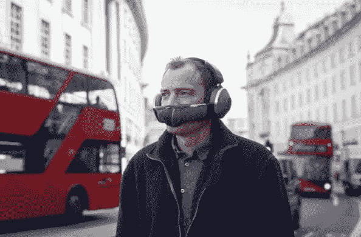

# 戴森区——真的吗？

> 原文：<https://medium.com/codex/the-dyson-zone-for-real-cc26172f523b?source=collection_archive---------17----------------------->

## 这可能是有史以来最精心制作的笑话之一，或者是一个杰出的创新。你决定吧。

全新戴森区耳机

减去 16 播客嘉宾特拉维斯 MCP

我不常以免责声明开始我的博客。这个故事发布的时机再糟糕不过了，或者说再好不过了。因此，在时机成熟时，如果这被证明是一个骗局，不要过于严厉地判断。从我进行的所有检查来看，它看起来是合法的，基于此，需要一些进一步的调查。我想说的是，经过六年的研究，在愚人节前夕发布新闻稿，嗯，不是最好的！所以，对于这个故事…

戴森区早期原型

## 该产品

由英国发明家詹姆斯·戴森创建的戴森公司首次进入可穿戴设备领域，该公司生产一些真正令人惊叹的家用电器。它们被命名为 Dyson Zone，是一对消除噪音、净化空气的耳机。护目镜通过一个可拆卸的护目镜负责将过滤后的空气吹到你的嘴巴周围。耳罩可传送净化空气，同时还能传送高清音频。戴森声称，他们会给你带来纯净的空气和纯净的声音。这些公司的网站告诉我们，这些耳机捕捉城市污染，包括*、【气体、过敏原和颗粒物】*。颇有些主张！

戴森区实验室测试

## **酝酿已久**

虽然，一开始，你可能会认为这款产品是对最近疫情事件的反应，但你错了。经过十多年对空气质量的研究，戴森专区不仅解决空气问题，还解决噪音污染问题。根据世界卫生组织的数据，90%的人呼吸的空气超过了污染物限量标准。

这些耳机的设计在原型的六年中发生了巨大的变化。最初的型号有一个通气管类型的设备接口，但随着项目的发展，越来越清楚的是，非接触式佩戴体验对公司非常重要。在我们这里看到的模型中，每个耳罩中都有压缩器。耳罩内的过滤器可以捕捉过敏原和微粒。此后，压缩机通过下颚面甲将净化空气输送到佩戴者的嘴和鼻子。

 [## AirPods Pro vs Beats Fit

### 我刚买了一双 AirPods Pro。我做了正确的选择吗？

medium.com](/codex/airpods-pro-vs-beats-fit-88a994d27634) 

戴森区的声学测试

## 音频

虽然戴森以其电机技术而闻名，但他以前从未进入过音频领域。面对其他音频公司采用的“黄金听众”方法，戴森决定与他们的音频工程师和声学家一起，通过指标和广泛的试验来寻求卓越的音频。对戴森来说，制造一副降噪耳机的决定是必须的，因为他们希望佩戴者能够屏蔽不想要的城市声音。穿过这些衣服的记者评论说，穿起来很舒服。工程师们竭尽全力制造一款重量分布均匀、佩戴舒适的耳机。该设计的灵感来自一个马鞍，中间有三个头枕，略微弯曲以通过接触区域分配负荷。ANC(主动降噪)通过耳罩上的物理开关激活。该开关允许佩戴者在各种声音模式之间切换，以找到最喜欢的设置。

 [## 折叠式苹果电脑再次成为新闻，苹果进军金融市场

### 2022 年 3 月 28 日至 4 月 1 日

medium.com](/codex/folding-macs-are-news-again-and-apple-move-in-to-the-financial-market-f0eaeaa46b42) 

戴森区空气净化

## 空气净化

空气净化面罩是一个可拆卸的卡扣式装置。一旦连接上，耳罩里的马达就会旋转起来，一股非常温和、柔和的净化气流就会输送过来。可以把它想象成个人的便携式面部空调。就像音频一样，空气净化也有不同的设置，从低到中到高。在疫情的光线下，如果你愿意，也有戴面具的空间。有一款应用正在开发中，可以显示你所在地区的污染程度。目前，该应用程序只允许城市和地区，而不是特定的地区，如你的工作场所或咖啡店。不过，到发布时，这项技术可能还没有开发出来。

在伦敦与戴森区

 [## 战斗开始了！

### iPad Air v iPad Pro——哪个适合你？

medium.com](/codex/y-ipad-the-fight-is-on-b6a2ba27b898) 

## 有效性

这还不清楚。新闻稿中没有定价或可用性，只是说该区域将从今年秋天开始提供。显然，这个区域是直接针对通勤者的，因为旅行再次在世界各地开放，并可能取得巨大成功。显然需要一些真实世界的测试，我们也需要了解电池寿命等普通功能，但早期的反馈都是积极的。最大的负面评价，当然是穿着时的区域外观。再说一次，回到现实世界的用法，我们需要知道在拥挤的大街上穿这些衣服你会有多害羞。我的意思是，我仍然没有足够的勇气戴着 AirPods Max 外出，所以我不确定我对 Dyson Zone 会有什么感觉。

戴森专区最新原型——2022 年秋季上市

## 结束的

有一个领域我仍然持怀疑态度，它类似于你在许多洗手间发现的戴森刀片。你知道，你把手放在墙上晾干的那个装置，你有没有想过那些水的微粒去了哪里？这不是一个密封的单元，只有这么多的水将下降，其余的我想是分配到两侧。一个可爱的想法，哈！戴森区也是如此吗？这可能只是我看待这个问题的方式，但这个区域实际上不就是一个超级传播者吗？这根本不包含你丢弃的空气颗粒。相反，它只是把它们堆到你周围和后面的人的旁边。现在看，我不是戴森总部的科学家的对手，但是，这难道不合理吗，这很好地照顾了佩戴者，但很少或根本不考虑你周围的人。我相信在未来的几个月里，将会有更多关于这一令人关注的领域的详细情况出现。戴森专区确实非常吸引我的技术个性，但我认为仍有一两个问题需要解决。我预计价格会很高，毕竟这是我们正在谈论的戴森创新，但同样，质量和用户体验将是首屈一指的。苹果和戴森真的有相似的 DNA。

至于美学，我觉得我们会习惯的。两年前被视为奇怪的面具很快变得司空见惯。我们有一种适应和习惯新设计的诀窍，比我们想象的要快。

我要警告的是…不要站在戴着防风帽的人面前！

 [## 太阳出来了！

### 随着今年 WWDC 的预计日期泄露，我们可以期待什么？

medium.com](/codex/here-comes-the-sun-9fe01350de9c) 

你订阅《媒介》了吗？

我只是高端博客网站 Medium 的众多作者之一。这是如此好的价值，你可以在这里加入 https://medium.com/membership

***加入我的幕后邮件列表****https://www.talkingtechandaudio.com*

****原载于 2022 年 4 月 4 日***[https://www.talkingtechandaudio.com/blog](https://www.talkingtechandaudio.com/blog)。*