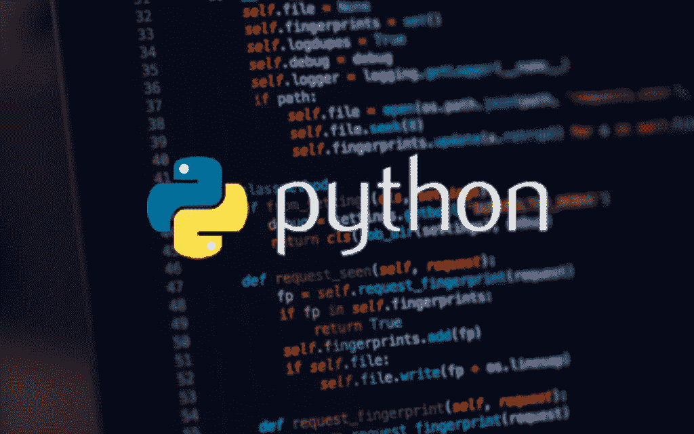

# 移动应用开发最简单的 Python 框架(iOS 和 Android)

> 原文：<https://medium.com/codex/the-easiest-python-framework-for-mobile-app-development-ios-and-android-a8f9dbdec7af?source=collection_archive---------8----------------------->

## 移动应用开发的两大 Python 框架。

Python 是一种多功能语言，可以用于许多事情，包括移动应用程序开发。有许多 Python 框架可用于移动应用程序开发，因此为您的项目选择正确的框架非常重要。