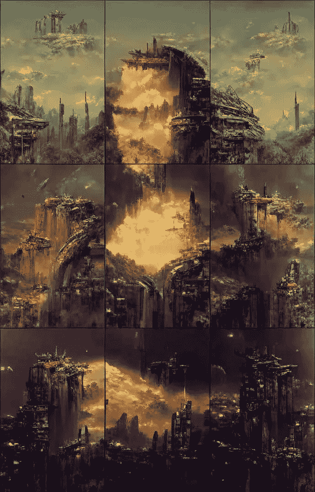

# 病毒人工智能生成的“废弃文明”绘画可以很容易地用你的手机重现

> 原文：<https://medium.com/codex/the-eerie-ai-generated-abandoned-civilization-painting-can-be-easily-recreated-with-your-phone-63197406369e?source=collection_archive---------1----------------------->

《被遗弃的文明》 [Reddit](https://www.reddit.com/r/Damnthatsinteresting/comments/tdyj1v/a_painting_entitled_abandoned_civilization_is_9/)

昨天，我在浏览我的脸书页面时，看到了一个 [Reddit 帖子](https://www.reddit.com/r/Damnthatsinteresting/comments/tdyj1v/a_painting_entitled_abandoned_civilization_is_9/)，是关于一幅名为“被遗弃的文明”的画——人工智能对著名的蒙娜丽莎的再现。这是一个由九幅独立画作拼凑而成的收藏，酷似达芬奇的作品。