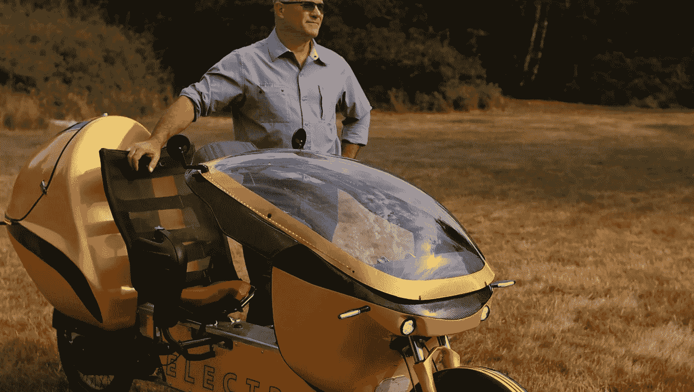

# 电动车:两轮卧式自行车

> 原文：<https://medium.com/codex/the-electrom-lev-a-two-wheeler-recumbent-bike-d94e1a97aee1?source=collection_archive---------5----------------------->

## 轻型电动汽车

[电动杠杆(电动媒体)](https://www.electrom.ca/wp-content/uploads/2021/09/Glossy-field.jpg)

乍一看，[电动车](https://www.electrom.ca/)看起来像一个典型的两轮自行车和电动滑板车的混合体。但仔细观察后，很明显这是一种独特设计的交通方式，弥补了自行车和汽车之间的差距。与前整流罩的结合，骑手可以穿越潮湿和…