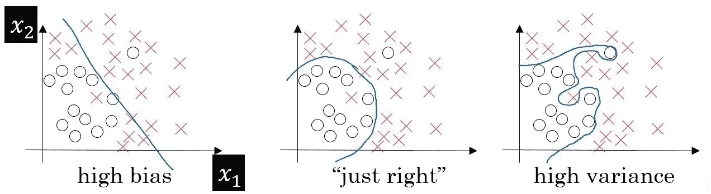
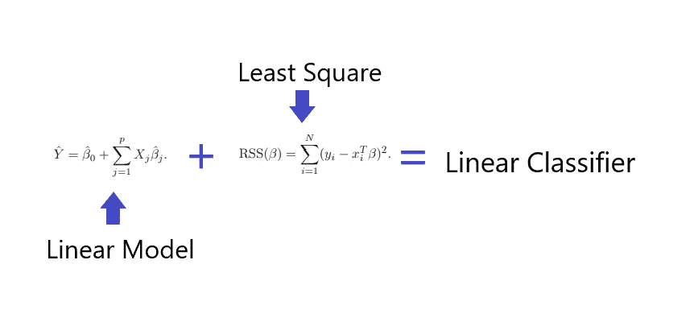
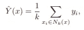

# 统计学习的要素 2

> 原文：<https://medium.com/codex/the-elements-of-statistical-learning-2-overview-of-supervised-learning-part-1-cfd16044e4f9?source=collection_archive---------12----------------------->

## 监督学习概述第 1 部分

**变量类型和术语**

我知道大多数阅读这篇文章的人可能都熟悉其中的一些术语。但由于这是一篇学术论文，我需要再一次击败死马，制定基本规则。

y 代表定量输出，G 代表定性输出，那么 X 呢？大家都知道“X”表示输入，有什么大不了的？嗯，在学术界，“X”代表一个标量或向量“**X”**(粗体)代表一个矩阵。虽然这种记法上的差异看似迂腐，但当我们在阅读一篇学术论文时，这种细微差别会澄清很多困惑。例如，如果“X”是一个向量，那么 X 下标 j 代表一个标量，而 **X** (bold)下标 j 代表一个向量，而不是一个标量！

大写字母用于描述变量的一般方面，而观察值用小写字母书写，这是一种统计和离散数学惯例。与编程惯例相反，小写是一个实例，大写通常是实例的集合。

**两个量词的故事**

将线性模型和最近邻归类为分类器类似于将枪和刀归类为武器。是的，它们都是武器，但是试图用枪的知识来理解刀会让我们问这样的问题，比如我们在哪里为刀装载 ammos？线性模型和最近邻都在尝试分类，但是它们的均值是昼夜不同的。

**线性分类器**

线性分类器由两部分组成:线性模型和最小二乘法。它们是专门从事不同任务的独立功能。线性模型进行预测，而最小二乘法衡量预测的好坏。如果你仔细观察上图，你甚至可以看到最小二乘法内部的一个微小的线性模型被实际值 y subscribe i 减去。

事实上，线性分类器有更多的辅助功能，比如更新线性模型参数的优化器，我将在后面的博客中介绍。虽然线性分类器产生相对稳定的预测，但其严格的模型假设会产生偏差结果。最近的邻居在相反的一端，是非常灵活的，这也有自己的问题。我将在后面的博客中回到刚性和柔性模型假设。

**最近邻居**

回想一下我之前提到的优化器，它不存在于最近邻中。好吧，那我们到底为什么要用”。适合“在 sklearn？答案与面向对象编程有关。我就不细说了，你要记住的就是”。fit”将训练数据存储为一个对象变量，因此我们可以在以后使用它进行预测。如果你认为将最近邻归类为机器学习模型有点误导，我将不得不同意你的观点，因为没有学习到任何参数。但是话说回来，我们仍然使用“虚数”这个术语，尽管它在现实世界中有非常广泛的应用，那么这是为什么呢？

那么最近邻是如何进行预测的呢？首先，它计算输入和每个可能的训练数据实例之间的距离(这就是为什么你的计算机正在融化)。其次，它将距离从最短到最远进行排序。第三，它过滤 k 个最短距离，并对其标签求和(标签表示它属于哪个类别)。最后，它将该总和除以 k。例如，如果我们的目标是用 k = 6 对黄色(1)和蓝色(0)进行分类，并且最接近的 5 个邻居是黄色(1)，则我们得到 5/6，这给出了更接近 1 的值。另一方面，如果邻域内的所有 5 个实例都是蓝色(0)，那么我们将得到 1/6，这更接近于 0。代表不同类别的二进制数是任意的，但是统计惯例告诉我们将 1 分配给感兴趣的类别。

该模型的灵活性可以超越我们拥有 100%训练数据准确性的理由。100%的准确率有什么问题？嗯，很多，实际上是两个。假设我们在训练数据中有一个实例“John ”,他被错误地标记为肥胖，而他的体重只有 150 磅。让我们也想象我们用 1 个最近邻(100%准确)训练一个 KNN。这个模型将体重 150 磅的人归类为肥胖，而不是 149 磅或 151 磅，因此放大了错误的标签。即使数据中没有错误标注“约翰”是一个异常值，他实际上是肥胖的，因为他是一个超级小的家伙，“这个模型在没有看不见的数据的情况下不会是准确的，所有其他因素都是一样的，包括身高。如你所见，两种情况都会给出不准确的预测。这种不稳定的现象称为高方差，将在后面的博客中讨论。

**结论**

这一部分讨论的是大家最熟悉的概念，但更为详细。我相信对 ML 模型内部工作原理感兴趣的程序员可以从阅读中受益。如果你想看到这两个模型的代码，而不是“导入 sklearn”并祈祷好运，我在下面有一个到我的 github 库的链接。感谢您的阅读，下一篇博客将讨论统计决策理论和更多内容。敬请期待！

[1]: [孙丽佳娜](https://github.com/janaSunrise)，[孙丽佳娜](https://github.com/janaSunrise)。(2021 年 6 月 12 日)。*最近邻*[https://github . com/yuan leoluo/mlfromscrack/blob/master/mlfromscrack/KNN . py](https://github.com/Yuanleoluo/MLfromscratch/blob/master/mlfromscratch/knn.py)

[2]: [Sunrit Jana](https://github.com/janaSunrise) ， [Sunrit Jana](https://github.com/janaSunrise) 。(2021 年 6 月 12 日)。*线性分类器*[https://github . com/yuan leoluo/mlfromstack/blob/master/mlfromstack/Linear _ regression . py](https://github.com/Yuanleoluo/MLfromscratch/blob/master/mlfromscratch/linear_regression.py)