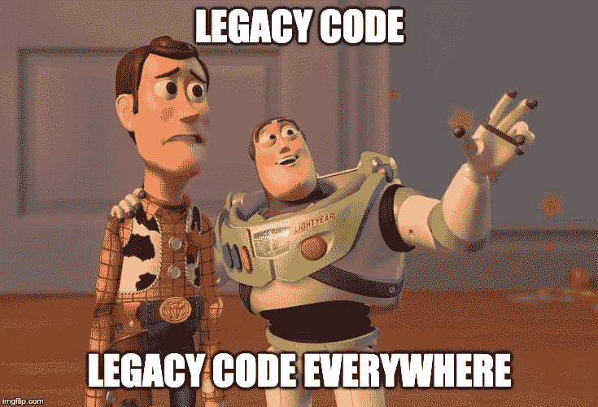
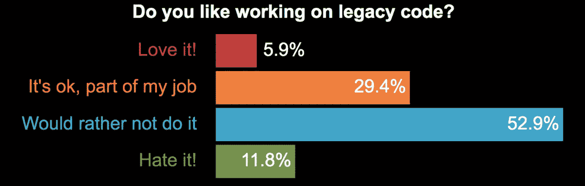
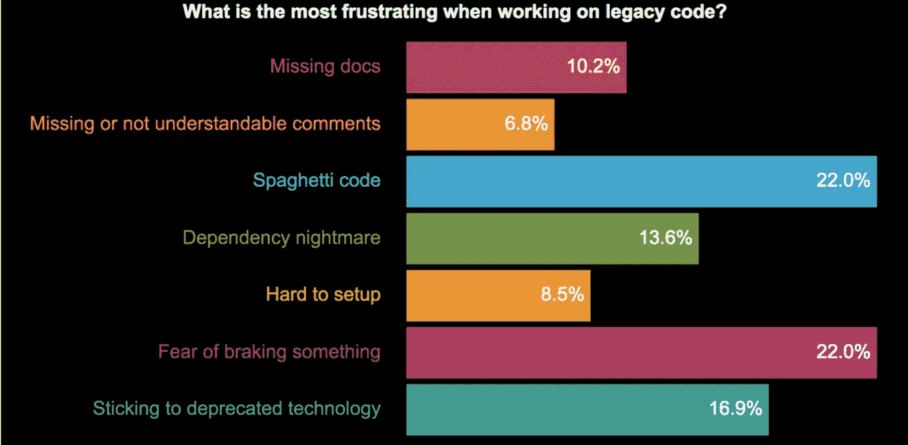
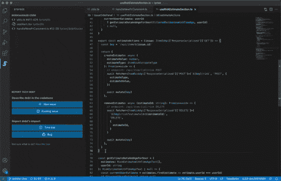

# 遗留代码工程师完全指南

> 原文：<https://medium.com/codex/the-engineers-complete-guide-to-legacy-code-4c101201dc6c?source=collection_archive---------2----------------------->

图片鸣谢:作者。

我们生活在一个进步为王的世界——完成任务、达到目标、投入更多、频繁部署、快速发货。但是，当代码库中潜伏着阻碍您前进的东西时，会发生什么呢？没错，遗留代码。让我们来看看如何一劳永逸地处理遗留代码。

在本指南中，我将介绍以下主题👇

*   什么是遗留代码？
*   遗留代码的特征
*   遗留代码和技术债务的问题
*   有效处理遗留代码的技巧和工具
*   遗留代码迁移和文化转变
*   处理遗留代码的资源

# 什么是遗留代码？

图片来源:imgflip.com。

当我们谈到遗留代码时，您首先想到的可能是陈旧过时的代码。是的，它可能是为不再受支持的操作系统编写的。但是，它也可能指以下代码:

*   继承的代码:它可能来自另一个开发人员、团队或旧的软件版本。
*   原始开发人员不再维护的代码。
*   不再是工程化的代码库，而是不断修补的代码库。
*   遗留代码也可以指不受支持的操作系统、硬件和格式。

# 遗留代码的特征

[Ionis](https://www.ionos.com/digitalguide/websites/web-development/what-is-legacy-code/) 将遗留代码描述为“易于理解、维护和适应的干净代码的对立面”。遗留代码笨拙、过时且混乱，这可能会导致许多问题。”它通常不会通过自动化测试来发现错误。

[Nicolas Carlo](https://understandlegacycode.com/blog/what-is-legacy-code-is-it-code-without-tests/) 称遗留代码是你不愿意改变的代码，也是“你害怕改变的有价值的代码”和“你需要改变的代码，你很难理解的代码*他认为，事实上，你可能要对“你写的代码负责，因为你记不起你当时脑子里想的是什么。是的，我们过去的自己经常犯愚蠢的错误。(如果你需要一个很好的理由来编写伟大的文档，这就是了！)*

# 遗留代码和技术债务的问题

有时候遗留代码的存在是有原因的。它可能指向一个有着疯狂的高流动率的团队，在他们的文档中做了很少的努力。或者一个更有经验的开发人员团队，他们熟悉更老的语言。由于相对于其他企业的竞争优势，公司可能会保留遗留代码。他们可能担心重写代码会引入新的错误或删除隐藏的功能。

然而，遗留代码也可能在一个黑箱中运行，对于更广泛的开发社区来说，这意味着质量改进、安全性和可维护性不足。当人们离开的时候，可能很难找到新的有适当技能的开发人员来使用它。随着时间的推移，代码可能很难与新的和新兴的应用程序和硬件一起工作。该公司面临落后的风险，并深陷技术债务之中。你讨厌遗留代码吗？

Ivo Luka 做了一项调查，调查显示[超过一半的受访者不愿意从事这项工作，另有 11%的人讨厌这项工作。](https://netgen.io/blog/how-to-cope-with-legacy-code-and-technical-debt)

图片鸣谢:伊沃·卢卡奇。

具体来说，他们的痛点有很多，最常见的担忧是意大利面条式的代码和对破坏某些东西的恐惧，其次是坚持贬值技术的挫败感。这项调查提供了对处理遗留代码的复杂性的洞察，并解释了开发人员优先考虑其他工作的一些原因。

遗留代码的本质是技术债务——每次代码转手，它都需要越来越多的功能和错误修复，所有这些都是耗时和令人沮丧的，而且技术债务的数量还在继续增长。

图片鸣谢:伊沃·卢卡奇。

# 有效处理遗留代码的技巧和工具

当处理遗留代码时，时间和精力是宝贵的，你需要知道在哪里集中你的努力。规划和目标至关重要——你需要知道什么可以改变，什么可以忽略。幸运的是，有很多工具可以让生活变得更简单: **‍**

# 静态代码 analysis‍

静态代码分析是在程序运行前通过检查源代码进行调试的过程。根据一组(或多组)编码规则分析代码。然后，您将获得一份基于严重程度的违反这些规则的诊断报告。这有助于你优先处理最紧急或最重要的任务。

一般来说，静态代码分析是一个很好的实践，甚至超越了遗留代码。它创造了在代码被推向功能性 QA 之前识别和消除代码缺陷的机会，节省了大量的后期痛苦并减少了技术债务。静态代码工具的一些示例:

*   [代码声纳](https://www.grammatech.com/products/source-code-analysis)
*   [施法](https://www.castsoftware.com/glossary/static-analysis-tool)
*   [Klocwork](http://www.klocwork.com/capabilities/static-code-analysis)
*   ‍

许多用于代码重构的 ide 已经使用了静态分析。

# 代码重构遗留代码

代码重构是处理遗留代码的一种方式。它是通过优化代码、简化和合并变量和类以及重写命令方法来彻底检查代码，使其更易于理解、维护和适应。

正如两本重构书籍的作者[马丁·福勒](https://martinfowler.com/aboutMe.html)所解释的:

“重构是一个改变软件系统的过程，它不会改变代码的外部行为，但会改进其内部结构。这是一种清理代码的训练有素的方法，可以最小化引入 bug 的机会。本质上，当你重构时，你是在改进代码的设计。”

然而，只有当你弄清楚代码是如何工作的——以及不工作的时候，你才能开始重构。然后一段一段地优化代码。删除或重写任何不必要的代码。代码中的类和变量被简化和合并。命令方法被改编和重写。最后，重构基本上是对遗留代码的全面检查。生成的代码更容易理解、维护和适应。

开发人员应该在重构后测试代码，以检查是否有任何漏洞。持续集成是有用的，因为它使您能够在出现问题时恢复到以前的构建。

# 向代码中添加上下文

[步长 VS 代码](https://bit.ly/3hi3DiB)和 [JetBrains 扩展](https://bit.ly/3gZ6OeF)帮助工程团队获得对他们的技术债务的可操作的洞察力，包括那些由遗留代码引起的债务。工程师可以跟踪债务，添加书签，并在代码编辑器中组织他们的待办事项，还可以查看技术债务的影响，并在 webapp 中对其进行优先排序[。](https://bit.ly/3AdAPAo)

# 遗留代码迁移和文化转变

人们对将遗留系统迁移到低代码开发平台越来越感兴趣。几年前，Sylvain Leroy 写了一本简洁而深入的遗留软件迁移指南，值得一读。还有一些实践，比如将桌面或内部数据中心迁移到云中，以及从单片服务器转移到微服务。虽然详细讨论所有这些超出了本文的范围，但探索文化变革和公司文化方面的这些趋势是很重要的:

*   开发者如何协作？
*   知识是如何从开发者传递给开发者的？
*   当有人离开时，为留住知识做了哪些努力？
*   公司的文件标准是什么？谁来确保符合这些标准？
*   公司如何优先安排处理技术债务的时间？他们提供了什么激励措施(如果每个人都讨厌这样做，这一点尤为重要:也许他们需要提供更多的休息时间或引入专家？
*   从现在开始，您如何确保新代码是干净的、没有错误的？培训和发展呢？

# 处理遗留代码的资源

*   使用遗留代码库的 4 种技术—Nicolas Carlo 在管理技术债务会议上的演讲。
*   [重构 Java，第 1 部分:用测试驱动开发驱动敏捷开发](https://blogs.oracle.com/javamagazine/refactoring-java-part-1-driving-agile-development-with-test-driven-development)——Oracle 基于 Kata 的重构基础系列，帮助建立测试驱动开发环境。
*   [有效地使用遗留代码](http://www.amazon.com/Working-Effectively-Legacy-Michael-Feathers/dp/0131177052)。
*   重构、技术债务和遗留代码的方法。
*   如何处理从 3 个开发团队继承的遗留代码:6 个经验教训。