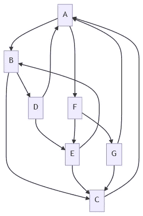

# 例外的错误

> 原文：<https://medium.com/codex/the-error-of-exceptions-3aed074c40dc?source=collection_archive---------5----------------------->

## 为什么我认为异常是糟糕的语言设计。

当我和同学第一次了解异常(在 C++中)时，我想“酷，我再也不用返回`-1`和`nullptr`了”。但是过了一会儿，一个朋友提出了一个好问题:异常和`goto`有什么区别？

由作者使用 [mermaid.js](https://mermaid-js.github.io) 制作

# 例外的问题

看看下面的 Java 代码，告诉我它会返回什么:

乍一看，这个方法可能会返回一个`String`、`null`或者抛出一个`NullPointerException`，如果`getCurrentUser`返回`null`。

但这还不是全部，它还可能抛出任何其他未检查的异常。可能`getCurrentUser`返回一个`IllegalStateException`，因为缺少了一些初始化？

对于用户名来说，这可能是无害的，但是下面的呢？

这种代码很容易通过代码审查。但是，如果任何一个缓存卸载抛出一个异常呢？在这种情况下，所有其他缓存都不会被卸载，如果`Cache`是一个接口，甚至不清楚会抛出什么异常。

这个错误非常普遍，以至于现在许多语言都有一个版本的`[try-with-resourses](https://docs.oracle.com/javase/tutorial/essential/exceptions/tryResourceClose.html)`语句。通常，它们用于文件流或连接，以确保它们被正确关闭。但是在其他情况下，这很容易被忽略，在这些情况下，大部分时间都很好。实话实说:你多久想一次“如果这个方法抛出一个异常怎么办？”

# 异常比 gotos 更糟糕(在某些方面)

回到最初的故事。我不知道当时我们想出了什么答案，但现在我想说的是:

它们很相似，但也有一些不同之处:

1.  我可以用它发送一些数据，
2.  我可以在调用方法时包含它(通过将它包装在一个`try-catch`中)，并且
3.  我不知道我会去哪里。

最后一点非常重要:当您看到一条`throw`语句时，您不会立即知道接下来将执行什么代码。更糟糕的是，有时您无法知道，因为该方法可以从多个来源调用。

当编写一个方法时，这是非常好的——方法只做一件事，这是我们应该关心的。无论如何，我们应该忽略它周围的大部分内容。

但是当审查代码时，这可能很快变得难以理解/阅读。我如何确保我的方法的所有调用者正确地处理它？

这就引出了上一个例子的问题:**我怎么知道一个方法可以返回什么异常？**答案是，我必须阅读该方法可能使用的所有代码，并寻找`throw`语句。然后我需要看看他们是否被处理。甚至一些拥有良好文档的库也喜欢保持一种神秘的气氛，围绕着什么时候抛出了什么异常。

# 异常比 gotos 更好(在某些方面)

那么，为什么例外被普遍接受，而`goto` s 几乎被普遍避免呢？

答案是上一节的前两点。如果使用正确，异常并没有那么糟糕。

## 您可以捕捉异常

与`goto`不同，函数的调用者实际上可以与异常交互。您可以确保即使抛出异常，您也有机会关闭文件流、关闭连接或仍然执行一些代码来防止非法状态。

这已经减轻了很大一部分`goto`的危险，因为我可以确保某些代码在任何情况下都被执行。

## 你可以用它发送一些数据

发送关于为什么在常规流程之外进行这种跳转的附加信息可以为其提供考虑周到的上下文。它不是告诉你接下来应该执行哪个代码，而是告诉你发生了什么。

当然，这是可以滥用的。异常现在也可以用作函数的额外返回值——可悲的是，这种情况经常发生。有一种想法是不使用异常进行流程控制，但是所有的异常都必须控制程序的流程。您只需要确保一个异常确实是异常。

# 替代方案

那么，我们应该学些什么来代替所有的`-1`和`nullptr`呢？

我最喜欢做的一件事就是扩展 API 的领域，让它更安全、更容易使用。我的意思是，它接受任何错误状态，并以成功返回的相同方式处理它们:它接受它作为有效输入，并以相同的方式呈现给用户，鼓励有时迫使用户优雅地处理它们。

这通常可以用`Result`型来完成(有时也称为`Throw`或`Either`)。一个非常基本的实现如下:

实现是非常基本的，如果你想使用它，你可能想添加更多的实用函数，但想法是存在的:用户得到一个`Result`实例，所以他已经知道它可能有一个成功状态或一个失败状态，因此，他不能忘记它们中的任何一个。

理想情况下，你不会使用一个通用的`Throwable`，而是针对任何给定函数中可能出现的不同错误定制的实际对象。在某种程度上，`Optional`(在其他语言中也常被称为`Maybe`)是`Result`的一种特殊形式。

这种方法有许多优点:

*   用户不能忘记错误，
*   api 可以显式地列出所有可能的错误及其值，而不需要增加函数本身或者依赖于文档和
*   在哪里处理失败更明显。

这种处理异常状态的一元方式已经可以在许多新的 API 中找到:C#中的 Linq、Java 中的 Streams、JavaScript 中的 Promises 等等

## 那么，应该用结果代替所有的异常吗？

如果我们想用结果类型包装一个可能抛出错误的函数，它应该是这样的:

这是相当多的样板代码，几乎每个第三方函数和标准库中的函数都必须重复这些代码。当然，你可以创建一个通用的包装函数，但是真的值得吗？

老实说，大多数情况下我不这么认为。我尽可能避免创建新的异常，但是我不会为了避免它们而包装已经存在的函数。如果有的话，这应该由语言本身来解决。

## 并不是每个例外都值得关注

如果`c`是`0`，像`b/c`这样的代码可能会抛出一个`ArithmeticException`。但是，我们需要解决这个问题，前提是我们没有首先检查这种情况不能发生。除了例外，我们可以什么都不做就忽略它。最有可能的是，我们最终会陷入一种无所不包的状态，记录问题并告诉程序员检查这一点。

对于`Result`类型，我们必须显式地忽略它，所以系统会自动提示我们检查这是否可行。这可能会导致一些额外的不必要的代码，但它使它更有弹性。

# 摘要

我相信，如果我们学习了类型而不是异常，我们的反应会基本相同。它们甚至可能更容易学习，因此会更早介绍。

这并不意味着异常实际上和`goto`一样糟糕，但是它们在常见程度上惊人地接近。我以前肯定浪费了几个小时试图弄清楚一个库方法可能抛出什么异常。当然，我以前也忽略了其中的一些。

也许更糟糕的是，异常很容易被误用为返回多个不同返回值的方式。可悲的是，我以前见过这样的事。

就我个人而言，我希望更多的语言能够采用这种更“函数化”的错误处理风格，而不是异常(就像 rust 已经做的那样)。我相信这样可以避免很多错误。

# 资源

如果你想玩玩我的缓存例子和`Return`，你可以在[上这样做。](https://www.online-java.com/g76FuKnpqs)

如果你想玩我漂亮的美人鱼图，你可以[按这个链接](https://mermaid-js.github.io/mermaid-live-editor/edit#eyJjb2RlIjoiZ3JhcGggVERcbiAgICBBIC0tPiBCXG4gICAgQiAtLT4gQ1xuICAgIEIgLS0-IERcbiAgICBEIC0tPiBFXG4gICAgRSAtLT4gQ1xuICAgIEMgLS0-IEFcbiAgICBEIC0tPiBBXG4gICAgQSAtLT4gRlxuICAgIEYgLS0-IEVcbiAgICBFIC0tPiBCXG4gICAgRyAtLT4gQVxuICAgIEYgLS0-IEdcbiAgICBHIC0tPiBDXG4gICAgIiwibWVybWFpZCI6IntcbiAgXCJ0aGVtZVwiOiBcImRlZmF1bHRcIlxufSIsInVwZGF0ZUVkaXRvciI6ZmFsc2UsImF1dG9TeW5jIjp0cnVlLCJ1cGRhdGVEaWFncmFtIjpmYWxzZX0)。