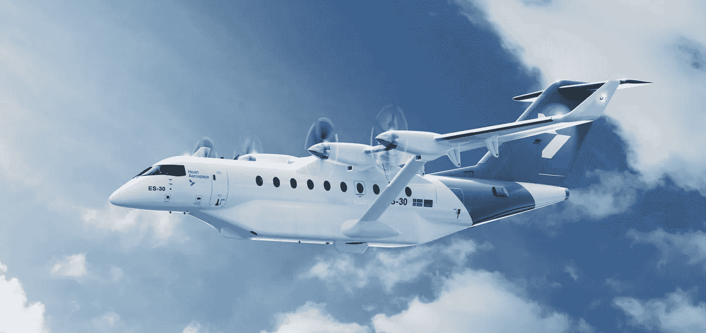

# ES-30:即将抵达您附近的机场！

> 原文：<https://medium.com/codex/the-es-30-coming-soon-to-an-airport-near-you-2ccddf0a7e2d?source=collection_archive---------0----------------------->

## 电动飞机类别的另一个条目

[ES-30(媒体由心航宇)](http://heartaerospace.com/wp-content/uploads/2022/09/heart_a2-poster-1-2500x1767.png)

Heart Aerospace 的 ES-30 电动飞机将于 2028 年服役。这架飞机可以容纳 30 名乘客，两人一组，在全电动模式下飞行 124 英里，或 200 公里。当电池由发电机补充时，航程可扩展到 249 英里，497 英里…