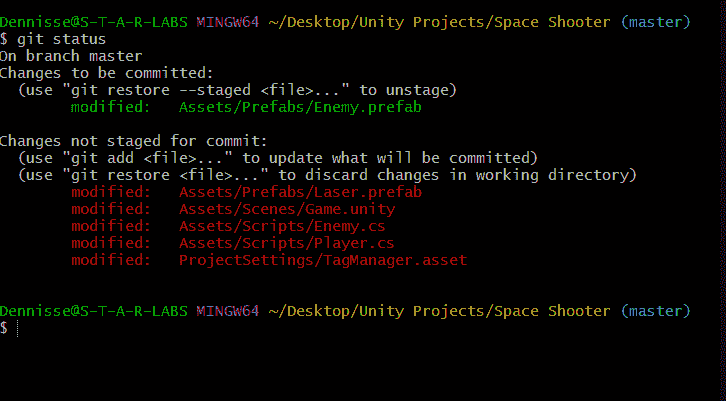

# GitHub 工作流的基本 Git Bash 让你快速高效！

> 原文：<https://medium.com/codex/the-essential-git-bash-to-github-workflow-to-get-you-productive-fast-c694bb6301e8?source=collection_archive---------9----------------------->


Git Bash 可能看起来是一头真正需要驯服的野兽。幸运的是，你不需要太多就可以开始变得高效并实施一个有效的工作流程。

## **PCP 工作流程概述**

当您使用版本控制存储库时，您必须认识到有一个服务器装载了可能对您的项目至关重要的信息。不言而喻，在您作为团队的一部分工作的情况下，会有多个人向同一个服务器提交变更。

如何避免合并冲突和其他与服务器的冲突？使用 Git Bash-Github 版本控制时，注意处理命令的顺序是非常重要的。

PCP 是我个人用来记住对我的项目进行版本控制的有效且简单的方法的肩峰。 **PCP 代表拉、提交和推**，我们将探讨它们各自的含义以及如何执行它们。

**PCP 工作流程步骤:**

1.  **Pull** 下载 GitHub 资源库中的信息，为我们提供尽可能最新的版本，并将其与您当前的工作合并。

**命令:**

```
$ git pull
```

当使用 git pull 时，您必须指定从哪个来源*获取*您的信息和接收者。

**示例:**

```
$ git pull origin master
```


**注意:**如果您需要更多关于在 Git Bash 和 Github 之间建立连接的信息，请访问以下链接:[**如何将 GitHub 连接到 Unity —一个快速简单的指南！**](https://dennisse-pd.medium.com/how-to-connect-github-to-unity-a-quick-and-easy-guide-f38f3710c4c0)

**记住。对于 git 状态，您可以随时查看当前可用的变更。它会以红色显示所有未保存的更改。**

```
$ git status
```


2.**使用以下命令添加**您希望备份到存储库中的所有未保存的更改。

```
$ git add .
```


git 状态将以绿色显示所有添加的文件。

您也可以通过使用特定文件的名称而不是“.”来添加单个文件代表“所有”。



3.**通过 commit -m 提交**您添加的更改，这允许您附加一条消息来简要说明您添加的内容。

```
$ commit -m "Added a laser to my game"
```


4.**通过以下方式将提交的更改推送到**服务器

```
$ git push origin master
```


**总结:基本工作流程如下**

1.  您正在从服务器上获取信息，以确保您拥有项目的最新版本，并且不会导致任何冲突。
2.  你正在用你**从服务器**获取的数据**添加**你当前的变化。
3.  您正在**承诺**这些是您想要存储的更改
4.  最后，您将向服务器推送新内容。

在我的下一篇文章中，我将向你展示如何让你的 Unity 编辑器更有效率！