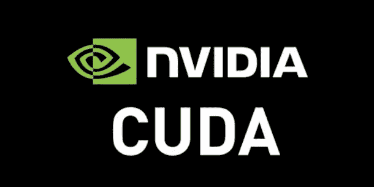

# GPU 的演变:从游戏到计算

> 原文：<https://medium.com/codex/the-evolution-of-a-gpu-from-gaming-to-computing-ff183a1eea4f?source=collection_archive---------3----------------------->

## [法典](http://medium.com/codex)

CPU 和 GPU 计算能力的增长

上图显示了 CPU 和 GPU 计算能力的增长，并强调了 GPU 的计算能力如何比 CPU 增长得更快。

今天，一个 GPU 每秒执行的浮点运算(FLOPS)数量可以轻松达到万亿次 FLOPS 的帐篷，即万亿亿次 FLOPS 的帐篷，这在 15 年前是不可想象的。但事情怎么会变成这样？

CPU 和 GPU 已经沿着不同的路线发展了它们的计算能力。

到 2000 年，CPU 通过提高时钟速度增加了它们的计算能力。这在一定程度上是可能的，因为更快的时钟意味着散热增加。此外，物理定律不允许达到任意快的时钟。出于这些原因，从 2000 年开始，与其加快时钟速度，不如用多核解决方案来提高并行性。

与此相反，GPU 大多将他们的生活与游戏联系在一起。最初，游戏图形是 2D 和标志性的:一个由精灵组成的图片必须显示它应该看起来是什么样子，而大脑可以推断出信息的剩余部分。一个简单的中央处理器就能完成这项工作。渐渐地，让图形更真实的愿望推动了更多的计算需求，需要图形加速器，将它们的角色从 CPU 中分离出来。

扎克·麦克克拉肯和外星人的 2D 图形。

第一个 GPU 是由 NVIDIA 在 1999 年以 GeForce 256 的名义发布和销售的。今天，强大的 GPU 可以进行全 3D 渲染，从锁定的视角观看图像，并利用和计算物理定律，使游戏超现实。

GPU 必须能够从给定的源发射数百万条光线，并测试它们是否与场景的离散化元素(图元)相交，通常是三角形。如果光线与图元相交，这意味着它是从相机上看到的。此外，如果一个球在一个游戏场景中反弹，则必须解决支配弹性 bomp 的真实物理定律。所有这些计算需求使得 GPU 成为真正的桌面超级计算机。

超现实游戏的例子。

现在商用 CPU 做的是内核的帐篷，而 GPU 做的是最多几千个可用的内核。

有了现成的超级计算机可供使用，使用它们来加速科学计算应用程序的想法就诞生了，从而开创了通用 GPU (GPGPU)计算的时代。

无论如何，缺少一种编程语言来简化科学计算对 GPU 的利用，最初的尝试是由少数愿意使用 DirectX 和 OpenGL 的先驱进行的，即，用于图形和游戏的相同 API，用于科学计算的目的。必须指出的是，GPGPU 的这种方法仍然是一小部分人的特权。

2004 年 10 月，斯坦福大学发布了 BrookGPU，这是一种基于 ANSI C 的编译编程语言，旨在运行在类似 ATI 和 NVIDIA 当时生产的 GPU 上。想法是隐藏 DirectX 和 OpenGL 的细节，以简化 GPU 编程。尽管 BrookGPU 在推广 GPGPU 方面有着毋庸置疑的优势，但主要的限制是兼容性。GPU 驱动程序优化和更新虽然对游戏玩家来说是一件好事，但可能会在一夜之间破坏 Brook 的兼容性，这中断了它用于开发旨在部署的工业质量代码。一段时间以来，BrookGPU 一直是好奇的研究人员和程序员的天地。

三年后的 2007 年 6 月 23 日，CUDA(计算统一设备架构)发布。CUDA 是一种硬件架构和编程模型，由 NVIDIA 开发，最初基于 ANSI C，但今天显示出与 C++的完全兼容性。CUDA 支持在 NVIDIA 显卡上对 GPU 进行并行编程，在问世 14 年后的今天，它已经成为 GPGPU 计算的标准。CUDA 在函数中隐藏了一大堆图形操作，使它们的调用变得简单，并允许开发高质量的科学代码和可部署的工业软件。显然，CUDA 仅限于 NVIDIA 卡，因为它是 NVIDIA 的专利。

2008 年 11 月，OpenCL(开放计算语言)也发布了，这是一个基于 ANSI C 和 C++的框架。它支持在许多平台上进行并行编程，包括多核 CPU 和 GPU。从 GPGPU 的角度来看，它允许在不同厂商的图形处理器上执行并行代码，包括 AMD 和 NVIDIA 开发的图形处理器，从而实现软件的可移植性。

500 强榜单—2020 年 11 月

最后，上面的图像显示了世界上最好的 10 台超级计算机的 500 强名单。该列表显示了 GPU 如何在大型主机上赶上超级计算。虽然在过去几年中只有少数大型超级计算机基于 GPU 的使用，但截至 2020 年 11 月，我们已经达到了 10 台中的 5 台。该列表还显示了他们有多少核心(从几十万到几百万，令人印象深刻！)，它们的理论最大计算能力 Rmax，它们在 Linpack 例程上的峰值计算能力 r peak 以及消耗的功率。