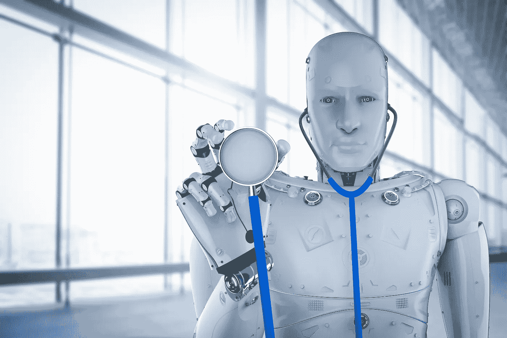

# 人工智能在医疗保健领域的发展

> 原文：<https://medium.com/codex/the-evolution-of-artificial-intelligence-in-healthcare-bc7da8bcfc1e?source=collection_archive---------4----------------------->

## 人工智能的潜在好处是巨大的，但危险也是巨大的——戴夫·沃特斯

*由* [*本杰明博物馆*](https://www.linkedin.com/in/benjamin-musrie-379a23116/) *，医学研究员。澳大利亚悉尼。*

Getty Images 授权的 [iStock 上的插图](https://www.istockphoto.com/)

A 人工智能(AI)是指机器，特别是计算机系统对人类智能的模拟。这些…