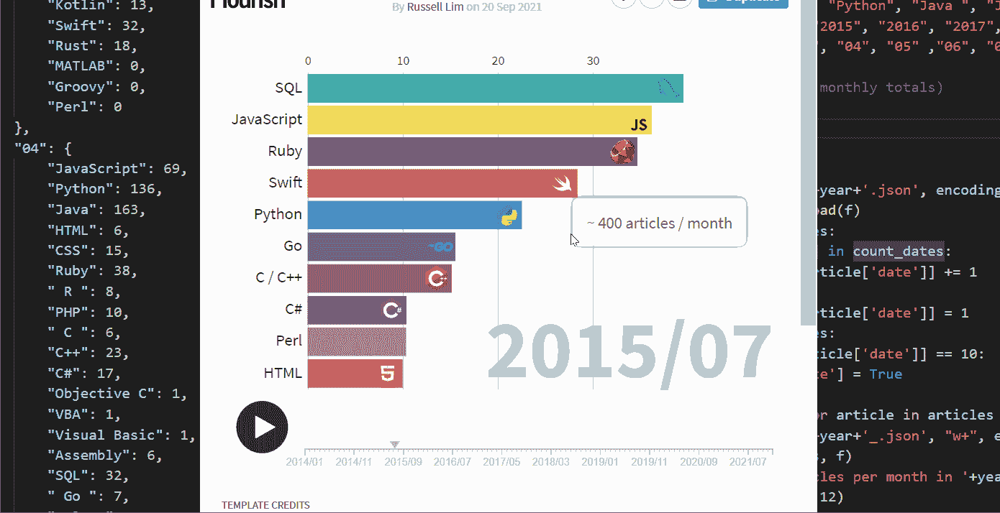

# 编程的演变

> 原文：<https://medium.com/codex/the-evolution-of-programming-8d0d31f6baf4?source=collection_archive---------6----------------------->

## 媒体文章 8 年趋势

作者图片

没有多少领域像计算机编程那样变化和发展得如此之快。

> “一旦新技术开始滚动，如果你不是压路机的一部分，你就是道路的一部分。”——*[*斯图尔特品牌*](https://en.wikipedia.org/wiki/Stewart_Brand)*

*自 2012 年以来，Medium 已经成为从初学者到有经验的开发人员到…*