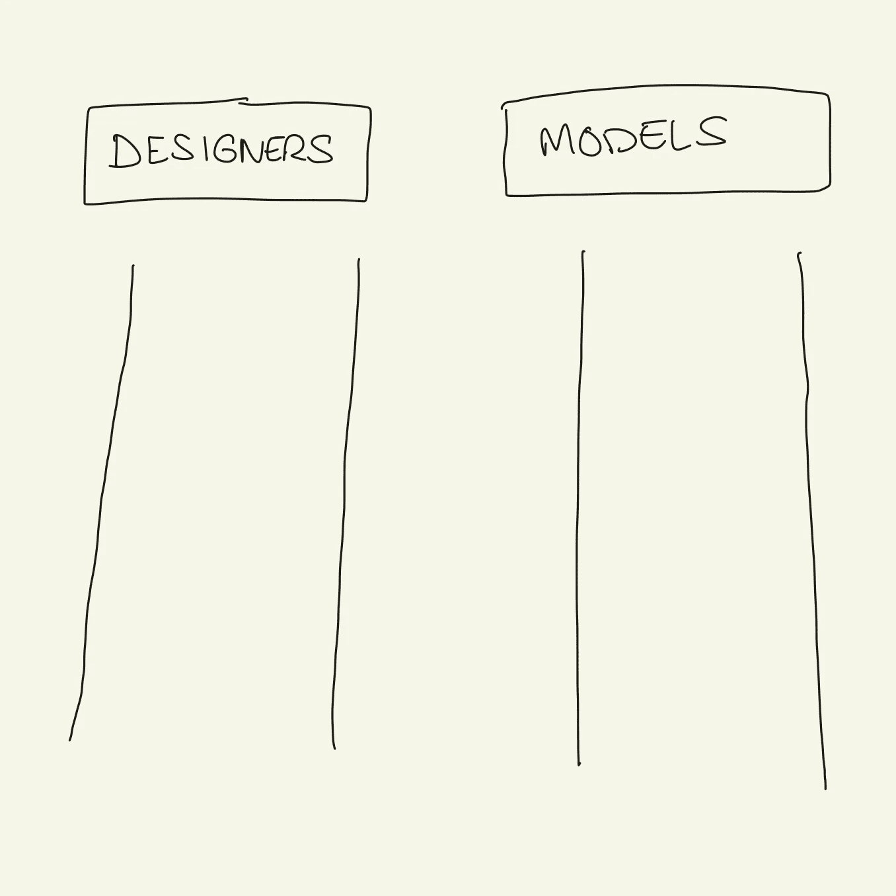
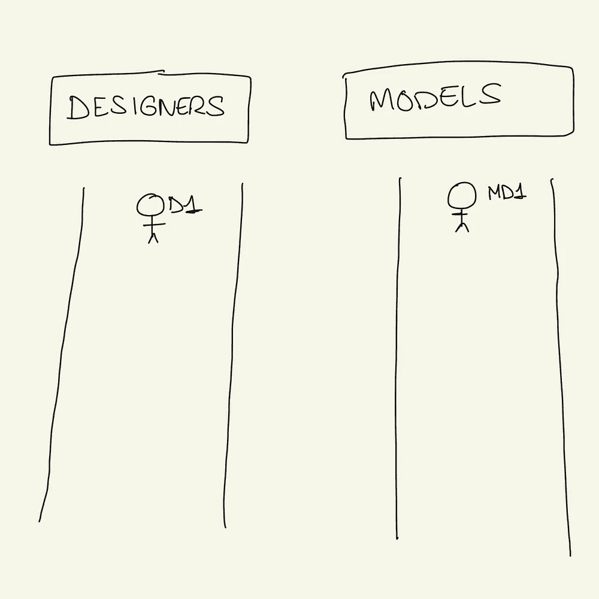
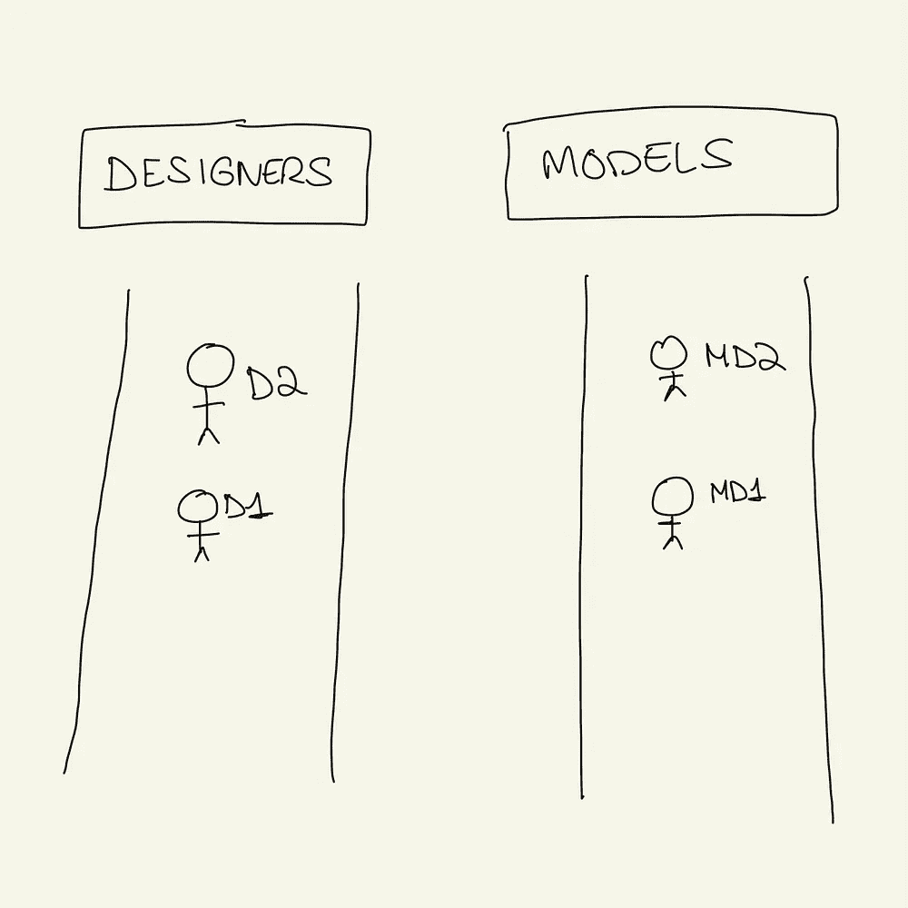
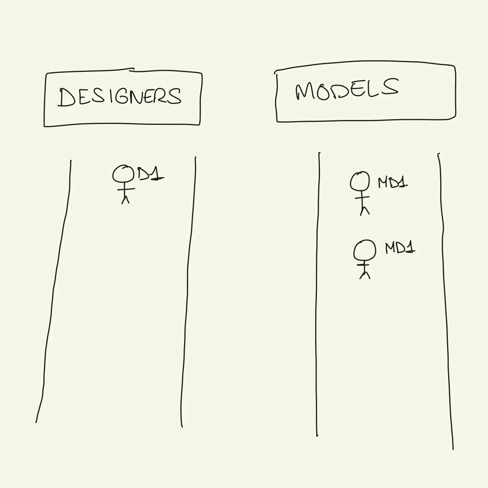
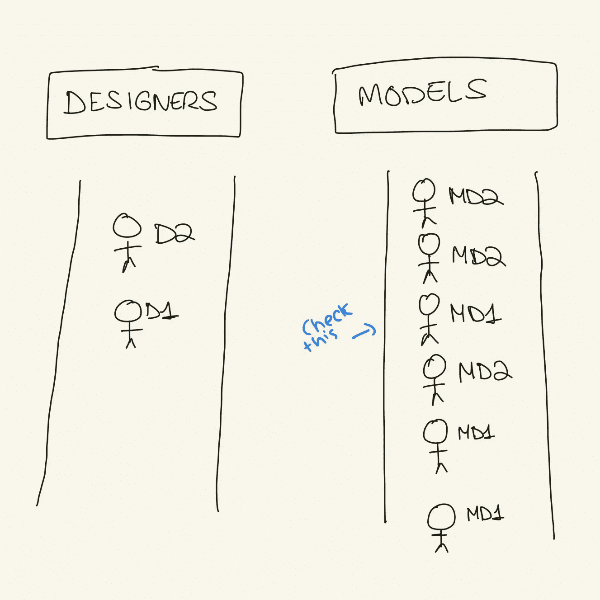
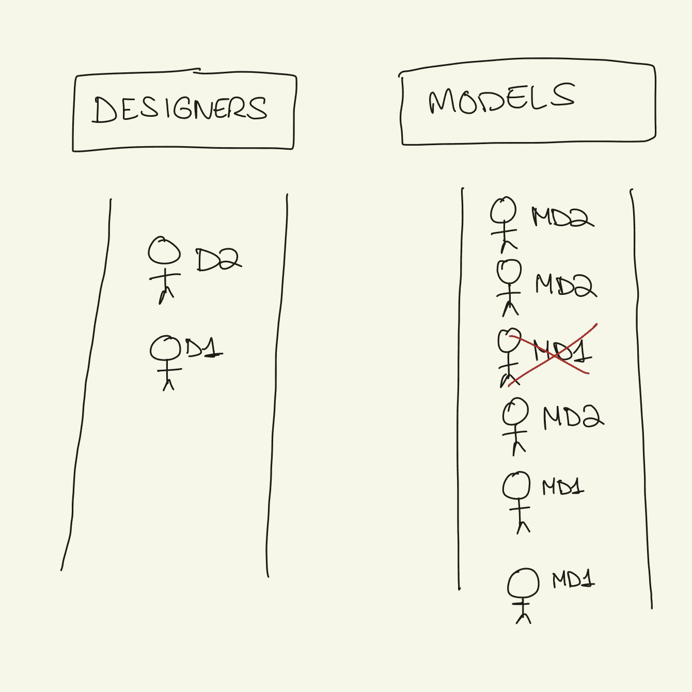

# 这个例子让我理解了 flatMap，然后是 flatMapLatest

> 原文：<https://medium.com/codex/the-example-that-made-me-understand-flatmap-and-then-flatmaplatest-83aa85af3e38?source=collection_archive---------8----------------------->

当我开始学习 observables 时，我很难理解 flatMap 和 flatMapLatest。哦，我谷歌地图对比平面地图的次数！我总是以更加困惑而告终。直到我的大脑神奇地为我创造了这个比喻。不要问我是怎么做到的。

我现在不会解释什么是可观的，因为如果你不知道，你就不会在这里。我还假设你理解 map 的功能，因为它非常简单，但是为了比较和对比，我还是用它来开始这个例子。

# 时装秀的例子

想象一场时装秀有两个 t 台。

天桥代表了一个可观察的序列。

第一场时装秀是为美丽礼服背后的设计师们准备的。第二场时装秀是给穿着这些设计师设计的漂亮服装的模特们看的。

**地图**

每位设计师只做了一件衣服。设计师和模特的数量是一样的。每个模特都穿着设计师设计的服装。所以每次设计师在第一次走秀时，穿着他设计的服装的模特会在第二次走秀时走出来。

*   设计师一起形成一个序列。
*   每件衣服本身并不是一个序列。但所有着装的结果都是一个序列。

**平面地图**

每个设计师都设计了几件衣服。每当一个设计师走上 t 台，穿着他的服装的模特就开始走下一个 t 台。

假设模特的数量少于礼服的数量。模特们需要去后台换衣服。

现在第一个设计师走上了 t 台，2 个模特穿着他的前 2 件衣服走上了第二个 t 台，但是设计师还有更多衣服可以炫耀。

与此同时，第二名设计师走上第一场时装秀，模特们也将开始穿第二名设计师的服装，同时她们将继续穿第一名设计师的服装。

然而，在第二次走秀时，看秀的人不再能分辨出模特穿的是第一还是第二设计师的服装。这两个系列的服装已经合并成一个系列。不管设计师是谁，你都会看到一个系列的服装。

第一个设计师的衣服会一直穿，一直展示，直到全部做好。模特会在第二次走秀时继续走出来，直到设计师走秀时不再有新的设计师走出来，直到每个走出来的设计师的所有服装也完成为止。

*   设计师是一个序列。
*   每位设计师的服装本身就是一个序列。但是设计师的所有服装的组合也是一个序列！

那又怎样？你看出区别了吗？该映射基于将每个元素映射到另一个元素来生成另一个可观察序列；每个设计师给一个模型；但是，平面图允许您对一个可观察对象进行操作，其中每个元素生成另一个可观察对象，因此，平面图不是为第一个可观察对象的每个元素生成另一个可观察对象，而是在组合所有结果序列的基础上生成一个可观察序列。

回到我的例子，如果平面图没有进行展平；对于每一个走出去的设计师，必须有一个新的现场建造的时装表演，让设计师的模特走上。

我心想:“嗯，好吧，我知道了。感谢大脑为我创造了这个例子。尽管 flatMapLatest 没有用。我现在不需要理解。”

后来有了经验，我明白我甚至比平面地图更需要它，但是我也不能仅仅通过看 rxMarbles 来理解它——尽管超级有用。

那么 flatMapLatest 在这个例子中是如何表现的呢？

**flatMapLatest**

人们疯了，他们说我们再也分不清哪件衣服是谁的了。所以大家都同意，每当一个新的设计师走上第一个 t 台时，前一个设计师的服装在第二个 t 台上就不再被模特展示了。

所以第一个设计师走出来，模特们开始展示。第二个走出来，模特们取消订阅(眨眼)他的衣服，处理掉(眨眼)然后开始穿着新设计师的衣服走出来。

我真的希望这些例子能让你更容易理解。我是一个非常视觉化的人，为了真正理解事物，我需要将它们与真实世界的例子联系起来。所以如果你和我一样，觉得这很有帮助，请在评论中告诉我。这会让我很开心。