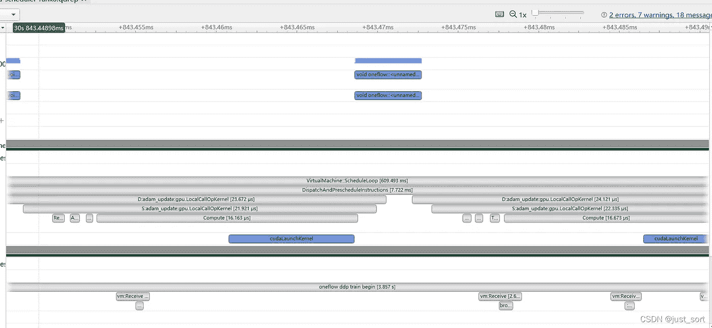

# 深度学习框架中张量的执行过程

> 原文：<https://medium.com/codex/the-execution-process-of-a-tensor-in-a-deep-learning-framework-a4d853645d5b?source=collection_archive---------8----------------------->

***张筱雨写的；翻译:刘小珍，徐晨阳，周亚坤***

> T 他的这篇文章关注的是深度学习框架[***one flow***](https://github.com/Oneflow-Inc/oneflow)中一个张量的执行背后发生的事情。以运算符“oneflow.relu”为例，介绍执行该运算符需要依赖的解释器和 VM 机制。希望本文对深度学习框架的系统设计有所启发。

首先，我们来看看 PyTorch 中的以下代码:

用 PyTorch 运行它，我们得到:

在上面的代码中，输入张量`x`被馈送给操作符`relu`，结果被打印出来。一切看起来简单又正常。但是如果有人问你是否清楚这背后发生了什么，以及`relu`对应的 Cuda 内核是什么时候被 GPU 调用的，你可能就不那么清楚了。我们习惯于直接使用深度学习框架，并没有对它进行更多的思考，所以我们可能对其背后的原理并没有深刻的理解。

然而在这篇文章中，我将试图解开这个问题。但我不会用 PyTorch 作为例子，而是用 OneFlow。为什么用 OneFlow 做例子？那是因为首先我在 OneFlow inc 工作，比 PyTorch 更了解它的执行机制，也就是说在调用链追踪的时候我的操作会更流畅。第二，执行机制的很多设计思路在 OneFlow 中都是独一无二的，所以相信这篇文章会对读者在深度学习框架的系统设计上有所启发。

那么，我们来看看 OneFlow 深度学习框架中一个张量的执行过程。为简单起见，本文只考虑单节点单 GPU 模式，不涉及 OneFlow 独有的一致模式(分布式相关)。

# Python 和 C++之间的桥梁

如果我们使用 OneFlow 运行以下代码:

系统首先在 GPU 上创建一个输入张量，然后调用导出到 Python 的 c++函数接口`relu`。这里涉及到 Python 包装器和 C++ `relu`函子，都与 pybind11 绑定有关。上面 Python 代码中的操作符`flow.relu`最终调用 ReLU C++ Functor 实现。让我们看一下代码:

在这段代码中，`op_`是一个指向`OpExpr`的指针，它调用构造函数中的 OpBuilder 函数来创建一个新的 OpExpr。从实际调用代码`OpInterpUtil::Dispatch<Tensor>(*op_, {x});`中我们可以看到，构造和运算符的执行是分开的(因为调度函数同时分配 OpExpr，input Tensor，和其他，并不直接分配执行的结果 Tensor，所以运算符的真正执行还没有开始)。这里的`OpInterpUtil::Dispatch`是分配 OpExpr，input Tensor，和其他参数(运算符 ReLU 除了 input 参数没有其他参数)，也意味着真正的执行还没有开始。

OpExpr 可以简单理解为 OneFlow 操作符的统一抽象。opExpr 可以大致分为 BuiltinOpExpr、FunctionOpExpr 和其他种类的 OpExpr，其中 BuiltinOpExpr 可以细分为 UserOpExpr 和非 UserOpExpr，用户可以通过 OpBuilder 构建 UserOpExpr。

我们不必完全理解 OpExpr 的定义，只需要知道这里 OpBuilder 构建了一个新的 OpExpr，新的 OpExpr 有 Op 名称、`UserOpConf proto_`的 ProtoBuf 对象、输入输出张量名称等关键信息。然后，顺着这个调度函数，我们可以发现`GetInterpreter`函数的`Apply`方法在`oneflow/core/framework/op_interpreter/op_interpreter_util.cpp`中被调用。

在这里，OpExprInterpContext 对象将存储操作符的动态属性、设备信息、分发信息等。这里我们不关注这个对象，因为它对于`Relu`函子是空的。接下来，我们可以分析解释器对象。

# 解释者

从上面的调用过程中我们可以看到，Python 层的运算符实际上调用的是导出到 Python 的 functor 接口。Functor 接口会将 OpExpr、输入张量和动态属性`attr`提交给解释器进行处理，因为上面的`GetInterpreter`函数是指获取一个解释器对象。解释器类是专门用来解释操作符执行过程的，上面 Relu 函子中的调度函数就是把任务分配给解释器执行。OneFlow 的解释器又进一步划分为 Eager 镜像解释器、Eager 一致解释器、LazyInterpreter 等类型。本文中的例子不涉及分布式相关信息，所以输入张量都是镜像张量，并调用 Eager 镜像解释器。镜像张量独立于每个秩，类似于 PyTorch 张量。

上面代码中的下一个`Apply`实际上调用了`oneflow/core/framework/op_interpreter/eager_mirrored_op_interpreter.cpp`文件中的`NaiveInterpret`函数。`NaiveInterpret`函数首先接受 OpExpr 对象、输入和输出张量以及一个`OpExprInterpContext`对象来导出操作符的设备、输出数据类型和输出形状等。

然后基于导出的元信息(元信息对应 TensorMeta 类对象，其中放了张量的基本信息如形状、数据类型、步距等。成类便于管理)，它分别构建了输入和输出对应的`BlobObject`、`input_eager_blob_objects`、`output_eager_blob_objects`(可以解释为输入输出张量的数据指针)。

最后，执行内核、输入输出张量数据指针和`OpExprInterpContext`对象以指令的形式发送到 OneFlow 的虚拟机(可以解释为 OneFlow 的 Eager runtime)执行并获得结果。

让我们看看`NaiveInterpret`函数是如何分段实现最终结果的。第一段代码如下所示:

这段代码遍历输入张量列表，将每个输入张量的设备与函数传递的默认设备进行比较。一旦发现输入张量的设备与默认设备不同，就会抛出异常。例如，输入张量在 CPU 上，而`nn.Module`在 GPU 上，可以执行错误检查并打印错误消息，通知设备不匹配。如果设备匹配，输入张量的`eager_blob_objects`将被添加到`input_eager_blob_objects`列表中。输入张量的`eager_blob_object`是一个`EagerBlobObject`类型的指针，这是一个指向输入张量的数据指针，稍后它将帮助与 OneFlow 的虚拟机(VM)进行交互。

> *这里补充说明一下 OneFlow 中 Tensor、TensorImpl、TensorMeta 和 BlobObject 之间的关系。张量和张量积使用桥模式设计。张量负责和 Python 接口，向上亲笔签名；TensorImpl 负责向下的真实数据。TensorMeta 将张量的形状、数据类型、步距等基本信息提取成一个类型，放在一起便于管理。BlobObject 是实际的数据对象，有数据指针。虚拟机使用这种类型来完成所指示的计算任务。*

第二段代码如下:

首先，代码声明一个类型为`EagerBlobObjectList`的指针`output_eager_blob_objects`和`output_tensor_metas`，它存储输出张量的元信息。然后，它遍历输出张量列表，以确定“`i` th”张量是否已经有值。

否则，将请求一个 MirroredTensor 类型的指针，并将其初始化为`tensor_impl`。并且索引`i`处的`output_tensor_metas`的值会更新为`tensor_impl`的张量元信息，为下一次的形状和类型派生做准备(如果有值，就是原地调用。另外，我们可以发现带值的`BlobObject`和某个输入的`BlobObject`是同一个对象。

如果输出张量已经有值(在位模式)，判断它是否有类型`EagerBlobObject`的数据指针。如果是，将这个数据指针放入列表中刚刚请求的`EagerBlobObjectList`类型的`output_eager_blob_objects`中。后续的形状派生和 dtype 派生也会用到这个`output_eager_blob_objects`。

第三段代码:

这个代码是 Op 对设备、形状和数据类型的派生。`user_op_expr.has_device_infer_fn()`用于判断当前 OpExpr 是否具有设备信息导出功能。否则，输出张量的设备信息将更新为当前的`default_device`。

如果有，直接从`user_op_expr`获取设备信息。在注册用户操作符时，已经确定了它是否是在这里派生的。我们在`oneflow/core/framework/op_expr.cpp`文件的`UserOpExpr::Init`中查看寄存器是否有器件派生功能。另外，我们可以在`oneflow/ir/include/OneFlow/OneFlowUserOps.td`文件中看到哪些操作符实现了设备派生功能。

接下来调用 OpExpr 中的`InferPhysicalShapeAndDType`完成输出张量的形状和 dtype 推导。对`InferPhysicalShapeAndDType`函数的跟踪显示，它调用了注册用户操作符时定义的形状派生和数据类型派生函数。

然后迭代`output_eager_blob_objects`，根据已经导出的张量元更新或检查对象(张量元检查是上面提到的 inplace 可能存在的结果，Inplace 前后的张量元不能改变)。

最后一段代码:

当解释器与 VM 交互时，最后一段代码是最关键的步骤。`user_op_expr.MutKernel4Device`在`op_device`上构建 StatefulOpKernel，并将`output_eager_blob_objects`中每个`EagerBlobObject`对象的`is_shape_synced_`值设置为 False。`is_shape_synced_`设置为 False 意味着输出张量的形状在运行时确定。输出张量的形状可以在核执行后得到。

为什么要默认设置为 False？因为对于一个 Op 来说，它的形状是否需要导出是 Op 的属性，所以默认会为 False。StatefulOpKernel 中有一个标志，从中可以知道哪些操作符处于动态形状。如果不是，它的标志设置为 True，这意味着它是同步的(不需要同步)。`builder->LocalCallOpKernel`功能是为虚拟机建立指令。而 PhysicalRun 负责将这条指令发送给 VM，并执行它得到最终结果。

# 虚拟机简介

OneFlow Eager 的运行时被抽象为虚拟机(VM)。当我们运行代码`flow.relu(x)`时，上面的解释器会向 VM 发送一条`LocalCallOpKernel`指令。VM 在执行这条指令时为输出张量请求内存，调用 ReLU 的 Cuda 内核来执行计算，并将结果写入输出张量。

让我们先了解一下 VM 的一些概念，然后看看关键代码，以便进一步理解。

在 OneFlow 程序运行期间，虚拟机不断在后台轮询，如果有新指令，则执行新指令，如果没有，则继续轮询。虚拟机有两种类型的线程:调度器线程和工作线程(如果我们运行 Python 脚本，脚本在主线程中运行)。虚拟机的轮询是在调度程序线程中，而工作线程处理阻塞操作，这很慢，不适合调度程序线程。

指令是虚拟机执行的最小单位。OneFlow 中的指令类型有`AccessBlobByCallback`、`LocalCallOpKernel`、`ReleaseTensor`等。`AccessBlobByCallback`是读取和修改一个 Blob 的值，`LocalCallOpKernel`是运行一个 Op，`ReleaseTensor`是释放声明周期已经结束的张量的内存。每条指令都携带一个`parallel_desc`指示该指令在哪些设备上执行(例如只在设备 1 上执行，或者在所有设备上执行)，并绑定一个 StreamType 指示该指令在哪个流上执行(文章开头 ReLU 对应的`LocalCallOpKernel`在一个 CudaStream 上执行)。

以`LocalCallOpKernel`为例，根据流类型的不同，有以下类型的指令:

根据`cpu.LocalCallOpKernel`指令，其 stram_type 被绑定到`CpuStreamType`，在`oneflow/core/eager/cpu_opkernel_instruction_type.cpp`中定义如下:

[https://gist . github . com/YakunZhou/7370 c 732248302 e5b 20 a 245370 f 0450 a](https://gist.github.com/YakunZhou/7370c732248302e5b20a245370f0450a)

每个流类型可以设置该流是否在调度器线程上工作，设置初始化、查询指令状态和完成指令计算等作业。

> *流是虚拟机中的设备抽象，每个流对应一个设备。此外，指令有推断和计算过程。Infer 是元信息的推导，compute 是启动计算内核进行执行。*

接下来，我们将看看指令之间的依赖关系。虚拟机指令是无序执行的，但是对具有依赖性的指令的执行顺序有要求。例如，如果用户发出两条指令“a”和“b”，“a”指令需要修改 Blob“c”的值，而“b”指令需要读取 Blob“c”的值，则“a”指令必须在“b”指令之前执行。

那么指令之间的依赖是如何构造的呢？指令之间的依赖性是通过依赖指令所携带的操作数来实现的。操作数的主要类型有 const、mut 和 mut2。const 对应输入(读)，mut 和 mut2 对应输出(写)。

上面的指令‘a’有一个 mut 操作数‘c’，指令‘b’有一个 const 操作数‘c’。这样，通过检查指令“a”和“b”中“c”的类型，可以在“a”和“b”之间建立“a”依赖性:

“b”的推断必须在“a”的推断之后完成，“b”的计算必须在“a”的计算之后完成。mut2 操作数处理某些运算(如 unique ),其输出形状只能在计算阶段确定。例如，如果 a 以 mut2 操作数“a”的形式持有“c”，那么“b”的推断和计算都需要在计算“a”之后发生。

从`oneflow/core/eager/local_call_opkernel_phy_instr_operand.h`中定义的`LocalCallOpKernelPhyInstrOperand`指令开始，重载了`ForEachConstMirroredObject`、`ForEachMutMirroredObject`、`ForEachMut2MirroredObject`三个方法，分别对应 const、mut、mut2 操作。在每个重载的方法中，调用传入的回调函数(`const std::function<void(vm::MirroredObject* compute)>& DoEach`)来建立指令之间的依赖关系。我们以 const 为例:

这一行代码`for (int64_t index : opkernel().input_tuple_indexes4const_ibns())`用于遍历 StatefulOpKernel 对象中的 const 操作数。它在输入元组中获取它的下标，从而得到`index`。然后根据`index`检索这个下标对应的`EagerBlobObject`对象。

然后在`EagerBlobObject`上调用`compute_local_dep_object`上的回调`DoEach`，相当于以 const 的方式消耗这个`compute_local_dep_object`。mut 和 mut2 类似。

这里还解释了虚拟机的指令间依赖关系是如何建立的。在`oneflow/core/vm/virtual_machine_engine.cpp`的`HandlePending`成员函数中，`ConsumeMirroredObjects`函数`for (const auto& operand : operands)`为每个操作数调用`ForEachMutMirroredObject`函数。例如，对于 mut:

DoEachT 是`ConsumeMutMirroredObject`，消耗`Mut Mirrored Object`。继续跟踪`ConsumeMutMirroredObject`的实施情况:

`AccessMirroredObject`添加到将访问`mirrored_object`的指令列表中。

`RwMutexedObject`锁定`mirrored_object`的读写。有了指令依赖之后，我们就可以构造指令边了。在构建了指令边缘之后，虚拟机可以执行由指令节点组成的 Dag。处理 Dag 的一个有效方法是拓扑排序，但在 OneFlow 的虚拟机中，这是通过`ready_instruction_list`和`pending_instaruction_list`来完成的。当调度器轮询时，它只需要连续处理这两个列表。在`ConsumeMirroredObjects`的这一部分中，我们再来看一下建造过程的说明部分:

它会分析两个指令之间的关系，比如一个读一个写，或者两个读一个写，分别构造指令边，把两个指令连接起来。

因此，虚拟机的指令依赖性没有嵌入到虚拟机中。而是通过消耗指令的操作数来实现。除了消耗操作数来构造指令依赖，它还可以消耗设备。以`LocalCallOpKernelPhyInstrOperand`指令的 mut 操作数为例，这里会得到 StatefulOpKernel 对应的设备，比如 cuda。那么每个设备方法也有一个`local_dep_object`成员；每条指令以 mut `local_dep_object`的形式消耗`local_dep_object`成员。这样前后两条指令在同一台设备上执行。所以这两条指令的执行顺序一定是需要按照发射顺序执行的依赖关系，因为它们在 mut 中都消耗了相同的`local_dep_object`。

> *这里的* `*local_dep_object*` *是专门用来帮助虚拟机构建指令端的对象。EagerBlobObject 和 Device 持有此对象。然后按顺序使用它，建立指令之间的联系。*

# VM 和解释器的整体调用链

这一部分从宏观上贯穿 Interpter 和虚拟机的调用链。首先，Python 层调用 OneFlow 的 Op 将通过解释器发送，以构建 VM 指令并执行它们。以 ReLU 为例，解释器的最后一步是:

然后跟进 LocalCallOpKernel 的实现:

`auto instruction = intrusive::make_shared<vm::InstructionMsg>...`这段代码构造了一个新的指令，并将一个`parallel_desc`绑定到它，指示在哪些设备上执行(例如，只在 0 号卡上执行，或者在所有卡上执行)以及一个 StreamType，指示在哪个流上执行该指令。而这段代码上面的`auto phy_instr_operand = JUST(vm::LocalCallOpKernelPhyInstrOperand::New...`用来绑定指令和操作数。现在说明已经有了。下一步是基于这些新创建的指令与 VM 进行交互，以构建指令端并执行它。这个交互的界面是`PhysicalInterpreter::Run`(从`PhysicalRun`跳转)。

跳转到`RunPhysicalInstruction`的定义，在`oneflow/core/eager/eager_oneflow.cpp`中:

它的输入参数是在我们构造指令的地方定义的全局`InstructionsBuilder`对象的`mut_instruction_list`和`eager_symbol_list`(虚拟机中的对象)。跳到`RunPhysicalInstruction(instruction_list, eager_symbol_list)`查看以下定义:

这里的`virtual_machine->Receive(instr_msg_list)`将获得刚刚构造的指令。

一旦获得指令，就可以在轮询虚拟机的调度程序线程时处理它们，即`oneflow/core/vm/virtual_machine_engine.cpp`中的`VirtualMachineEngine::Schedule`功能。

调度功能不断轮询。整体功能可分为接受主线程指令、轮询指令完成、处理阻塞指令和分派就绪指令。事实上，当我们点击进入 HandlePending 时，可以发现它正在消耗我们的`local_dep_opbject`进行指令构造和指令边缘链接，这与上面分析的过程相对应。

# NSYS 结果显示

关于解释器和 VM 的细节比我们想象的要复杂得多。最后我放一张某网络训练时生成的 NSYS 图。

您可以看到虚拟机正在工作，调度程序线程正在分发就绪指令，并启动 Adam 的 cuda 内核来执行参数更新。

# 摘要

本文以操作符`oneflow.relu`为例，介绍执行该操作符需要依赖的解释器和 VM 机制。希望对那些渴望了解 OneFlow 执行机制的人也有所帮助。

# 参考

*   设计模式桥梁模式:[https://segmentfault.com/a/1190000041225650](https://segmentfault.com/a/1190000041225650)
*   [https://github.com/Oneflow-Inc/oneflow](https://github.com/Oneflow-Inc/oneflow)

***相关文章:***

1.  [***AutoTest 框架使得深度学习框架的操作者对齐任务变得容易***](https://oneflow2020.medium.com/the-autotest-framework-makes-the-operator-alignment-task-for-deep-learning-frameworks-easy-7e47143b7606)
2.  [***基于信用的流量控制的发展(下)***](https://oneflow2020.medium.com/the-development-of-credit-based-flow-control-part-2-f04b76010a16)

*欢迎访问 OneFlow 上的**[***GitHub***](https://github.com/Oneflow-Inc/oneflow)**并关注我们上的**[***推特***](https://twitter.com/home)**和* 【T5****

**还有，欢迎加入我们的 [***不和谐群***](https://discord.gg/4kpjGA5bZY)*讨论和提问 OneFlow 相关问题，与 OneFlow 贡献者和全球用户联系。***