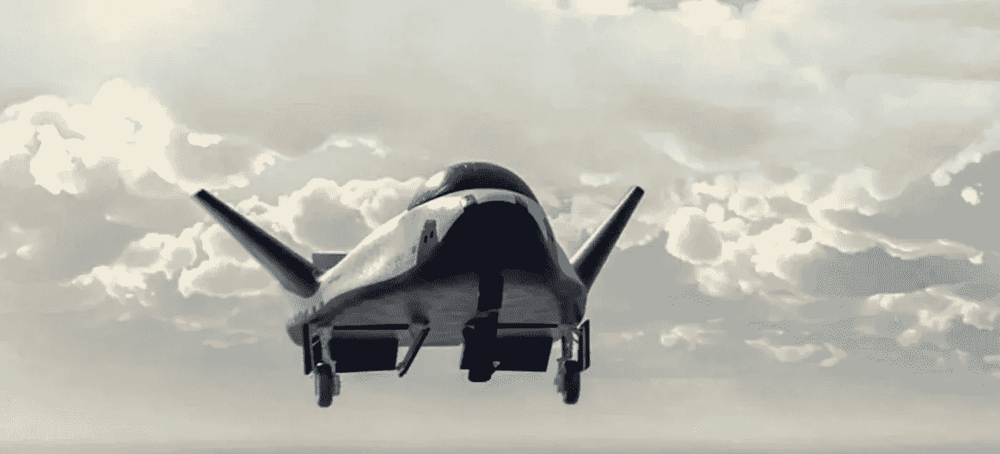

# 有史以来第一架有翼商用太空飞机

> 原文：<https://medium.com/codex/the-first-ever-winged-commercial-spaceplane-68f446814208?source=collection_archive---------1----------------------->

## 现在介绍“追梦人”

[追梦者(塞拉空间媒体)](https://www.sierraspace.com/wp-content/uploads/2022/03/S-end-01.svg)

由[塞拉空间](https://www.sierraspace.com/space-transportation/dream-chaser-spaceplane/)制造的第一架有翼商业太空飞机已经亮相。这架太空飞机能够在跑道上平稳着陆，也被称为“**追梦人**”，是运送贵重货物的理想选择，尤其是人类乘客。它还容纳了大量的用品和设备。美国宇航局正在寻找开始补给任务…