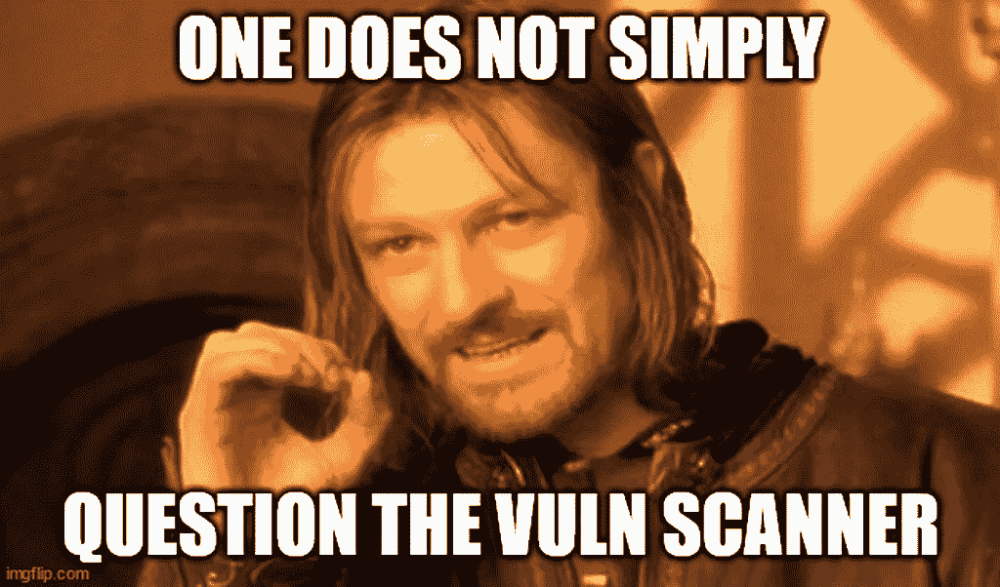

# 夸利斯俱乐部的第一条规则是你不能谈论夸利斯俱乐部

> 原文：<https://medium.com/codex/the-first-rule-of-qualys-club-is-you-dont-talk-about-qualys-club-99585cf70ea6?source=collection_archive---------8----------------------->

如果您是任何类型的服务器或平台管理员，我们对您的了解都非常有信心，这是三件事:

1.  在进行任何实质性工作之前，以及此后至少一年一次，您需要参加一个基于计算机的培训课程，解释什么是安全事件以及如何报告。检测和报告入侵是公司 IT 安全计划的基础。
2.  您的企业安全团队正在远程扫描您管理的所有服务器，通过模拟敌对行为者来测试漏洞。根据我为大型金融机构提供咨询的经验，这几乎总是 Qualys 的扫描仪。此外，根据我的经验，扫描器生成的日志是可报告安全事件的教科书示例。
3.  您可能从来没有报告过这些扫描生成的日志，或者即使您报告了，也没有报告到任何地方。

前两个问题在我工作过的每一份咨询工作中都是真实的，可以追溯到 15 年前。第三种方法相当可靠，但有所不同。有些人实际上试图将扫描日志报告为培训中定义的安全事件类型。把这些人想象成你团队中的“天真乐观者”。或者可能是“失业者”不管怎样，这是一个小群体，所以我相信第三个是可靠的。

作为一名顾问，从定义上来说，我在演出间隙是失业的。我的专业领域不缺工作，在我职业生涯的早期，我认为报告扫描结果不会有什么损失。“嘿，”我会告诉我的主管，“这些日志看起来像是可报告的安全事件。”对此，主管总是回答“你这个白痴，那些是 Qualys 的扫描。别理他们。”

经过一年这样的指责，我开始问一个明显的后续问题:“我们怎么知道这些是来自合法的 Qualys 扫描仪？难道我们不应该以某种方式对它们进行认证吗？”那时我才发现 Qualys 俱乐部是有规则的，而*Qualys 俱乐部的第一条规则就是你不能谈论 Qualys 俱乐部。*

原来漏洞扫描是神圣的。每个上市公司都会制作年度合规证明，vuln 扫描对这些公司至关重要。在 PCI 等一些合规制度中，如果你失败了，他们会剥夺你做生意的能力，因此质疑 vuln 扫描就像质疑业务本身一样。IT 工作者很快学会甚至不去想 vuln 扫描程序有什么问题。

你*尤其是*从来没有指出扫描生成的日志与入侵没有区别。这样做就是犯了 CLM——职业生涯的限制——因为承认组织不能区分 vuln 扫描和入侵会使认证无效。你，我的基层管理朋友，不要拉停止认证流水线的绳子。当团队领导说“忽略它”时，你就这么做。

这样做的一个不良后果是，我们让公司每个平台技术的管理员都忽略了漏洞扫描。当直线级管理员问“这些日志看起来不像入侵吗？”团队领导回答“忽略它，它是 Qualys，”潜在的指令是你应该忽略所有看起来像这样的东西，从现在开始直到时间结束，永远不要再用它来打扰团队领导。

当我进一步追问“但是我们*怎么知道*这些是来自合法的 Qualys 扫描？”回答总是有些“因为这就是 Qualys 扫描的样子。”啊哈。现在，我们开始了解扫描旨在减轻的威胁模型:恶意行为者足够老练，可以在内部网中建立立足点，但太愚蠢，无法执行假的 vuln 扫描，并在其中嵌入实际的黑客探针。也就是说它不能保护我，我也不是那么好的黑客。指出这种威胁特征是有缺陷的，这是 CLM 的典型例子，所以除非你打算离开，否则你可能不想这么做。

平台管理员是扫描团队担心的对手之一，这并没有帮助。从扫描团队的角度来看，这是一个通过/失败的练习。例如，扫描器抛出一个密钥重新协商攻击，如果被拒绝，则服务器通过。

但是平台管理员知道，在通过和失败之间是一个灰色区域，在这里漏洞利用失败了，但是尝试使服务器陷入困境。并不是每个供应商都能得到正确的补丁，有时成功的 vuln 扫描会导致停机。因此，一些平台管理员会找出扫描的来源，并阻止这些地址。扫描团队知道这一点，并采用了许多规避策略，就像真正的攻击一样。这使得扫描更加有效，但代价是减少了扫描对服务器的损害。

要明确的是，我并不是说扫描不好，只是说我们需要一个更聪明的方法。个人经验的两个例子是将 vuln 扫描报告集成到员工演练计划和行动后白名单中。

第一种方法将扫描后安全报告视为网络钓鱼演习报告。当 vuln 扫描完成时，每个报告入侵企图的人都会受到攻击。连续几次报告失败会导致对该平台日志集中的入侵检测是否有效的调查。

行动后白名单顾名思义，就是在扫描完成时，发布给定时间窗口内发起扫描的地址列表。平台管理员使用工具从他们的日志视图中删除白名单条目，这使得识别实际异常活动更加容易。(当然，完整的日志保存在某个地方。)

我们还需要更聪明地减轻扫描的影响。“全部扫描并让本地系统管理员解决”的方法不起作用，并且，由于上面解释的原因，部门管理员将解决扫描损害，而不是质疑扫描方法。在我的专业领域，当我告诉平台供应商他们的组件没有通过扫描时，他们会做出响应。通过扫描后，当我告诉他们他们的组件不可靠时，他们的反应是一样的。但是等待供应商修复的平台管理员需要一个程序来防止客户受到扫描的影响。这可能意味着让某些服务器暂时免于更具敌意的测试，但这比完全阻止扫描或因为该公司的移动应用程序停止工作而制造新闻要好得多。

如果你想打破 Qualys 俱乐部的第一条规则，也许不要以“这太疯狂了！”通过报告每一次扫描来放松它。当他们告诉您这些日志是合法扫描的结果时，询问您可以用来区分攻击和扫描的标准。通过这种方式，您的企业安全团队将会得出结论，这完全是他们自己的疯狂行为。这是方法。

**感谢 Qualys**

当然，这一切适用于*任何*漏洞扫描器。我在这里使用 Qualys 作为例子，因为他们的扫描仪在我的银行和金融客户中非常普遍。从供应商的角度来看，我假设他们认为这种普遍性是一件好事，并且会原谅我在我的例子中使用它们。也许作为该领域的领导者，他们甚至可以帮助解决我在这里提出的一些问题，在这种情况下，我们都可以像培训告诉我们的那样开始报告安全事件。

与此同时，Qualys，如果你不告诉我的客户，我违反了他们的强制性安全培训，没有报告你的扫描记录证据，我会把它作为一个人情。毕竟，我们知道这些肯定是合法的。