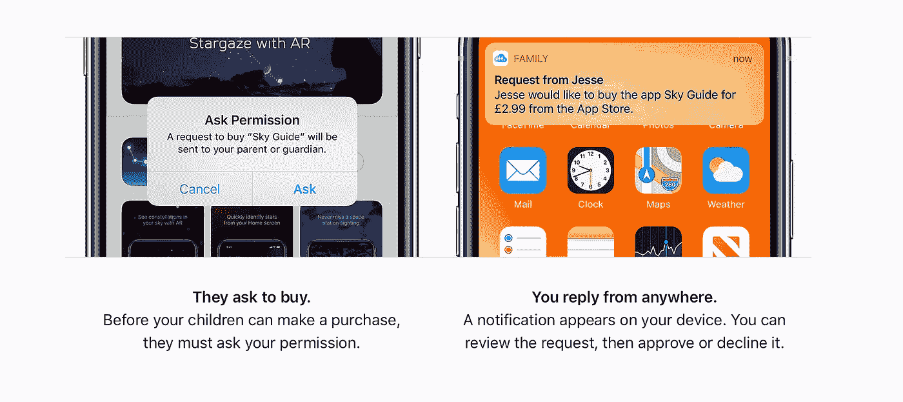

# 被遗忘的苹果宝石

> 原文：<https://medium.com/codex/the-forgotten-apple-gem-817f2c38e8eb?source=collection_archive---------17----------------------->

## 家庭共享以及为什么您应该使用它

苹果上的家庭分享

尽管我热爱苹果，但我会第一个承认，这家加州科技巨头并没有给我们太多免费的东西。但是，有一个我们都可以使用的功能，它不需要任何成本，并且嵌入在 iOS 中，确实应该更多地使用。那个特征就是 ***家族共享*** 。我现在喜欢上了*苹果电视+* ，感谢你对这个功能的关注，我将在后面解释。

家庭共享——来自苹果的礼物！

## **是什么？**

就其核心而言，家庭共享就是让家庭去做这些事情——共享内容。这是一种在多个 iOS 设备和 Apple ID 帐户之间共享应用程序、购买和存储的超级简单的方式。它也不局限于 iOS 设备，在 macOS 上也同样适用。

您可以分享的内容范围很广，包括 Apple Music、Apple Books、Fitness+、News+、Apple Arcade、照片甚至日历。如上所述，储物空间也可以与计划中的家庭成员共享。跟踪年轻家庭成员的行踪也包括在内，其中*查找我的*包括在共享功能列表中。除了您自己(*组织者)*，您可以在您的家庭组中设置五个其他成员，包括孩子。作为组长，任何采购都是你的责任，并从你的账户中扣除。

 [## AirPod Pro 2 来了

### 我们能从他们那里期待什么？

medium.com](/codex/airpod-pro-2-are-coming-c93d56f371e2) 

家庭共享入门

## 设置家庭共享

向计划中添加成员非常简单。作为*组织者*，你不仅要选择谁加入*家庭*，还要选择你希望与每个成员分享的内容。一般来说，你可以通过 *iMessage* 发送邀请，一旦收件人接受了邀请，*家庭共享*就会在他们的设备上建立起来。首先，只需进入设置中的 Apple ID，点击*家庭共享*，然后开始添加家庭成员。作为*组织者*，你决定你想要与每个成员分享哪些应用和功能。

分享的另一个好处是，只有一个家庭成员需要购买任何节目、专辑或应用程序，然后，购买的内容将与其他家庭成员分享。只需要购买一个存储计划，甚至只需要设置 Apple Music 帐户。它是如此珍贵的一个特性，应该有更多的人利用它。某些购买可以保密，你所有的照片和文件也是保密的，除非你另有决定。

 [## iPhone 14 泄露& CADS、有机发光二极管为 iPad 屏幕& WWDC 新闻

### 苹果视图综述

medium.com](/codex/iphone-14-leaks-cads-oled-screens-for-ipad-wwdc-news-5f05a6fc4ced) 

家庭共享—您决定

## **孩子**

要成为家庭共享计划的成员，每个成员都必须有一个 Apple ID。13 岁以下的儿童必须获得你的许可才能设置，但该电子邮件地址和 Apple ID 将伴随他们直到成年。*这是对苹果生态系统的一个巧妙的小搭配，是吧！*可以对孩子的账户设置家长控制和限制，包括 ***要求购买*** 。这个功能显然很重要，因为每当孩子试图购买时，您都会收到推送通知。你不仅可以检查你是否满意购买的合适内容，而且，你可以跟踪花费，这样你就不会在月底收到一大笔意想不到的账单。对于成年成员，显然需要一些信任。我会让你来判断的！

应用程序是家庭共享的一部分

## iTunes 和 App Store 购买

您购买的任何音乐、电影或节目都将对该群组可用。已经购买的应用程序也将随时可用。

苹果音乐也是如此

## 苹果音乐

有了每月 14.99 美元的苹果音乐家庭计划，家庭成员将可以在他们的设备上无限制地使用苹果音乐。每个成员都将获得他们的个人账户、图书馆和推荐信。*比六个苹果音乐订阅要便宜得多。*

家庭共享应用程序—超值

## iCloud 储存

您将无法查看其他家庭成员的文件和照片，但您 ***将*** 能够看到每个家庭成员使用了多少存储空间。因此，作为组织者，你可以支付 2 TB 的 iCloud 存储空间，足够整个家庭使用，而不是每个成员单独支付存储计划。

查找我的—家庭共享的一部分

## 位置共享

如果你决定启用这一功能，最好的部分是所有的家庭设备都将显示在*查找我的*应用程序上，从而更容易找到任何丢失的 iPhones 或 iPads。每个成员都可以选择关闭*分享我的位置*来获得更大的隐私。

监控儿童的屏幕时间

## 看电视的时间

作为*组织者*，大概也是家长，或者一家之主，你将能够监控孩子们的在线时间。在应用程序中，可以为特定的应用程序等设置时间限制

要求购买

## 采购和要求购买

任何购买的付款将由*主办方*在其首选卡&账户上进行。所有的购买都是你的责任。*要求购买*，默认为 13 岁以下儿童启用，但如果您愿意，可以手动更改。

 [## 我讨厌正确！

### 让我们把六月的 WWDC 看得更远一点

medium.com](/codex/i-hate-being-right-49073d66cb) 

## 共享相册

当您设置您的*家庭*时，所有家庭成员设备上的照片应用程序会自动创建一个共享相册。这意味着所有家庭成员都可以向该相册添加照片、视频和评论。群组日历和提醒也是家庭共享功能的一部分。

为什么要等？

## **为什么要等待？**

虽然你很可能知道 iOS 中的*家庭共享*功能，但老实说，你*实际上*用了多少？这是一个如此强大和包容的应用程序，我强烈建议你花点时间去看看。我前面提到是 *Apple TV+* 促使我再看一遍。看过并喜欢这部电影后，我想和我的女儿分享。她住在伦敦，没有苹果电视+账户。*一个简单的邀请之后，问题就解决了。*

希望这篇博客已经激起了你的兴趣，让你再去看看*家庭分享*。苹果通常不会因为免费给我们东西而感到内疚，但这确实是一颗无私的宝石！一定要充分利用。

***你有什么想和家人分享的？你已经在用了吗？让我知道。***

## 在你走之前

你订阅媒体了吗？

我只是高端博客网站 Medium 的众多作者之一。它是如此物有所值，你可以在这里加入 https://medium.com/membership

加入我的幕后邮件列表

最初发表于 2022 年 4 月 12 日 https://www.talkingtechandaudio.com/blog。