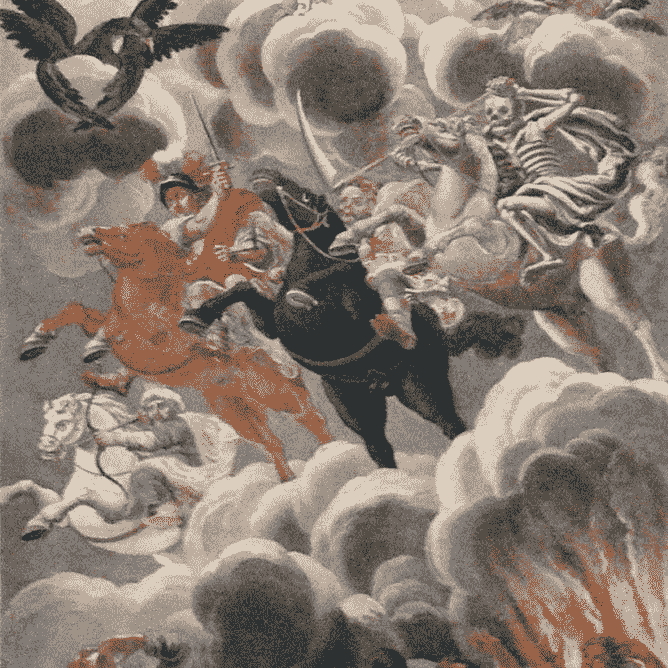

# Perl 仇恨的四个吵闹的骑士

> 原文：<https://medium.com/codex/the-four-noisy-horsemen-of-perl-hate-5abe7091af25?source=collection_archive---------15----------------------->

我每周在这个博客上发布一次 Perl 的故事，似乎每次社交媒体上至少有一个回应是，我讨厌 Perl，因为它奇怪的 syn tax。”或者，“看起来像线路噪声。”(Perl 似乎在这个问题上胜出了——您上次使用声学调制解调器是什么时候？)或者引用 [Keith Bostic](http://bostic.com) 的话:“RSA 加密前后唯一看起来一样的语言。"