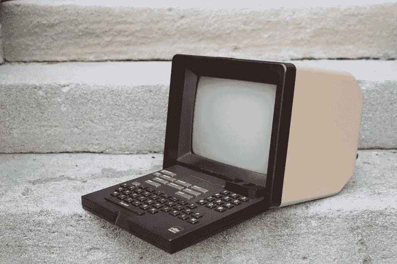

# 法国万维网:Minitel 的故事

> 原文：<https://medium.com/codex/the-french-wide-web-the-story-of-minitel-a971b8fd3695?source=collection_archive---------14----------------------->

Minitel 1。图片由 Minitel 研究实验室提供，美国(https://minitel.us/)

20 世纪 70 年代，法国的通信结构正在崩溃，700 万条电话线难以容纳约 4700 万用户，而且新线路的等待时间很长——巴黎居民要等 6 个月才能接到新线路。此外，美国政府正焦急地注视着美国在发展计算机工业方面所取得的进展。

1977 年，向法国总统瓦里·吉斯卡尔·德斯坦提交了一份关于社会信息化的报告，其中描述了一场称为远程信息处理的新革命:允许通过电信网络访问存储在计算机上的数据的终端的长途连接。根据这份报告，政府不仅决定按照最初的计划，用全自动系统取代陈旧的电话网络，而且决定更进一步，提供普遍的语音和数据服务。

五年后的 1982 年 7 月 15 日，法国总统在风景如画的法国港口圣马洛为一项由法国国家电话和邮政公司 PTT (Postes，télégraps and téléphone)提供的新服务举行了落成典礼。该公司最初名为 **TELETEL** ，很快又以法语名称“信息电话交互媒体”(Information Téléphonique)的首字母缩写为 **Minitel** 。

Minitel 是由屏幕、键盘和调制解调器组成的计算机终端，但没有微处理器。由于 Minitel 本身没有计算能力，它使用可视电话技术通过电话线连接到远程服务。

起初，PTT 设计了 Minitel，以减少印制电话号码簿的费用和雇员提供用户信息的费用。由于提供了免费的终端，他们允许客户在几秒钟内浏览电话目录(大约有 2400 万条条目)，比搜索整本书的页面还要快。

为了缓解担心新的电子媒体的报纸的反对，PTT 允许他们提供在线新闻，建立了 Minitel 提供的第一个消费者服务。网上购物、即时消息和其他服务很快就接踵而至。Minitel 不仅使用方便，而且是一种使用电话费进行支付的简单方法，这一点很快就让 Minitel 变得流行起来，并开始得到广泛应用。

几年后，法国变成了世界上最有线的国家。通过安装约 900 万台 Minitel 设备和 26，000 项服务供选择，约 2，500 万用户可以阅读最新新闻、参与多人互动游戏、订购当天送达的杂货、预定戏票、远程控制家用电器、管理银行账户或使用约会服务。

这样，在 80 年代，法国发现自己成为了技术中心。随着 **TGV** (法国时速 300 公里的城际高速铁路服务)的出现，**蓬皮杜中心**(一座复杂的高科技建筑，内有**公共信息图书馆**、**国家现代艺术博物馆**——欧洲最大的现代艺术博物馆 **IRCAM** ， 音乐和声学研究中心)和**阿丽亚娜**项目(在法属圭亚那库鲁**圭亚那航天中心**开发欧洲航天运载火箭)以及最后随着 Minitel 的爆炸，法国可以自诩为一个高科技中心。

二十年来，法国享受着这种科技爆炸的势头，然而，现实跟上了。通过万维网使用互联网的爆炸式增长逐渐使 Minitel 过时，导致创收大幅下降，2012 年，PTT 被迫终止其服务。

万维网和微型电话的发展表明了完全依赖国营项目或完全依赖私人倡议的好处和危险。互联网几乎失败，直到其参数通过政府干预得到修复，迷你电话最终失败，因为政府官僚无法跟上私人项目的创新。

如今，人们对迷你酒店又有了新的兴趣。许多忠实的粉丝仍然使用旧的终端，并为它们发明新的用途。朱利安·梅兰德(印第安纳大学媒体学院电信副教授)和凯文·德里斯科尔(弗吉尼亚大学媒体研究副教授)写了一本书“**迷你电话:欢迎来到互联网**”，由麻省理工学院出版社于 2017 年出版，对迷你电话现象进行了学术分析。他们有一个网站，美国 Minitel 研究实验室([https://minitel.us/](https://minitel.us/))来“创建一个全面的、独立的数字 Minitel 博物馆和资源中心；探索 Minitel 网络的技术、社会、政治和法律意义；并创造性地利用这些机器来激发对网络设计的批判性思考”。

博物馆的实物收藏在印第安纳州布卢明顿的印第安纳大学。