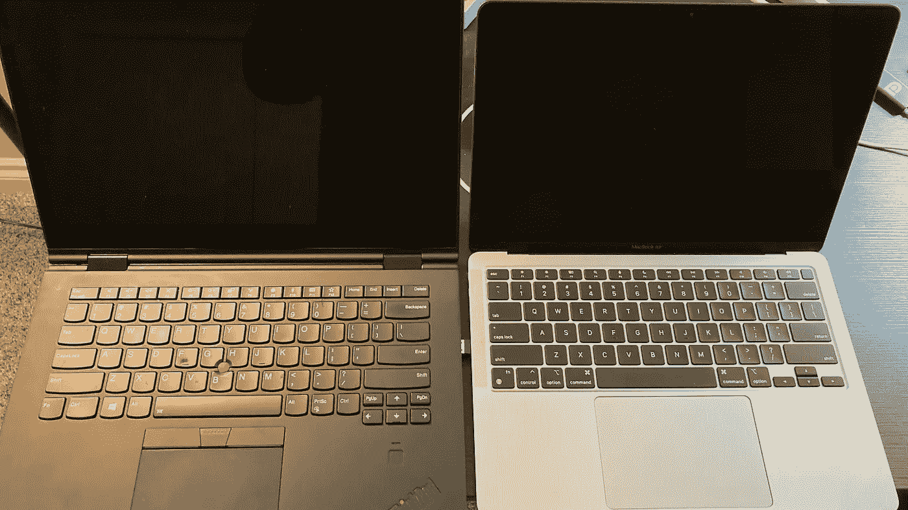

# 苹果 M1 芯片后的未来

> 原文：<https://medium.com/codex/the-future-after-apple-m1-chip-3820390b597a?source=collection_archive---------7----------------------->

Thinkpad 和 MacBook Air M1

几个月前，每天晚上，当我的 ThinkPad 键盘的风扇疯狂地吹着，当键盘烧伤我的手指时，我都希望有一台笔记本电脑可以安静而凉爽地运行很长一段时间。

然后，苹果 M1 来了。像魔法一样。

笔记本电脑运行凉爽，安静，功能强大。这在以前是不可想象的。M1 芯片像是来自平行宇宙的东西。