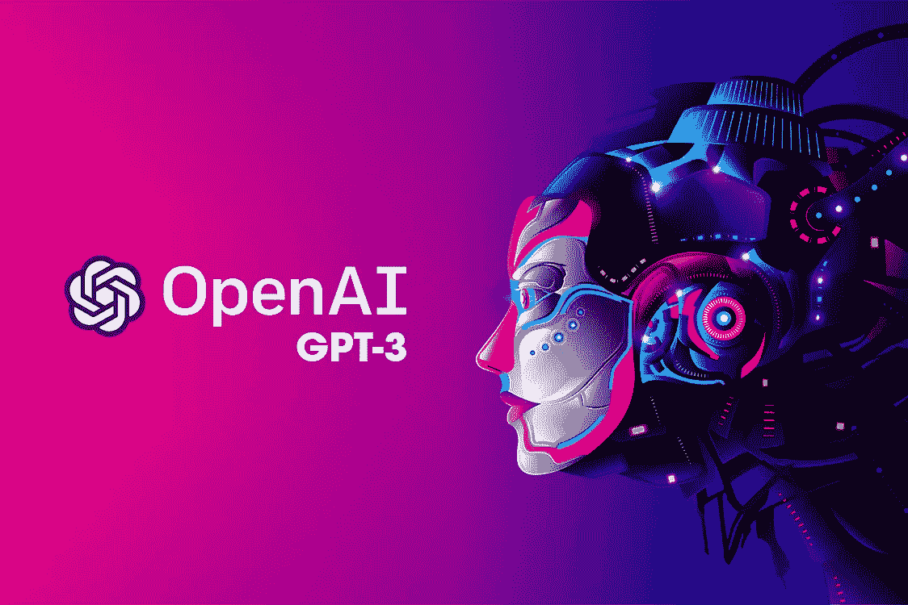

# 人工智能的未来:GPT-3 和智能机器的新时代

> 原文：<https://medium.com/codex/the-future-of-ai-gpt-3-and-the-new-age-of-intelligent-machines-d3aae25a8e74?source=collection_archive---------9----------------------->

## GPT-3 是有史以来最大的人工智能模型。

巨型 GPT-3 是有史以来最大的人工智能模型，它有可能彻底改变人工智能(AI)领域。

GPT-3 是一个由 OpenAI 创建的机器学习模型，open ai 是一个专注于开发…