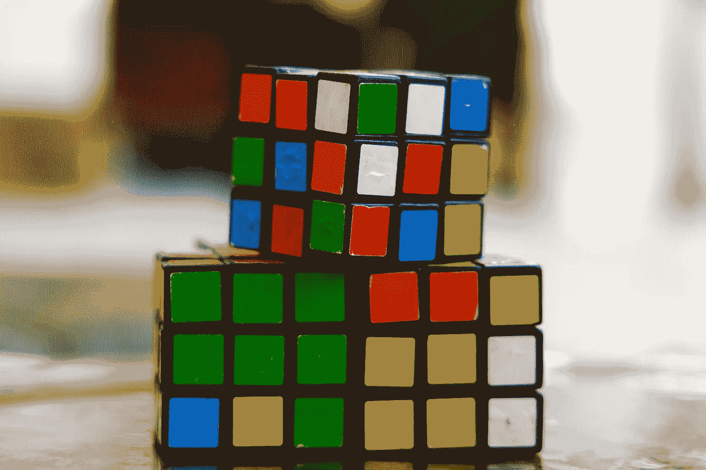

# 人工智能的未来

> 原文：<https://medium.com/codex/the-future-of-artificial-intelligence-8d4a1f4fb58c?source=collection_archive---------33----------------------->

## 人类大脑将如何进化

照片由 Engin Akyurt 拍摄

# 人工智能

人工智能(AI)是指机器可以被训练来执行需要智能的任务，如学习或推理。人工智能目前的状态仍然很小，但它是一个令人兴奋的领域，具有改变世界的巨大潜力。研究人员和发明家…