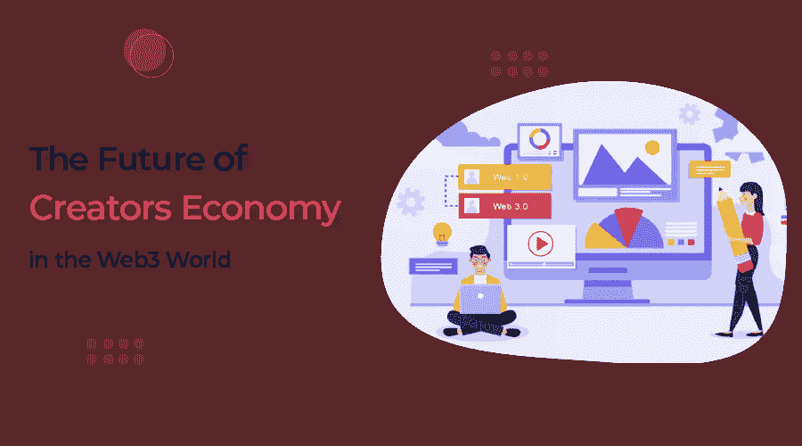
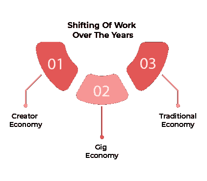

# 网络 3 世界中创造者经济的未来

> 原文：<https://medium.com/codex/the-future-of-creators-economy-in-the-web3-world-96a0573e9a2e?source=collection_archive---------6----------------------->

在过去的几年中，最值得注意的变化之一是创造者文化的兴起。到 2022 年底，将有超过五千万人认为自己是创造者。

创造者经济推动不同行业的创新，并以前所未有的方式改变了工作的定义。它为个人提供了新的机会，通过创造媒体，如照片、视频或音乐来赚取收入。

抖音、Instagram、Discord 和 Substack 等平台为内容创作和盈利开辟了新的途径。这些平台正在推动内容创作者和消费者之间的直接接触，以控制他们的创作，并要求他们的所有权并获得相应的报酬。

智能合同和虚拟现实开发等 Web3 技术正在重塑这一日益重要的格局。

让我们在今天的博客中看看 web3 技术将如何影响创造者经济的未来。

但在我们深入了解更多细节之前，让我们先来了解一下工作的转变是如何在这些年里发生变化的。

# **互联网转向 Web3.0**

在过去几年中，工作模式经历了三个阶段。让我们一个一个地快速浏览一下。

**1。传统经济**

传统经济指的是为大型组织工作的很大一部分人。在这种经济形势下，员工对自己正在做的工作类型或如何执行工作几乎没有自主权。一般来说，这是大多数人遵循的工作方法。

**2。零工经济**

近年来，零工经济蓬勃发展。在这种经济下，工人可以在特定的基础上为雇主完成较小的、可管理的任务，例如通过 UberEats 或 Zomato 递送食物。

虽然这种工作模式给了员工比以前更多的灵活性和自主权，但他们仍然严重依赖他们的雇主。

**3。创造者经济**

在创作者经济中，创作者可以在他们想工作的时候工作，创作他们想创作的东西，并完全自主地决定如何从他们的创作中获利。这样工人就不用依赖雇主了。

这种新的所有权结构象征着第一阶段和第二阶段经济中传统雇主-雇员动态的更大权力转移。而在第一阶段和第二阶段，权力几乎完全掌握在雇主手中。

创作者经济使个人创作者能够保留对其创作的所有方面的控制权，比如他们希望如何获得工作报酬，以及他们希望谁分享他们的个人数据来赚钱。

至此，我们已经讨论了工作模块的三个阶段。我们现在将深入探讨 web3 如何为未来几年创作者的经济繁荣铺平道路。

> **亦读- Top** [**Web3 货币化趋势**](https://www.quytech.com/blog/top-web3-monetization-trends/) **展望 2022 年及以后**

# Web3 将如何加速创造者经济

创造者经济背后的原则分散化、工作所有权和灵活性与 Web3 不可避免的崛起并行不悖。随着未来几年世界越来越接近下一代互联网，这两种想法将越来越多地重叠。现在让我们看看 Web3 如何影响创作者的经济。

**1。创作者拥有的内容和平台的崛起**

在 web3 世界中，人们将拥有内容和平台的一部分。早期的平台所有者曾经拥有制作的内容。这将不再是 web3 世界的情况。创作者将拥有内容，他们将根据自己的选择和偏好将其货币化。

没有大公司或社交媒体平台可以阻止他们的收入和增长，因此我们将见证 web3.0 世界给予用户更多的控制权。

内容创建者将能够通过支持区块链的不可替代令牌(NFTs)拥有内容。这些令牌作为所有权的证明，并认证所有出版的作品，使它们无法伪造或复制。

这意味着如果有人试图窃取或修改信息，内容所有者可以很容易地知道并采取必要的行动。

**2。沉浸式交互将增强**

Web3.0 培养了沉浸式体验，使创作者能够更方便地与平台和粉丝互动。然而，Web 2.0 已经提供了用户友好的交互，并奖励用户参与网络，但 Web 3.0 将把这一点提升到一个全新的水平。

Web3.0 将促进沉浸式交互，并给用户带来愉快和神奇的体验。这样，Web3.0 将为创作者增加收入和有效发展业务铺平道路。

> **也读-** [**如何获得一个元宇宙应用开发出来的**](https://www.quytech.com/blog/metaverse-application-development-guide-for-businesses/) **？**

**3。粉丝数量增加**

内容创作者希望与他们的每个粉丝接触，以发展他们的平台，并为他们提供更多的互动体验。毕竟，是他们的粉丝观看、喜欢和关注他们的内容，使他们受到欢迎，并增加他们的收入来源。

在 Web2.0 中，创作者不能直接与他们的粉丝互动，因为有平台和中介不允许这样做。然而，web3 world 消除了中介，而是允许创作者直接联系他们的粉丝，粉丝联系他们喜欢的创作者。这将有助于创作者增加他们的粉丝群和粉丝所有权。

区块链技术使 web3.0 世界成为可能，并使创作者能够直接与粉丝联系。创作者和粉丝可以利用这些新的机会(区块链和 web3.0)，帮助他们在彼此之间建立更多的个人联系。

**4。虚拟世界中的排他性**

不可替代代币(NFT)为人们提供了访问虚拟世界中发生的专属社区、事件和场所的途径。在位于区块链并为用户提供安全访问的 NFT 的帮助下，用户可以轻松地参与虚拟活动和会议。

除此之外，分散环境中的令牌门控为粉丝提供了独特的机会，例如与创作者私下交流或访问私人论坛。

这种排他性在 web2.0 中是不可能的，因为区块链支持的 web3.0 是唯一一个加强安全问题并提供去中心化平台的 web 3.0。

**5。创造者制造的元宇宙平台**

创作者将成为元宇宙的重要组成部分。他们不仅会参与其中，还能在不了解编码或编程技能的情况下为元宇宙创造东西。例如，Roblox 帮助用户创建视频游戏，并直接在平台上赚钱。

根据一份报告，仅在 2020 年，创作者就从 Roblox 赚了 3.29 亿美元，这意味着“元宇宙创作者”将继续增长，赚更多的钱。

> **也读-** [**品牌如何利用元宇宙吸引顾客**](https://www.quytech.com/blog/brands-are-using-metaverse-to-engage-customer/)

# 总结一下！

Web 3.0 将控制权从大公司分散到内容创作者手中，并允许他们在没有任何中介的情况下将其内容货币化。区块链技术给予创作者自由，而不依赖于集中式 web 主机或社交媒体网络的支持。

粉丝和创意者现在可以以一种前所未有的方式相互交流，促进创意，加速变革，为创作者提供无尽的机会。

我们将看到创作者人数大幅上升并获得巨额收入的日子不远了，这一切都将发生在 web3.0 中。

如果您正在寻找如何在您的业务中采用最新技术，您可以通过 [**联系我们**](https://www.quytech.com/contactus.php)**[**Quytech**](https://www.quytech.com/)**获得即时的专家帮助。****

**感谢阅读！**