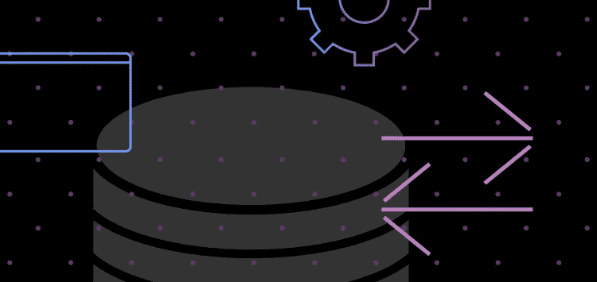
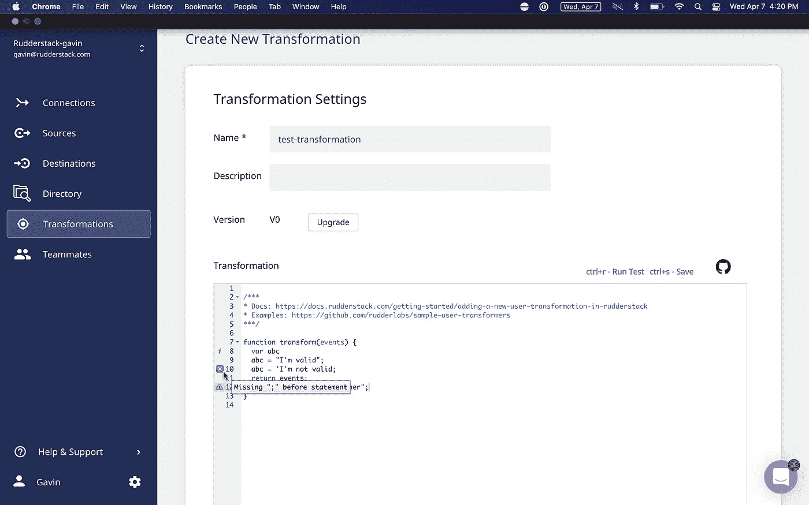
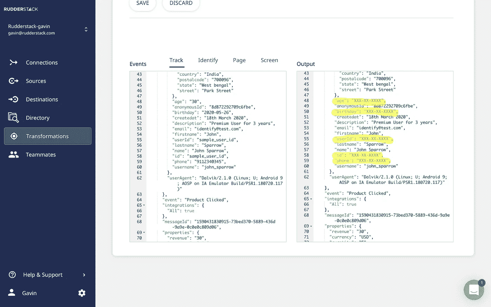

# 数据管道工具的未来必须包括比 ETL 更好的转换

> 原文：<https://medium.com/codex/the-future-of-data-pipeline-tools-must-include-better-transformations-than-etl-ever-had-657fa42579da?source=collection_archive---------3----------------------->

每个人都讨厌管道工具中的数据转换。开发人员非常讨厌 ETL 工具中的转换，以至于他们提出了一种全新的工具分类——ELT——它完全去除了转换，将这项工作留给了专门的工具，如 [dbt](https://www.getdbt.com/) 来处理数据仓库。

很容易理解为什么。数据管道工具总是使转换难以使用。送到仓库，在那里改造。比较容易。你只需要知道 SQL，那些脚本运行起来会更快。

嗯……我在这个普遍持有的信念上打电话给 BS。虽然这没有错，但它的问题是没有一个数据管道工具能够很好地实现数据转换。

那不再是真的了。我们有。

RudderStack 转换易于构建、调试和管理；它们是实时运行的。它们是数据转换，像你认为的那样工作。

# 您使用过的每个数据管道工具中的数据转换问题

# 难以构建和管理

当您转换数据时，总会有某种程度的技术复杂性。在管道工具中构建数据转换几乎总是需要编程知识。然而，这些工具似乎总是对使用它们的数据工程师有某种程度的蔑视，这就是事情变得复杂的地方。

在这一点上，大多数工具支持重用数据转换，这很好，但是重用是最低限度的。

我可以重用这个转换吗？是的。太好了，我可以在另一个转换中重用它来执行更复杂的转换吗？？？

数据管道工具不支持模块化等常见的软件工程概念。这使得数据工程师的工作更加复杂。您最终不得不将代码从一个转换复制并粘贴到另一个转换，以复制现有的功能作为新的但不同的转换的一部分。那你就得永远手动维护了。

将建筑改造整合到你的工程流程中也很困难。您的转换的代码存在于数据管道工具中，并且，虽然您可以在此时对您的转换进行版本化，但是只有少数工具集成了 git。更罕见的是一个数据管道工具，它有一个 API，允许您用所有您喜欢的过程和工具来构建和管理您的转换。

呸。给我 dbt 代替。

# 难以调试

调试数据转换也是一场噩梦。在代码上有一个调试器是很好的，大多数人都是这样做的，但这也是最起码的。

我的代码能运行吗？是的。太好了，它产生了预期的结果吗？？？

数据管道工具对此提出的解决方案是…什么也没有。把数据传过去，看看另一边会有什么结果。有些有数据调试器，但是你仍然需要通过它运行数据。

历史上没有人认为在产品上做这样的测试是一个好主意(或者，如果他们这样做了，他们会后悔)。那你是做什么的？为您的 ETL 工具构建一个测试环境？

很难通过。

# 实时转换的数据更有价值

管道工具中的数据转换总是成批运行。这是它们所属的工具(ETL 工具)的产物，ETL 工具批量运行作业，并在作业运行时应用转换。

传统 ETL 工具的刻板印象是，您必须等到明天早上或下周才能获得更新的数据。这些等待时间是每批运行的频率，它们远没有以前那么糟糕。大多数主要的 ETL 工具都是可配置的，并且已经缩短到最短 5 分钟左右。

这是很大的改进，但标准不是 5 分钟——这是最好和最昂贵的选择——而且 5 分钟不是接近实时。您希望在传输过程中集成和转换的许多数据在实时交付时更有价值。

# 在将数据发送到目的地之前，您有充分的理由转换数据

鉴于这些缺陷，英语教学的口号似乎是一个简单的口号。您的数据管道用于提取和加载数据。使用特定的数据转换工具来转换数据仓库中的数据。效果更好。

ELT 假设了一些在数据管道中不再真实的东西。ELT 假设目的地是数据仓库。所以，如果你在加载前没有应用转换，没什么大不了的。之后再涂。这没有什么真正的区别。

然而，现代数据堆栈要比这复杂得多。您希望将数据发送到您的仓库，但是您还想将数据发送到 20 个其他工具。他们每个人都有自己的转换需求，并且事后应用转换通常是不现实或不可能的。

虽然您应该使用 dbt 之类的工具在您的仓库中进行大多数建模和大量静态转换，但是在途转换对于解决现代公司面临的问题仍然至关重要。

受益于传输中转换的一个经典用例是在将数据发送到仓库之前过滤和加强数据质量。在传输过程中执行这种转换意味着数据仓库中的数据总是可供分析的。如果在静止状态下完成，您的分析就绪数据的保真度将只取决于您的转换运行的频率。

另一个受益于传输中转换的更现代的用例是屏蔽或删除 PII 和敏感数据。如果这种数据从不被加载到不需要的地方，包括您的仓库，那就更好了。虽然您可以在将数据加载到您的仓库后屏蔽/移除 PII，但在加载到您的 20 个其他目的地工具后，您可能无法屏蔽/移除。您需要在途转换来支持这个非常常见的用例。

# 在将数据实时发送到目标工具之前转换数据是非常有价值的

当您走出 ETL 和 ELT 管道的批处理世界，进入事件流管道的实时世界时，在加载到目标工具之前转换数据的能力变得更加重要。

发送实时事件非常有价值，因为您可以通过将这些数据发送到使用它来自动执行的工具来开始实施基于行为的策略——想想通过 [Customer.io](https://customer.io/) 发送电子邮件或通过[brash](https://www.braze.com/)个性化用户体验，两者都基于您应用程序中的触发操作。这些基于行为的策略做得好的话会有很高的投资回报率。

但是，您不能将原始事件流发送到您使用的每个目标工具。您的数据质量会受到影响。此外，您可能希望丰富您的事件——比如添加来自 Clearbit 或位置数据的信息。

更重要的是，您不能将事件流中的 PII 和敏感数据发送到所有目标工具。这是一场数据隐私噩梦。在数据到达目标工具之前，您应该屏蔽或移除尽可能多的 PII 和敏感数据。这是对您的客户和您的企业最安全的方法。对于高度监管行业的企业而言，事件流的可行性将取决于此。

# 方向舵堆栈转换。数据转换像你认为的那样工作。

RudderStack 转换允许您转换通过 RudderStack 发送的任何数据，您可以在事件流、仓库操作和云提取管道中使用它们。它们易于构建、调试和管理；并且它们在数据收集之后和传送到目的地之前实时运行。它们是数据转换，像你认为的那样工作。

**舵栈转换易于编写和维护。你用 Javascript 编写它们，这是一种通用且易于使用的语言。每个转换都是可重用的。所以写一次就可以到处用。转换也是模块化的。您可以将它们保存到您组织的转换库中，并作为其他转换的一部分重用它们，就像软件编程中的库一样(我们甚至在 RudderStack 库中包含了一些现成的转换库)。**

您甚至可以使用您喜欢的转换 API 的所有过程和工具来构建转换。通过它，您可以以编程方式向平台添加和移除转换，创建一个组织范围的沙箱，在将转换发布到真实环境之前，您的团队可以在其中存储转换，定义库，并对您的转换进行版本控制。

RudderStack 转换使得调试代码和数据变得容易。

**创建新的转换**

我们不仅给你一个代码调试器，让你可以确认你的转换将运行，而且我们还有一个转换测试。它允许您通过转换发送一个示例负载，并在将它应用到您的数据管道之前查看 RudderStack 内部的结果。我们提供了示例事件流有效负载，您可以使用它来测试您的转换，但是您可以更改有效负载来复制您将要转换的数据。

**实时调试器**

**舵栈转换实时运行。**他们不是一批。它们在数据收集之后和交付到目的地之前的传输中应用。因此，除了我们的 ELT 管道之外，它们还与我们的事件流和反向 ETL 管道一起工作。

在我们的帖子[中，了解更多我们添加到转换中的新功能，介绍 RudderStack 转换的新功能:API、库和调试器](https://rudderstack.com/blog/introducing-new-functionality-to-rudderstack-transformations-api-library-and-debugger)。

在我们的文章 RudderStack 的转换 API *中了解更多关于转换 API 的信息。*

# 免费注册并开始发送数据

测试我们的事件流、ELT 和反向 ETL 管道。使用我们的 HTTP 源在不到 5 分钟的时间内发送数据，或者在您的网站或应用程序中安装我们 12 个 SDK 中的一个。[入门](https://app.rudderlabs.com/signup?type=freetrial)。

这篇博客最初发表于:
[https://rudder stack . com/blog/the-future-of-data-pipeline-tools-must-include-better-transformations-than-ETL-even-had](https://rudderstack.com/blog/the-future-of-data-pipeline-tools-must-include-better-transformations-than-etl-ever-had)