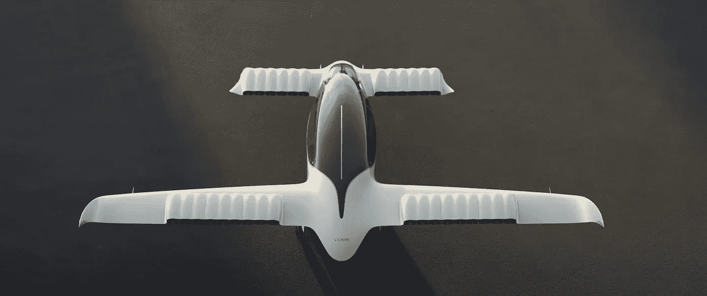

# 飞行的未来:介绍 Lilium 喷气式飞机

> 原文：<https://medium.com/codex/the-future-of-flight-introducing-the-lilium-jet-95af3ea41b4f?source=collection_archive---------0----------------------->

## 第一架电动垂直起降喷气式飞机

[Lilium Jet(Lilium 的媒体)](https://lilium.com/files/redaktion/redesign-2022/jet/Lilium_Jet_top_render_1500.jpg)

德国制造商 [Lilium](https://lilium.com/) 宣布了他们在航空领域的最新创新:电动垂直起降喷气式飞机，或称电动垂直起降。这种改变游戏规则的飞机有望比以前的任何飞机都更加通用和高效，具有一系列配置来满足任何需求…