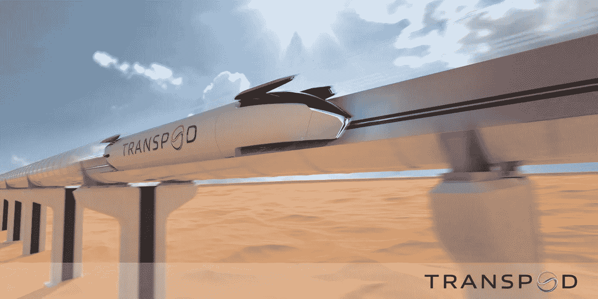

# 地面旅行的未来就在这里:TransPod 的 FluxJet 概念

> 原文：<https://medium.com/codex/the-future-of-ground-travel-is-here-transpods-fluxjet-concept-953138870924?source=collection_archive---------4----------------------->

## 今天的概念和明天的现实？

[FluxJet(trans pod 媒体)](https://www.transpod.com/wp-content/uploads/2022/07/fluxjet-transpod.jpg)

想象一下，你和其他 52 名乘客从多伦多到蒙特利尔只需 45 分钟。或者纽约到华盛顿不到一小时。这是 TransPod 新 FluxJet 概念的承诺，旨在将私人包机的速度与可负担性和便利性结合起来…