# 互动媒体的未来——生产流水线风格

> 原文：<https://medium.com/codex/the-future-of-interactive-media-pipelining-stylegan3-for-production-636c080db2f4?source=collection_archive---------1----------------------->

这是一个关于如何使用 StyleGAN3 和潜在空间操作，通过点击按钮来制作任何风格的图像的教程。

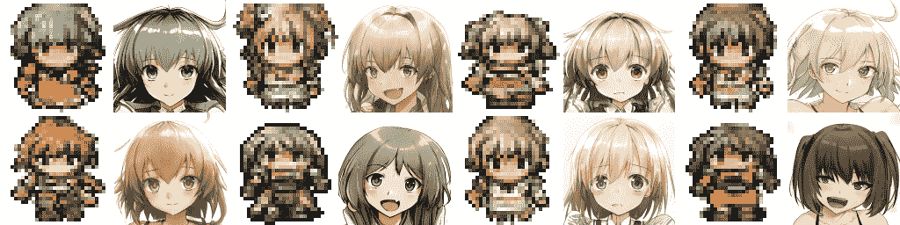

来源:作者

自从英伟达在 2018 年底发布了[原始 StyleGAN](https://arxiv.org/abs/1812.04948) 以来，许多技术爱好者都对无限人工智能生成的娱乐媒体的未来感到兴奋。尤其是我自己。当然，生成性对抗网络(GANs)不仅仅适用于视频游戏。已经成功利用它们制作了愚蠢的视频过滤器和更严肃的[匿名医疗培训资源](https://pubmed.ncbi.nlm.nih.gov/32167919/)。然而，生成算法变化无常，难以控制。如果你不了解它们的局限性以及如何驯服它们，它们的输出可能会很糟糕。

在本教程中，我将介绍 StyleGAN3 潜在空间的基本原理，然后解释三种使用这些原理来控制 GAN 输出的实用技术。最后，我将演示如何将所有这些放在一个管道中，准备用一个命令生成可用的图像集。我的重点是实践而不是理论，但我会为那些对数学感兴趣的人链接其他来源。

这个项目的主题是我最喜欢的互动媒体，日式角色扮演游戏。我们不会讨论最初的模型火车，因为已经有很多关于这个主题的教程了。我将使用我训练的两个 StyleGAN 模型:一个制作人物精灵艺术，一个制作动漫风格的肖像艺术。你可以通过进入我的 [GitHub 页面](https://github.com/tocantrell/stylegan3-fun-pipeline)查看我所有工作的代码，但我目前无法分享我的训练数据或我训练的模型。

最后，如果没有实现 [StyleGAN3](https://github.com/NVlabs/stylegan3) 所做的大量工作以及在 [stylegan3-fun](https://github.com/PDillis/stylegan3-fun) 添加的功能，这个项目是不可能的。

**了解潜在空间**

潜在空间是一个模糊的概念，通常要么过于复杂的数学，要么完全掩盖。但是理解它是一个重要的概念，这样我们就可以操纵我们的输入，这样模型就会始终如一地给我们提供符合我们需要的图像。

经过训练的 GAN 的输出不是无限的。它生成的图像将永远与你训练的数据相似。例如，如果你只在狗的图像上训练 GAN，你将永远不会生成飞机的图像。发电机模型只在训练中学习了狗的视觉特征。

当然，狗到底长什么样可能会很棘手。吉娃娃和柯基犬看起来不太相似。吉娃娃的图片在你的数据集中可能很少见，但是有一些共同的模式和特征，在所有的品种中创造了一种“狗样”。GAN 模型将这些特征编码并简化为一组可能的数字。集合中的每个数字范围都遵循正态分布，也称为高斯分布或钟形曲线，其中最常见的特征以平均值表示为零，罕见的特征为异常值。在我们的狗的例子中，吉娃娃的眼睛是一个被编码的特征，但是它们可能用不太接近平均值的值来表示。

可能的图像输出的整个集合被称为模型的**潜在空间**，用数字分布术语的编码是 **z 空间**。

经过训练的 GAN 模型是确定性的。这意味着，如果你让它用相同的输入输出一幅图像多次，你将总是得到相同的输出。通过改变输入模型的内容，我们可以得到看似无限多的输出图像:z 空间样本(或 **z 向量**)。此示例是从 z 空间分布中提取的一组随机数。这样，您最常见的狗图像输出将看起来像是在分布平均值附近编码的，可能是基于所有在线狗照片的具有强大 corgi 特征的东西。吉娃娃的眼睛只会偶尔出现，因为它们的编码值不太可能从分布中取样。

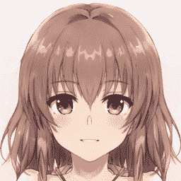

通过使用全零的 z 空间样本及其映射的 w 空间样本被截断以移除异常值，我们可以看到人脸模型对最普通的女性动漫角色的想法。使用模型的平均 w 空间值将返回相同的结果。来源:作者

当然，我们的“珠子眼”狗的例子是对潜在空间如何真正工作的过度简化，因为在一组可能的数字中，没有一个数字会如此清晰地映射。我们不希望输出看起来像这些吉娃娃眼睛的哈士奇。z 空间中的每个数字，以及我们随机选择的 z 向量，都与其他数字相互关联。由于这种纠缠，一只吉娃娃的眼睛通常只会在狗的其他部分有吉娃娃的特征时才会出现。解析出每个随机值对最终图像意味着什么是一个难题。

StyleGAN 模型通过引入 **w 空间**回避了这个解释问题。w 空间是 z 空间和图像输出之间的中间表示。它由一系列有序的数字矩阵组成，再次表示模型中编码的特定特征。然而，与 z 空间不同，w 空间是人类可以解释的。w 空间中的每个矩阵对应于最终输出图像的一个方面，或一种*风格*。下面的矩阵代表输出的基本方面。在我们的狗的例子中，这些层可能会映射到像狗的姿势或品种这样的方面。中间层代表输出的不太基本的方面，如狗的鼻子大小或面部表情。最后，较高的层对应于更精细的细节，如狗的皮毛颜色或图像的光照。从 StyleGAN3 开始，始终有 16 层矩阵，标记为 0 到 15。

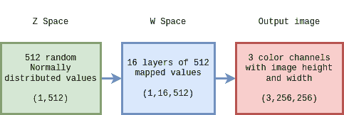

通过理解潜在空间是如何工作的，我们能够操纵它，这样一个模型就会始终如一地给我们提供符合我们需要的图像。

**质量通过截断绝招**

操纵模型输出最简单的方法是使用**截断技巧**。如前所述，在 z 空间中，常见特征的编码更接近平均值，而稀有特征的编码则更远。通常，该模型可以学习对我们人类查看输出图像没有意义的特征，但谢天谢地，这些特征很少，因此编码在不接近平均值的值中。截断技巧是当从 z 空间中随机选择时，我们限制可以采样的范围，确保怪异或罕见的特征永远不会被选择。然而，与机器学习中的一切一样，这项技术需要仔细调整。如果切掉太多，所有的输出看起来都一样，那么一开始就没有必要使用 GAN。

虽然大多数 GAN 直接将截断技巧应用于 z 空间样本，但在 StyleGAN3 实现中，它在选择 z 向量后应用于 w 空间值。这里通过变量 *truncation_psi* 指定截断技巧。使用低于 1.0 的值将产生更标准和统一的结果，而高于 1.0 的值将产生更多不寻常的异常值示例。

```
for i in range(4):
    w1 = get_w_from_seed(G,device,seed=i,truncation_psi=1.5)
    w2 = get_w_from_seed(G,device,seed=i,truncation_psi=0.7)

    img1 = w_to_img(G,w1,’none’)
    img2 = w_to_img(G,w2,’none’)
```

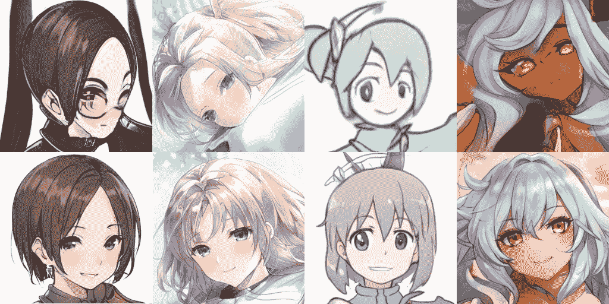

上图:使用相同 z 空间的配对截断技巧示例。顶部的 truncation_psi 设置为 1.5，底部的设置为 0.7。本文中的大多数其他示例也将其值设置为 0.7。来源:作者

**找到合适的风格组合**

我之前解释过 w 空间的层对应于输出图像的特定方面，但是我们如何处理这些信息呢？编码信息太复杂，无法用手操作。我知道的最好的解决方案是**风格混合**。

风格混合比你想象的要简单得多。你所要做的就是找到一个你喜欢的图像的某个方面，并从中提取与这些方面相关的 w 空间样本层。然后，您可以使用该层覆盖新图像的相应层，或者将它们平均在一起。这种混合可以用一层或多层同时进行。如果您的输出有更复杂的要求，您甚至可以混合来自不同图像的多个其他层。

```
truncation_psi = 0.7
w_avg = G.mapping.w_avg
w_list = []for i in range(4):
    z = np.random.RandomState(i).randn(1, G.z_dim)
    w = G.mapping(torch.from_numpy(z).to(device), None)
    w = w_avg + (w — w_avg) * truncation_psi
    w_list.append(w)w_base = w_list[0].clone()
for i in range(1,4):
    w_base[:,:7,:] = (w_list[i][:,:7,:]+w_base[:,:7,:])*.5
    img1 = w_to_img(G,w_base,’none’)
    w_base[:,:7,:] = w_list[i][:,:7,:]
    img2 = w_to_img(G,w_base,’none’)
```

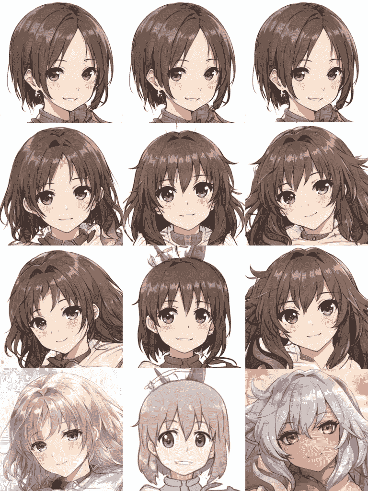

使用 w 空间层 0 到 7 混合顶行和底行的样式示例。第二行是两幅图像的等权重组合，第三行完全从底部图像中提取这些 w 空间层。这演示了一个基本的风格混合，其中颜色、绘画风格和其他细节保留了原始的，但是发型、体型和姿势来自添加的图像。来源:作者

```
w_base = w_list[0].clone()
for i in range(1,4):
    w_base[:,8:,:] = (w_list[i][:,8:,:]+w_base[:,8:,:])*.5
    img1 = w_to_img(G,w_base,’none’)
    w_base[:,8:,:] = w_list[i][:,8:,:]
    img2 = w_to_img(G,w_base,’none’)
```

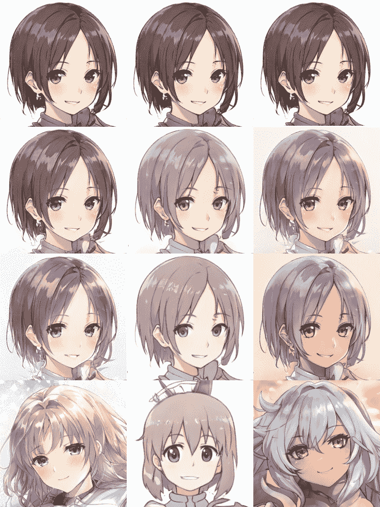

同上，但这次使用 w 空间层 8 到 15。在这种情况下，基本细节保持不变，但艺术风格和颜色等细节从底部图像中提取。来源:作者

使用这种风格混合技术，我们可以确保我们的最终图像具有我们需要的特征或风格。在这个视频游戏的例子中，我们可以确信我们随机生成的恶棍总是眯着眼睛，或者我们年轻的英雄总是带着幸福的微笑。我们甚至可以定义一个特定的艺术风格，如水彩画或波普艺术。所有你需要的是一个图像来传递所需的风格。

**潜在空间投影**

虽然我说过你需要做的只是找到你喜欢的图像的 w 空间样本层，但这并不容易，除非该图像已经是同一模型的输出。寻找不相关图像的潜在空间表示的技术被称为**投影**。

潜在空间投影用于搜索 GAN 模型的潜在空间，以找到给定图像的近似表示。不幸的是，它不像到目前为止描述的其他技术那样简单。它涉及一个耗时的搜索，依赖于一点随机性。有多种方法可以完成这项任务，但是我在这里使用的代码是基于 Abdal 等人的[image2 stylegan](https://arxiv.org/abs/1904.03189)。

虽然这种技术在概念上比前两种更复杂，但幸运的是，我们不需要考虑太多，它就能很好地满足我们的需求。首先要记住的是，我们是在为特定类型的图像构建的模型的潜在空间中进行搜索。如果你试图在一个狗模型中找到飞机的投影，结果不会很好。您的输入图像与用于 for 模型的数据越相似，您在潜在空间中找到的表示就越好。此外，获得一个好的匹配需要时间，所以它可能最好用在任何实时需求之外。

让我们来看一个示例投影，以及我们如何使用它的 w 空间样本来获得我们想要的样式。因为最终目标是为日式 RPG 塑造一个年轻的女英雄，我们将把鹿目圆作为一个经典的魔法女孩的例子。

```
python projector.py --network=models/face_GAN.pkl \
--target=data/wide_eye.png --num-steps=3000 --outdir=projections \ --stabilize-projection --vgg-normed
```

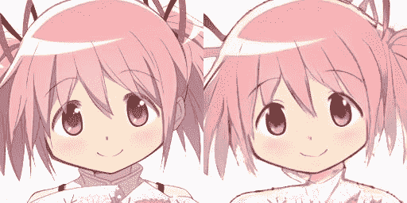

资料来源:玛奇卡四重奏/ Aniplex

我一边清理人脸模型的训练数据，一边准备左边的人画图像。右边的图像是它使用这个训练好的模型的潜在空间投影。投影并不完美，但这无关紧要，因为我们只需要 w 空间*样式*。在这个例子中，眼睛的形状和面部表情。

该代码将 w 空间的所有 16 个图层输出到一个. npy 文件中。我们只需加载它，并提取我们关心的层:6 和 7。

```
w_input_loc = ‘models/wide_eye_w.npy’
input_w = _parse_cols(w_input_loc, G, device, 0.7)for i in range(4):

    w = get_w_from_seed(G,device,i,0.7)
    output_w = w.clone()
    output_w[:,6,:] = input_w[:,6,:]
    output_w[:,7,:] = input_w[:,7,:]
    img_in = w_to_img(G,w,’none’)
    img_out = w_to_img(G,output_w,’none’)

    display(PIL.Image.fromarray(img_in.squeeze(0), ‘RGB’))
    display(PIL.Image.fromarray(img_out.squeeze(0), ‘RGB’))
```

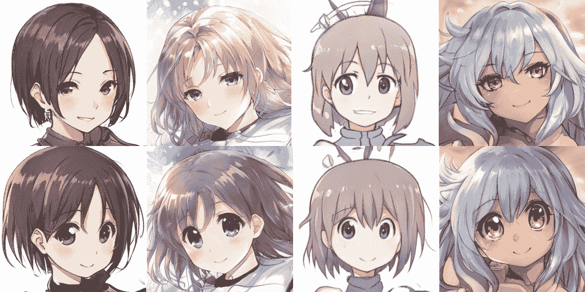

来源:作者

我们需要不止一个角色，所以让我们继续为女主角的对手做一个表情。为了保持眼睛的形状一致，我们将选择另一个神奇的女孩和圆冈自己的陪衬，晓美焰:

```
python projector.py --network=models/face_GAN.pkl \
--target=data/narrow_eye.png --num-steps=3000 --outdir=projections \ --stabilize-projection --vgg-normed
```

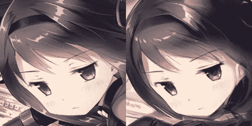

资料来源:玛奇卡四重奏/ Aniplex

这次投影看起来更好了！让我们看看它与我们随机生成的面孔的对应程度:

```
w_input_loc = ‘models/narrow_eye_w.npy’
input_w = _parse_cols(w_input_loc, G, device, 0.7)for i in range(4):

    w = get_w_from_seed(G,device,i,0.7)
    output_w = w.clone()
    output_w[:,6,:] = input_w[:,6,:]
    output_w[:,7,:] = input_w[:,7,:]
    img_in = w_to_img(G,w,’none’)
    img_out = w_to_img(G,output_w,’none’)

    display(PIL.Image.fromarray(img_in.squeeze(0), ‘RGB’))
    display(PIL.Image.fromarray(img_out.squeeze(0), ‘RGB’))
```

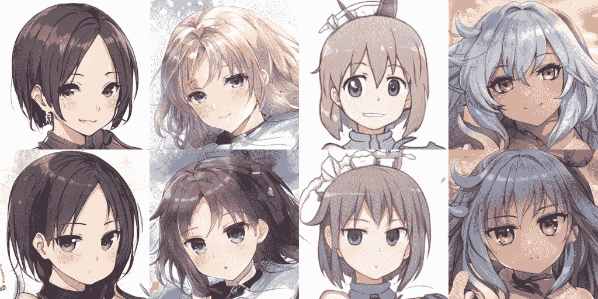

来源:作者

完美。我们仍然有过大的眼睛来保持艺术风格的一致性，但表达方式明显不同于早期的测试。

需要注意的一点是，由于嵌入在第 7 层中的表达式，颜色往往会变得更暗，即使颜色通常与更高层相关联。这是有意义的，因为训练集中具有相似面部表情的许多绘图具有较暗的调色板。虽然风格被 w 空间层分隔，但可能仍然存在一些难以理清的风格队列。

选择面部表情的第 6 层和第 7 层是通过大量的试验和错误确定的。除了图层顺序的一般细节级别之外，没有明确的映射来说明哪个 w 空间图层会影响最终输出的哪个特定方面。对于你训练的每一个 StyleGAN 模型，你需要做一些逐层混合的工作来观察结果。官方的 StyleGAN3 GitHub 库有一个很有用的工具， [visualizer.py](https://github.com/NVlabs/stylegan3#interactive-visualization) ，可以快速比较两个 z 矢量的 w 空间层混合。

**管道工程**

现在我们已经有了所有需要的工具，让我们把它们放在一起自动制作我们游戏的角色艺术！在传统的 JRPG 中，可玩角色需要两种类型的艺术资产:他们的动画精灵和肖像艺术。到目前为止，我所有的例子都使用肖像艺术模型，因为它更容易解释每种技术。从这一点上，我们也将连接到一个精灵艺术生成器。

这第二个 GAN 产生包括同一角色的十二个不同视图的图像，以制作行走动画。这种格式很好地映射到简单的视频游戏制作软件， [RPG 制作 MV](https://www.rpgmakerweb.com/products/rpg-maker-mv) 。

这是我们视频游戏角色项目的最终流程图:

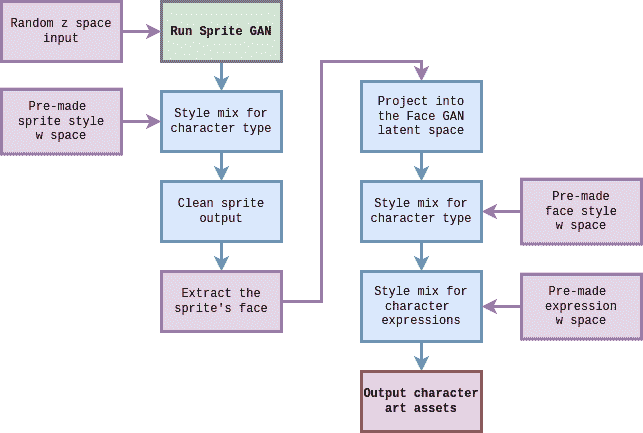

让我们用一个年轻的女英雄角色的测试运行例子来遍历每个输出。首先，我们使用自动创建的随机 z 向量运行精灵生成模型。然后，我们使用我提前在一个具有适当体型的角色上制作的投影的 w 空间样本，对此输出进行样式混合。最后，这种风格混合输出被清理，并准备在游戏中使用。

```
python generate_character.py heroine 0.6
```

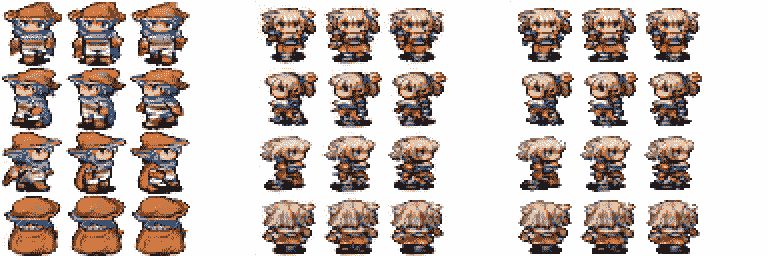

左:初始随机输出。中心:后风格与预先制作的女孩特征 w 空间样本混合。右图:自动清洗后。来源:作者

我们最初的随机输出看起来像一个男性吟游诗人，但风格组合将他变成了我们年轻的女主角，同时保留了一些颜色方面。这不是像我们看到的人脸模型那样的直接翻译，但在这个阶段我们只需要一个看起来像女孩的随机输出。

接下来，我们简单地裁剪并放大顶部中间的精灵，以聚焦她的头部。然后，我们通过面部潜在空间投影仪运行此输出，以根据肖像模型大致了解这个角色的样子。

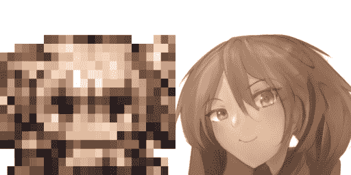

左:最终的精灵输出裁剪和放大。右图:精灵投射到甘脸部的潜在空间。来源:作者

这个阶段的输出当然不值得投入一个产品，这是一个比较好的后期投影输出例子。有两个原因，它不具有与其他投影相同的质量:首先，这是来自一种图像类型的脸甘从来没有见过。它的块状不映射到任何已知的特征。第二，我们运行这个预测的时间要短得多:与我们用于管道外预测的 3000 个步骤相比，只有 200 个步骤。这一过程将运行多次，不像其他一次性完成的工作，所以速度很重要。此外，我们将在下一个风格组合中加大处理力度。在混合表达式的例子中，我们只使用了两层，但是当来自一个杂乱的投影时，我们将覆盖更多的层:层 0，2，6，7 和 8。我们只想保持颜色，头发的形状，和一般的姿势。

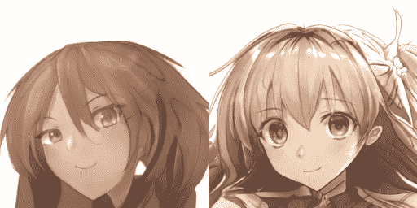

左图:上一步的投影输出。右图:投影风格混合了我们预先准备好的女主角的 w 空间样本。来源:作者

这张脸好看多了。但是对于一个真正的游戏，我们不能只有一件艺术品。角色应该能够根据对话表现出不同的表情。我们的管道采用这一输出，并与其他预先准备的 w 空间样本进行大量有针对性的混合，这些样本对我们想要的外观进行编码。

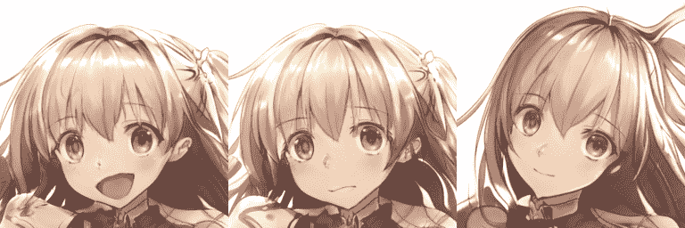

左侧和中间:使用第 6 层混合快乐和担忧的风格。右图:使用第 1 层调整姿势。来源:作者

点击一下按钮就能创作出大量的艺术作品！当然，它确实有些古怪，有一张令人毛骨悚然的快乐的脸和一些无视重力的头发。在这次运行中，我将所有输出设置为使用 0.6 的 truncation_psi 来保持一致，但它仍然不完美。让我们用更严格的截断技巧做另一个简单的例子。这次我将尝试输出我们的另一个角色。

```
python generate_character.py villain 0.4
```

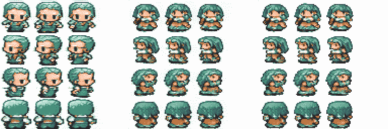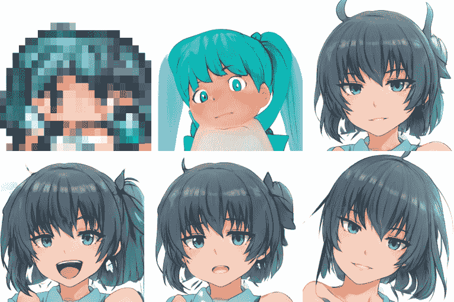

所有输出都与我们的女主角示例相同，但这次最终的人脸是使用 truncation _ psi 0.4 生成的。来源:作者

最后的脸看起来不错。眼睛更匀称，嘴巴看起来更自然。不幸的是，他们在模仿原始精灵方面做得更差。绿色的头发是有点罕见的脸甘的潜在空间，所以截断推输出到一个更常见的黑色。发型也更像模型的最普通输出，而不是投影。这说明了在使用 GANs 生产随机内容时，你必须做出的最大选择:是多样性更重要还是质量更重要？如果除了技术演示之外，您还需要稳定的输出，那么这是一个必须权衡的问题。

我希望这篇文章能启发您如何在现实世界中使用 GANs，通过流水线特性调整来获得完美的、完全随机的输出。让我知道你打算如何使用生成算法来解决你的问题！

**附加资源:**

*   [在你开始阅读关于 GANs](https://towardsdatascience.com/keywords-to-know-before-you-start-reading-papers-on-gans-8a08a665b40c) 的论文之前要知道的关键词:另一个用更简单的术语描述潜在空间和风格混合的资源。
*   [理解机器学习中的潜在空间](https://towardsdatascience.com/understanding-latent-space-in-machine-learning-de5a7c687d8d):从总体上对潜在空间的概念有一个稍微深入的了解。
*   [StyleGAN v2:关于训练和潜空间探索的笔记](https://towardsdatascience.com/stylegan-v2-notes-on-training-and-latent-space-exploration-e51cf96584b3)
*   [深度学习。AI 的生成对抗网络(GANs)专业化](https://www.coursera.org/specializations/generative-adversarial-networks-gans):虽然是付费的 Coursera 课程，但这是我找到的入门 GANs 的最好资源。(作者无隶属关系。)