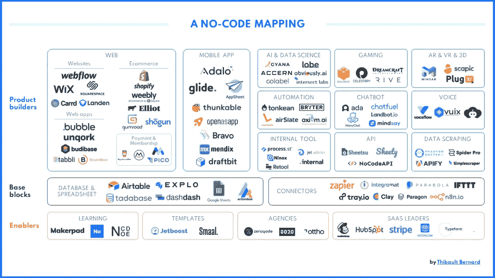

# 2021 年无代码技术的未来

> 原文：<https://medium.com/codex/the-future-of-no-code-technologies-in-2021-14d3edb30066?source=collection_archive---------19----------------------->

# 无代码技术的出现

计算机不再局限于数据输入和输出。现在，它们可以使用可视化界面进行编程，也称为“无代码”技术。

没有任何代码技术允许任何对计算机有基本了解的人不用写一行代码就能编写软件。这些技术越来越受欢迎，并被用于从设计到 web 开发的各种工作角色中。

对任何了解计算机的人来说，学习如何使用这些新的编程语言和可视化界面都很容易，这极大地拓展了潜在程序员的范围，降低了进入该领域的门槛。

# 清楚地理解无代码技术的承诺

许多新技术寻求改变事物的方法之一是消除对开发人员的需求。这很难承认来自一个开发者。

无代码技术是这些新技术的子集。这种技术为非技术人员提供了一种无需编写一行代码就能构建强大应用程序的方法。然后，它为应用程序提供一个 API，可以用来定制它以满足客户的需求。

这项技术已经开始影响行业，因为我们开始看到越来越多的基于“不需要编码”的应用程序被发布到市场上。

# 快速浏览 2021 年无代码技术的未来

2021 年，我们将会看到更多的公司为大众市场设计产品。他们还将寻求开发易于营销和销售的新产品，而不必有任何编码经验。

没有代码技术会让没有编程经验的人更容易开发和设计他们需要的产品。这也将使公司更容易接触和销售他们的产品，而不必花费时间或金钱雇佣程序员或编码员。

# 未来会怎样？

非代码技术的发展，人工智能和机器学习的进步开辟了新的行业，甚至比我们以前见过的更快的技术发展。在开发的最初几年，这些新技术的质量可能会受到质疑。然而，它为编码人员和非编码人员提供了不同的机会。

我想分享一个无代码技术的列表，它可能会帮助你提升你自己的工作流程，并帮助你设计一个新产品。我也期待看到这些产品如何成长，如何在科技生态系统中占据一席之地。

# 10 种无代码技术

1.  [Webflow](https://webflow.com/) —网页设计&开发
2.  [Figma](http://figma.com/) (有用插件 [Anima](https://www.animaapp.com/) / [漫威](https://marvelapp.com/) / [Protopie](https://www.protopie.io/) ) —原型&设计
3.  [Airtables](https://www.airtable.com/) —关系数据库
4.  [气泡](https://bubble.io/) —网络应用
5.  [Zapier](https://zapier.com/) — API 连接器
6.  [integra mat](https://www.integromat.com/en)—API 连接器
7.  [AppGyver](https://www.appgyver.com/) —移动应用开发
8.  [Adalo](https://www.adalo.com/) —移动应用开发
9.  Shopify —网上电子商务商店
10.  [显然 AI](https://www.obviously.ai/) —数据科学&机器学习

如果你想更深入地了解，请查看关于无代码生态系统的文章。

在我的下一篇博客文章中，我正在考虑跟进这篇文章，看看开发人员将如何受到无代码生态系统的影响，或者是另一本书的摘要，因为我刚刚读完了奥斯汀·克莱恩的三部曲。让我知道你想知道的更多。