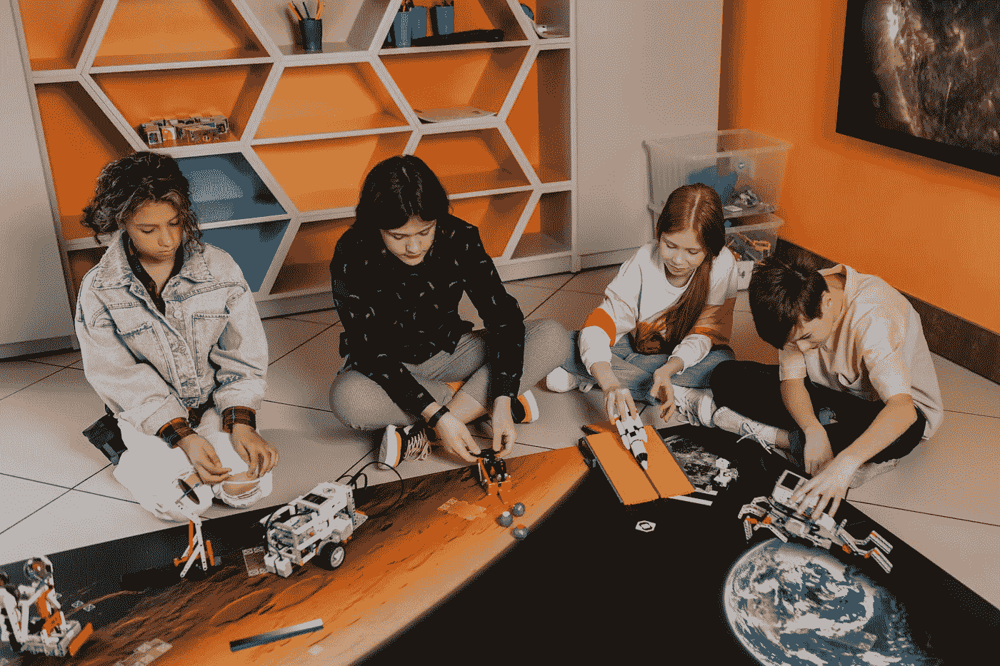

# 机器人技术的未来

> 原文：<https://medium.com/codex/the-future-of-robotics-1d496bbd7e05?source=collection_archive---------4----------------------->

## 世界上最重要的机器人

照片由来自 [Pexels](https://www.pexels.com/photo/adolescent-people-building-robots-7751038/?utm_content=attributionCopyText&utm_medium=referral&utm_source=pexels) 的 [Alena Darmel](https://www.pexels.com/@a-darmel?utm_content=attributionCopyText&utm_medium=referral&utm_source=pexels) 拍摄

# 机器人技术的未来

机器人越来越融入我们的生活。从社会上最有影响力的人到日常工作人员，机器人被期望做从保护我们到制作我们的饮料的一切事情。但是这对我们的未来意味着什么呢？