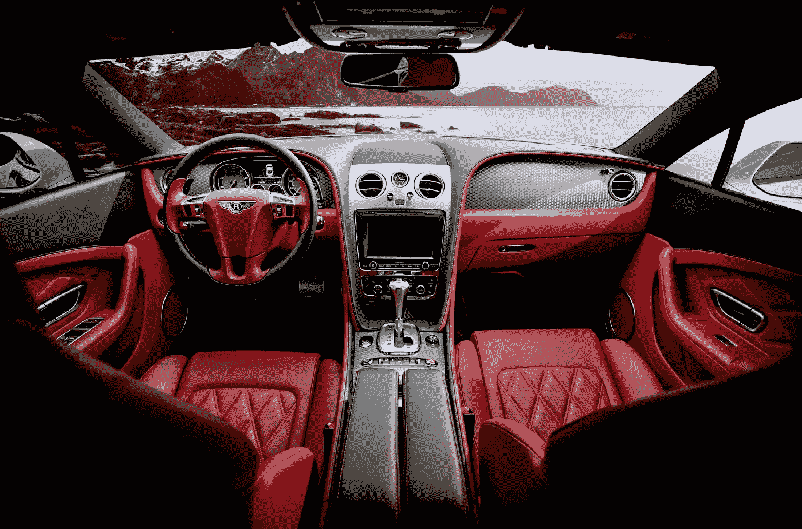
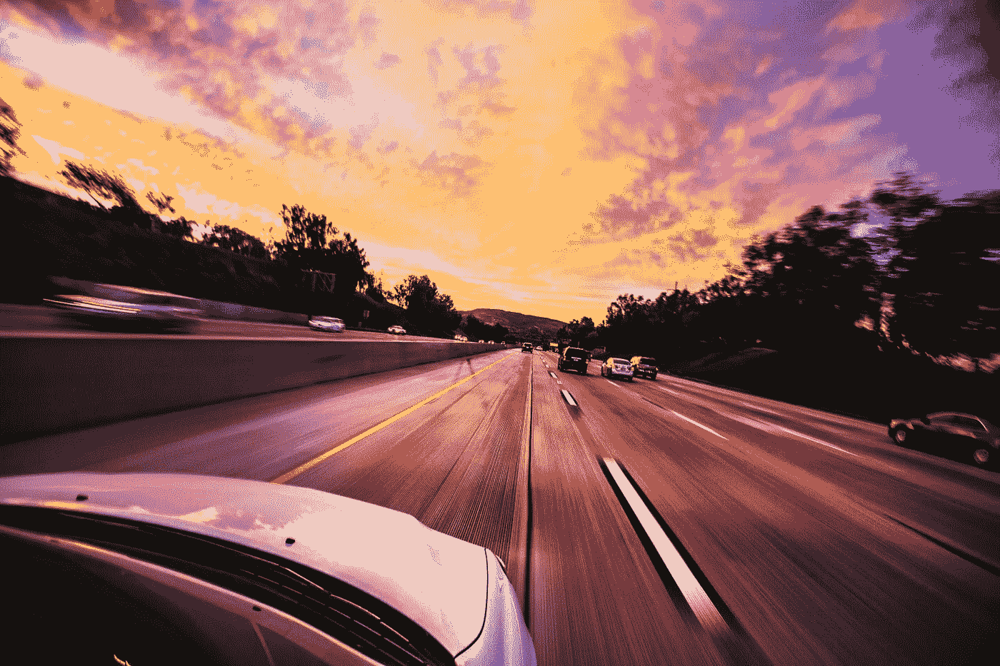

# 交通和自动驾驶汽车的未来

> 原文：<https://medium.com/codex/the-future-of-transportation-and-self-driving-cars-12f29655688a?source=collection_archive---------1----------------------->

无人驾驶汽车已经上路，而且在未来几年将变得更加普遍。如今，它们主要用于测试，但这种情况很快就会改变。无人驾驶汽车不仅可以减少交通死亡，还可以减少污染，重塑人们的生活方式。此外，像亚马逊这样的公司已经开始测试自动驾驶送货卡车，其他企业已经迫不及待地将这项技术用于他们的目的。我们中的一些人可能仍然对乘坐无人驾驶汽车保持警惕，但是，很可能，我们无法避免它们太久。

# 采用

自动驾驶汽车将比一般人预期的更快被采用。很多人认为无人驾驶汽车的广泛普及和使用还需要很长时间，但我相信这比大多数人想象的要快得多。与 2019 年的 45 万辆相比，道路上超过 7000 万辆汽车已经拥有一定程度的自主性。在未来，采用率会有更大的飞跃。

# 利益

自动驾驶汽车有很多好处。其中一些包括:

*   安全:自动驾驶汽车将减少道路上的事故数量，因为它们比人类司机反应更快。
*   效率:无人驾驶汽车已被证明比人类驾驶的车辆更安全，这意味着你可以长时间使用它们，而不会因为手机而感到疲劳或分心。它们还消耗更少的燃料，排放更少的废气，因此对环境更好。
*   减少停车问题:自动驾驶车辆可以自动停在指定的区域，这样当你等待乘车时，它们就不会阻碍交通。
*   降低运营成本:购买燃料、电力或租赁停车位的成本都将因拥有一辆自动驾驶汽车而降低。

# 技术的发展

许多大型科技公司目前正在研究无人驾驶汽车。下面是两个最大的名字:

谷歌已经研究这种技术很长时间了，目前大约有 200 辆自动驾驶汽车在路上行驶。该公司还在开发一种名为 Waymo 的乘车服务。谷歌的自动驾驶汽车技术包括激光雷达、雷达和摄像头等传感器，使车辆能够看到周围的环境。它还包括允许汽车根据所见做出决定的软件，例如当另一辆汽车在你面前做出不安全的变道或突然刹车时。据谷歌网站称，自 2010 年以来，谷歌的自动驾驶汽车已经在公共道路上行驶了 200 多万英里，在电脑控制下没有发生任何事故。

苹果公司于 2014 年开始研发自动驾驶汽车，名为“泰坦计划”。据报道，他们正在研究一种完全自动驾驶的汽车，这种汽车不需要人类的参与，比迄今为止任何其他汽车制造商都要走得更远。这是一个大项目，猜测称苹果打算设计一款没有方向盘和踏板的汽车。

# 伦理问题

自动驾驶汽车会有伦理问题吗？这个问题至关重要，因为如果车辆没有被编程来做出道德决定，那么这项技术对社会可能是危险的。

想象一下这样一种情况，自动驾驶车辆必须在拯救它的主人或车里的另一个人之间做出选择。在这种情况下，它必须确定谁更重要:主人还是一个随机的陌生人？如果没有合适的道德程序，两个人都同样有价值，那么汽车很难在不犯错误的情况下做出如此重要的决定。

问题是我们想给机器多少控制权。你想让你的生命掌握在机器手里吗？未来几年，答案可能是肯定的。

# 结论

自动驾驶汽车将以超出我们想象的方式改变我们的世界。这项技术是新的，但是不久我们就会在路上看到它们。我们可能没有这种情况发生的确切时间框架，但有一点是肯定的:自动驾驶汽车将彻底改变我们的出行方式。这些汽车将使交通运输更安全、更高效，对车上的每个人都更方便。使用自动驾驶汽车有这么多好处，用不了多久它们就会被整个社会广泛接受。