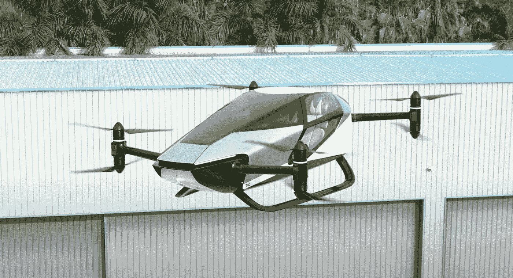

# 城市交通的未来:XPENG X2 飞行汽车

> 原文：<https://medium.com/codex/the-future-of-urban-transportation-the-xpeng-x2-flying-car-33c36e3c1046?source=collection_archive---------6----------------------->

## 问题是将来什么时候？

[XPENG X2(媒体由 XPENG AERO HT)](https://www.aeroht.com/)

我们都在未来电影和电视节目中见过飞行汽车，并梦想有一天我们可以在城市中穿梭而不会被交通堵塞。嗯，那一天可能比我们想象的要早。[亚洲最大的飞行汽车公司,](https://www.aeroht.com/)Xpeng AEROHT 宣布其电动…