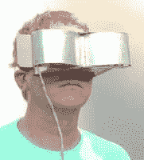
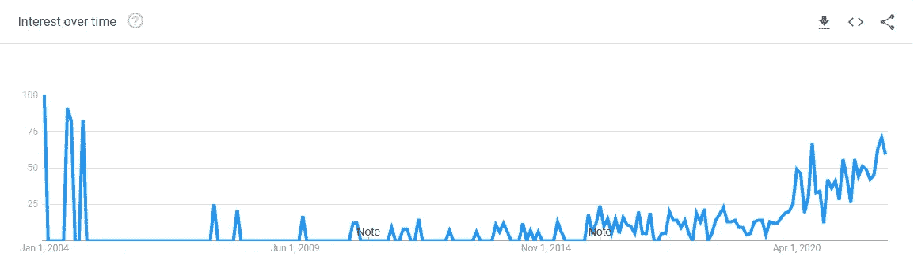
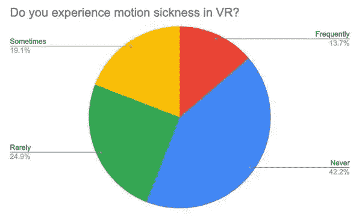
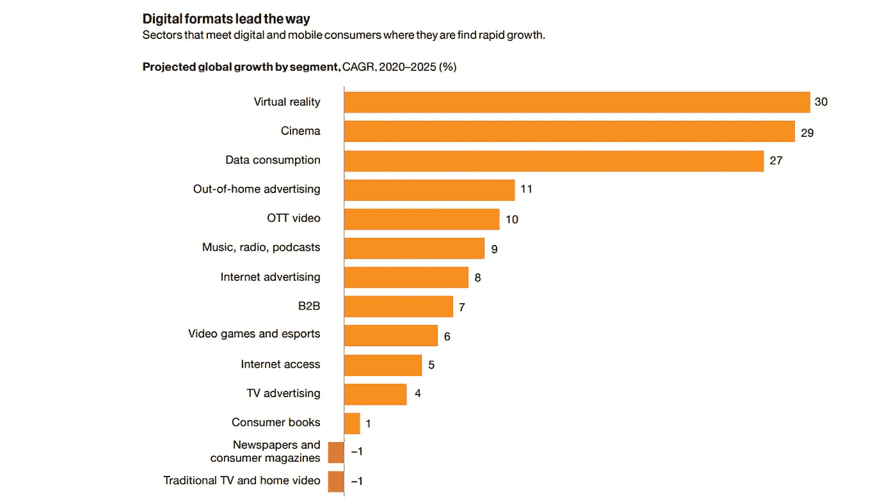

# 虚拟现实和人工智能在游戏中的未来

> 原文：<https://medium.com/codex/the-future-of-vr-and-ai-in-gaming-b744c90cbb88?source=collection_archive---------15----------------------->

## 看来我们解锁了一个新的模拟现实。它在这里停留吗？

尽管有一些令人鼓舞的数字，我们仍然不能确定虚拟现实是否会在未来几年内被大众消费者接受，或者它是否有再次下降的风险。如果 VR*似乎正在大步前进，我们应该期待看到什么内容？*

# *虚拟现实的简史*

*为了大胆猜测，让我们快速回顾一下虚拟现实的时间线。*

*早在 1929 年，[链教练机](https://en.wikipedia.org/wiki/Link_Trainer)，一个飞行模拟器，是为了安全训练二战飞行员而建造的。1989 年，美国宇航局将这一想法应用于太空。斯坦利·温鲍姆的*皮格马利翁的眼镜*在 20 世纪 30 年代预测了我们当代的虚拟现实概念[虚拟街机](https://en.wikipedia.org/wiki/Virtuality_(product))早在 1991 年就开始流通。这些甚至是实时的(少于 50 毫秒的延迟)和多人联网的！*

**

*1960 年第一次 HMD*

*91 年后，世嘉和任天堂推出了大型 3D 和耳机产品，但这些产品也逐渐淡出人们的视线。那么什么给了(给了？)?为什么所有这些控制台和机器都日落了？*

*每个人都缺少一个*非常*需要的组成部分:*舒适性*。*

## *网络病*

**

*“网络病”的谷歌趋势(我可能是其中相当大的一部分)*

*正如你可能猜测的那样，网络病是一种因接触虚拟世界而发生的晕动病。这通常被认为是由我们的本体感觉、我们的位置感和运动感与现实的差异造成的。这种恶心会因为另一个差异而加剧，即眼球运动与你的眼睛所期待的现实和他们所感知的现实不一致。*

*所以在某种程度上，我们可以用数字屏幕遮住我们的脸，我们的大脑会说“哦，我想这就是我现在的生活”，这真是太棒了。完全相信模拟并不是挑战，沉浸感实际上工作得如此之好，以至于产生了问题。*

*最大的挑战是我们的[迅速扫视](https://en.wikipedia.org/wiki/Saccade)，我们的眼睛用于注视和快速眼动睡眠的连续跳动，其角速度可达 700 /s。因此，如果虚拟现实软件的物理和速度不能让我们的身体相信我们正在持续移动，让我们的眼睛相信我们正在看到我们预期的东西，那么我们将在现实中度过大部分时间。没人希望如此。*

*好吧，早期虚拟现实的问题是图形限制和令人作呕的动作。但是根据 Oculus Quest 的销售数量，我们现在肯定已经解决了这个问题，对吗？*

# *现在现在*

## *感觉好些了吗？*

*截至 2022 年，图形紧凑，游戏火爆。我们已经进行了几十年的研究，并找出了怎样做才能更好地减少恶心感。更轻的 HMD，更平滑的过渡，外围模糊，黑暗和温暖的照明。所有这些都让它变得更容易忍受。但是大规模采用仍然是一场斗争。*

**

*一项有 300 名参与者的 [2020 年研究](https://vrheaven.io/vr-motion-sickness-statistics/)*

*对于超过 1/3 的人来说，当他们戴上耳机时，仍然会有恶心的感觉。这意味着要么图形仍然不够，耳机导致迷失方向，或者更糟的是，许多人的感知管道只是拒绝现实沉浸感。*

*与主机和 PC 游戏相关的恶心相比，这基本上是 30%的总可用市场缩减。随着如此大规模的下降，保持广泛的采用势头几乎是不可能的。*

*简而言之，虚拟内容必须学会如何变得更加平易近人。*

## *你的老朋友艾*

*好消息是严肃的 R&D 给出了答案。 [Copernic360](https://www.storyfutures.com/showcase/reducing-cybersickness-with-kagenovas-copernic360) 使用几何人工智能来创建逼真的环境。他们不是唯一的一群。随着 Meta 继续向他们的元宇宙投入数十亿美元(到目前为止已经达到 100 亿美元),风投们有更大的动力投资那些致力于乘风破浪的公司。*

> *从 2021 年到 2024 年，虚拟现实市场的年收入预计将增长两倍，超过 120 亿美元*

*再加上这个时代恰逢其时，机器学习领域正在积极地吹起来，VR 的寿命看起来是光明的。每年我们都在获得更快和(计算上)更便宜的神经网络。更不用说大多数 VR 头戴设备，控制器中有加速度计，摄像头指向我们的眼睛，是 AI 工具的完美跳板。*

## *我们能到达那里*

*所以对于现在是否真的是虚拟现实的转折点这个问题，作者认为*是的*。大规模收养是可能发生的。许多人可能会说，它现在就在这里，但尽管有这些庞大的投资周期，设备变成复古新奇产品的合理风险仍然存在。但市场分析师似乎普遍相信增长潜力，市场信心会带来个人信心！*

**

*来源: [RoadToVr](https://www.roadtovr.com/vr-revenue-forecast-growth-pwc/)*

## *未来内容*

*最后，我想谈谈我认为在未来几年将会有重大突破的几个领域*

***多人游戏***

*随着我们继续达到更高的并发玩家数量，多人游戏将成为开发者的下一个关注点。订阅服务、付费赢、PvP DLC 等。可以带回家一些真正的切达干酪。看看微软以 687 亿美元收购 Activision 就知道了。虽然 2018 年出现了巨大的 VR 投资热潮，但由于活动和延迟的不确定性，许多内容都是单人游戏(高分板不算)。*

*对于后者，我们有来自 Unity 的 XR 工具的新的与控制台无关的更新，更平滑的图形和人工智能预测来抵消延迟。*

*并发挑战有点像鸡和蛋的问题:你需要用户来获得用户。嗯，最近，虚拟现实密室和射击游戏在城市地区到处出现，我认为部分原因是独立开发者在一个立即可测试(和创收)的环境中创建多人游戏内容。*

***健身***

*竞争健身游戏将变得更加普遍，在一份[五年 CAGR 报告](https://arstechnica.com/gadgets/2021/10/vr-ar-wearables-and-smart-home-tech-are-now-mainstream-research-says/)中，可穿戴市场将扩大近 10%。*

***疗法***

*先进的 NLP 技术与行为解析/预测相结合，将产生虚拟的人工智能治疗伴侣。*

***表格***

*位置估计网络和姿势建议软件可以为运动和身体训练提供改进。*

***教育***

*最令人兴奋的是，教育部门有着巨大的增长市场。随着个性化定制的住宿、竞争性游戏化(道德上有争议)和注意力监控(好吧，让我们不要太*奥威尔式)我们的教育银行模式可以得到迫切需要的改进。**

***监狱***

*不可否认，这更像是一个白日梦。监狱条例可能相当残酷，但在此之前已经有人做过了。我希望看到在通过技能培养和康复软件帮助减少累犯的领域提供更多的内容。*

*~-~-~-~-~-~-~-~-~-~-~-~-~-~-~*

*最后，如果我不提我自己的公司 [Lovelace Studios](https://lovelacestudio.com/) ，我会是什么样的企业家呢？*

*白天是一个合作游戏孵化器工作室，晚上是一个独特的沉浸式赛博朋克街机酒吧。我们同步工作室/街机二元论来生成面向玩家的动态内容。*