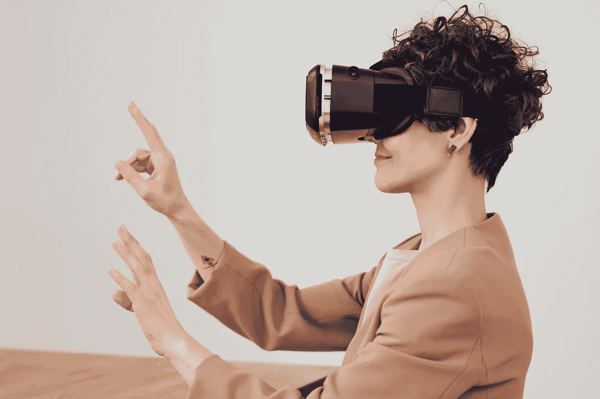
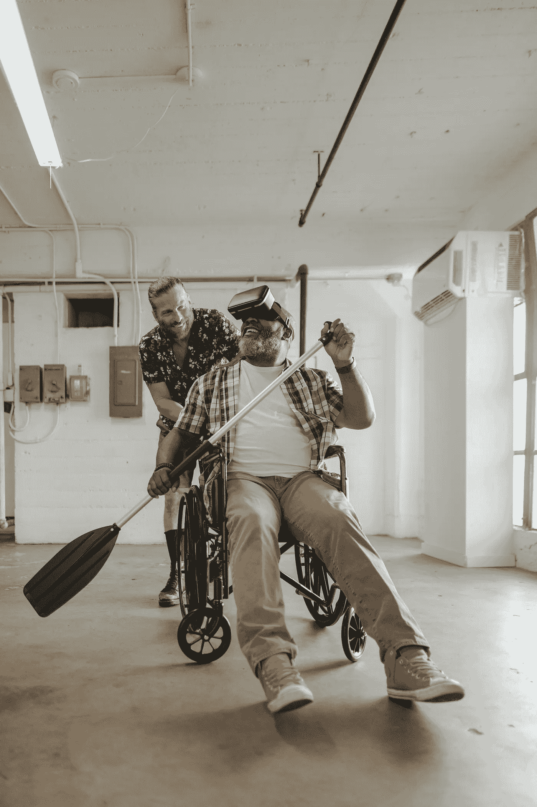

# 虚拟现实/增强现实在医疗保健领域的未来

> 原文：<https://medium.com/codex/the-future-of-vr-ar-in-healthcare-db5d9183721b?source=collection_archive---------14----------------------->

虚拟和增强现实是风靡全球的新兴技术。医疗保健行业也开始接受这些技术，看起来它们会一直存在下去。在这篇博文中，我们将讨论这些技术如何应用于医疗领域，它们对患者护理的影响，以及它们未来的发展方向。

# 一般信息

虚拟现实(VR)是一种创建虚拟的、计算机生成的环境的技术。一个人可以通过使用特殊的设备，例如耳机和手套来探索这个环境。VR 让人们沉浸在不同的体验中，以新的方式与周围的世界互动。

VR 在游戏、娱乐和训练中有许多用途，因为它提供了不同于任何其他媒体形式的沉浸式体验。例如，VR 已用于飞行员或士兵的飞行模拟训练，他们需要学习如何操作武器系统或驾驶像坦克或直升机这样的车辆。

它也可以被医生用来在病人身上进行手术，而不需要切开任何人！同样，虚拟现实已被用作恐惧症或焦虑症等精神健康疾病的治疗模型，方法是随着时间的推移慢慢暴露患者，直到他们在屏幕上反复看到他们的恐惧在他们面前上演后不再害怕。

# 手术室里的 AR

AR 已经被用于辅助外科手术，并帮助外科医生可视化身体内部正在发生的事情。AR 可用于帮助外科医生识别肿瘤和其他异常情况，通过将 3D 模型覆盖在实时视频上来可视化患者的解剖结构，并向医生展示器官在被移除或修复后的样子。

除了改善手术，AR 还通过允许医生在不离开房间的情况下访问患者记录来提高医疗保健的效率。医生在不同部门之间共享信息的能力也带来了更好的护理，因为专家们可以比完全没有访问权限时更容易地相互咨询。

# 更实惠的临床试验

为了降低临床试验的成本，许多制药公司现在转向增强现实技术。这可以用来帮助医生和病人在新药进行人体试验之前想象出它的效果。

这项技术的工作原理是从真实的病人身上获取 MRI 扫描或 CT 扫描，然后将它们与虚拟图像叠加，这些虚拟图像代表了病人在接受实验性治疗后的表现。医生可以利用这些信息做出重要决定，决定他们是否应该在现实生活中使用某些药物，以及这些药物随着时间的推移可能会如何影响患者的身体。

# 未来应用

VR 和 AR 在医疗领域的使用不仅限于外科医生或医生。其他专业人士也将这项技术融入到他们的工作中。例如，通过用身临其境的虚拟模拟器取代昂贵的模拟器，虚拟现实正被用来使医疗培训变得更加负担得起。

除了这些应用程序对专业人员有用之外，它们还可以帮助患者通过可视化工具更好地了解自己的病情，如 3D 扫描或用 VR 相机制作的视频——这使他们有机会进行自我反思，从而对自己的健康做出更健康的决定。

# 结论

总之，AR 和 VR 在医疗保健中是不可避免的。虽然不太可能所有的医生都会很快使用增强现实听诊器，但这项技术很有前途。我们可能在十年或更长时间内看不到 VR 或 AR 的全部功能，但正如我们所知，它们肯定会彻底改变医学。