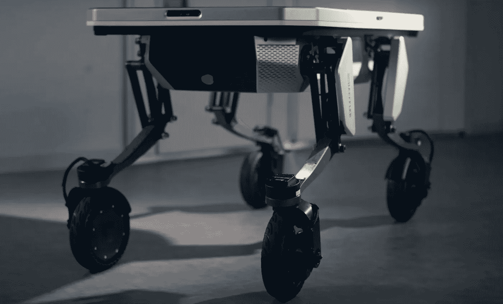

# 工作的未来在这里！介绍移动平台 DEX

> 原文：<https://medium.com/codex/the-future-of-work-is-here-introducing-dex-the-mobile-platform-29ae90a72a54?source=collection_archive---------10----------------------->

## 改变工作方式

[DEX(舍弗勒集团培养基)](https://youtu.be/mnJl5dTwYTY)

无论什么时候，只要有东西承诺让工作和基本任务变得更容易管理，你就必须停下来，接受传递给你的一切。来自[舍弗勒集团](https://www.schaeffler.com/en/group/)名为 DEX 的这项前景看好的技术就是如此。这是“T4 腿”的简称，这个移动平台可以为工作场所创造奇迹。