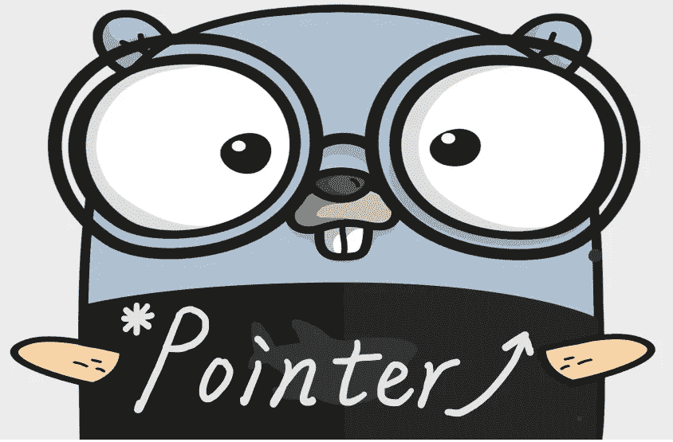

# 围棋指针魔术

> 原文：<https://medium.com/codex/the-go-pointer-magic-b35438627ff9?source=collection_archive---------2----------------------->

## 有趣的 Go 指针转换

Go 是一种指针类型的语言，通过它我们可以

*   将指针传入函数并就地更新值。
*   将方法作为`(* T) A`添加到结构中，这与`(T) A()`不同。

然而，指针在 Go 中是类型安全的，这意味着指针有这样的限制。